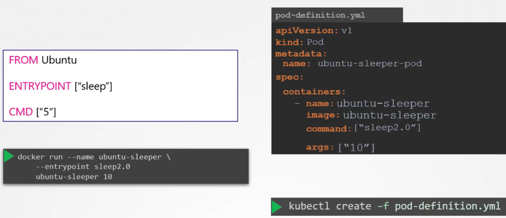
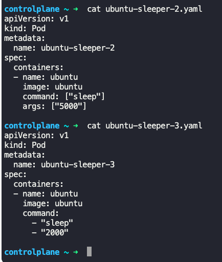

### Commands and Arguments in Kubernetes

- From the docker file
```
FROM Ubuntu
ENTRYPOINT [ "sleep" ]
CMD [ "5" ]
```
- Build the docker file - `docker build -t ubuntu-sleeper .`
- 
- To create a pod from this container, create a pod definition file
```
apiVersion: v1
kind: Pod
metadata:
  name: ubuntu-sleeper-pod
spec:
  containers:
    - name: ubuntu-sleeper
      image: ubuntu-sleeper
      command: [ "sleep2.0" ]
      args: [ "10" ]
```
- `command:` - corresponds to `ENTRYPOINT` instruction in docker file.
	- This overrides the `ENTRYPOINT` instruction in the docker file
- `args:` - Anything which is appended to the `docker run` command goes here.
	- This overrides the `CMD` instruction in the docker file
	- P.S: This is an array `[ "10", "11", "12" ]`
- `kubectl run webapp-green --image=kodekloud/webapp-color -- --color green`
	- `--` separates options for `kubectl` utility and the options as arguments
- 


---
