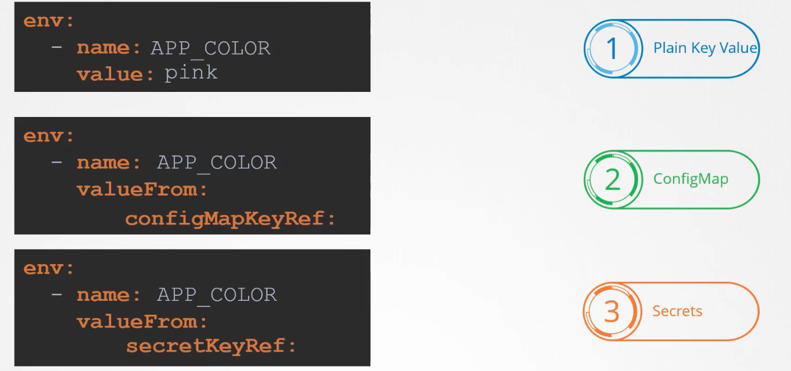

### Environment variables in Kubernetes

- It is set under `spec:` section as `env:` property in the pod definition yaml file
```
spec:
  containers:
    -name: simple-app
	 image: simple-app
	 ports:
	   -containerPort: 8080
	 env:
	   -name: APP_COLOR
	    value: pink
	   -name: APP_COLOR2
	    valueFrom:
	      configMapKeyRef:
	   -name: APP_COLOR3
	    valueFrom:
	      secretKeyRef:
```
- `env:` is an array
	- `-name:` is the name of environment variable
	- `value:` is value of environment variable
	- `valueFrom:` - `configMapRef:` is for config map
	- `valueFrom:` - `secretMapRef:` is for secrets
- 


---


