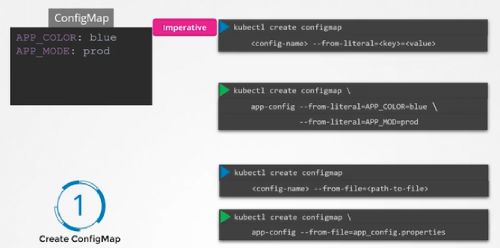
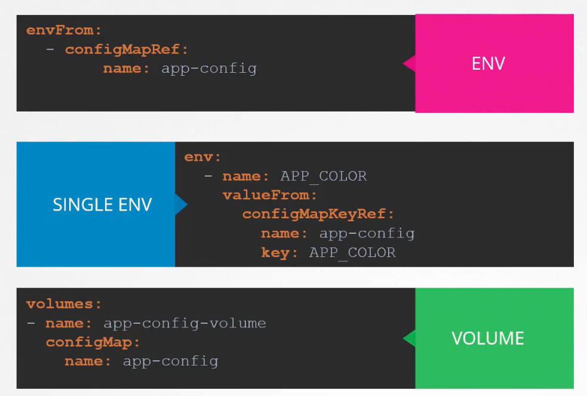

### ConfigMaps

- When there are a lot of pod definition files, it will become difficult to manage the environment data stored within various pod definition files
- We can take this environment data out of pod definition files and manage it centrally in ConfigMaps
- ConfigMaps are used to pass configuration data in the form of key-value pair in Kubernetes
- When a pod is created, inject the ConfigMap into the pod, the key-value pairs are available to the application hosted inside the container
- 2 phases involved
	- Create ConfigMap
		- Imperative way - `kubectl create configmap`
			- `kubectl create configmap <config_name> --from-literal=APP_COLOR=blue`
			- `--from-literal` specifies the key-value pair in command itself
			- If multiple key-value pairs need to be specified, then repeat `--from-literal` for each pair again and again.
			- `kubectl create configmap <config_name> --from-file=<path_to_file>`
			- `--from-file` allows you to specify the environment variables from a file like app_config.properties
			- 
			- 
		- Declarative way
			- Create a ConfigMap definition file
			- Create the ConfigMap - `kubectl create -f configmap-defn.yaml`
			- `kubectl get configmaps` - Lists all ConfigMaps
			- `kubectl describe configmap <config_map>` - Describes a cConfigMap
			```
	          apiVersion: v1
	          kind: ConfigMap
	          metadata:
	            name: app-config
	          data:
	            APP_COLOR: blue
	            APP_MODE: prod
		   ```
	- 
	- Inject into pod
		- In the pod definition file, under `spec:` -> `containers:` add `envFrom:` -> `configMapRef:`
		```
          envFrom:
            - configMapRef:
                name: app-config
       ```
		- `envFrom:` is a list
		- `app-config` is the name of ConfigMap
		- `kubectl create -f pod-defn.yaml`
			- It will take the details from ConfigMap
		- 
		- 
		- Other ways to inject environment variable into pod definition file
			- Single Environment variable
			```
			env:
			  - name: APP_COLOR
			    valueFrom:
			      configMapKeyRef:
			        name: app-config
			        key: APP_COLOR
           ```
			- 
			- Volume
			```
			volumes:
			  - name: app-config-volume
			    configMap:
			      name: app-config
           ```



---
