### Kubernetes secrets

- Hardcoding hostname, DB credentials in code is not a good practice
- ConfigMap can be used to store these type of information, but it stores them as plain text
- Kubernetes secrets are used to store sensitive information like passwords and keys
	- Similar to ConfigMap, except they are stored in an encoded format
- Create Secret
	- Imperative
		- `kubectl create secret generic <secret_name> --from-literal=<key>=<value>`
		- Ex: `kubectl create secret generic app-secret --from-literal=DB_Host=mysql --from-literal=DB_User=root --from-literal=DB_Password=paswrd`
		- `kubectl create secret generic <secret_name> --from-file=<path_to_file>`
		- `kubectl create secret generic app-secret --from-file=app_secret.properties`
		- 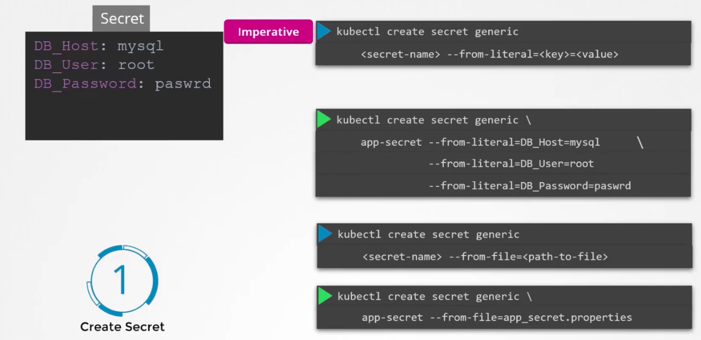
	- Declarative
		- Create the secret definition file as below
		```
           apiVersion: v1
           kind: Secret
           metadata:
             name: app-secret
           data:
             DB_Host: mysql
             DB_User: root
             DB_Password: paswrd
       ```
		- `kubectl create -f secret-data.yaml` - Creates Kubernetes secrets
		- The values must be specified in encoded format
			- `echo -n 'mysql' | base64`
			- `echo -n 'root' | base64`
			- `echo -n 'passwrd' | base64`
		- 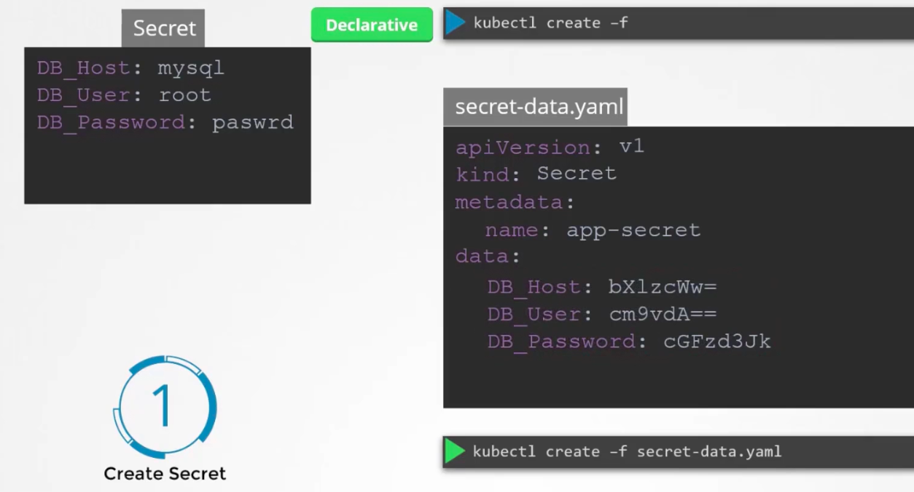
		- `kubectl get secrets` - Lists all secrets created
		- `kubectl describe secret <secret_name>` - Describes secret
		- `kubectl get secret app-secret -o yaml` - To view the secret value
			- This returns the secrets in base64 encoded format
			- `echo -n <encoded_text> | base64-decode`
		- 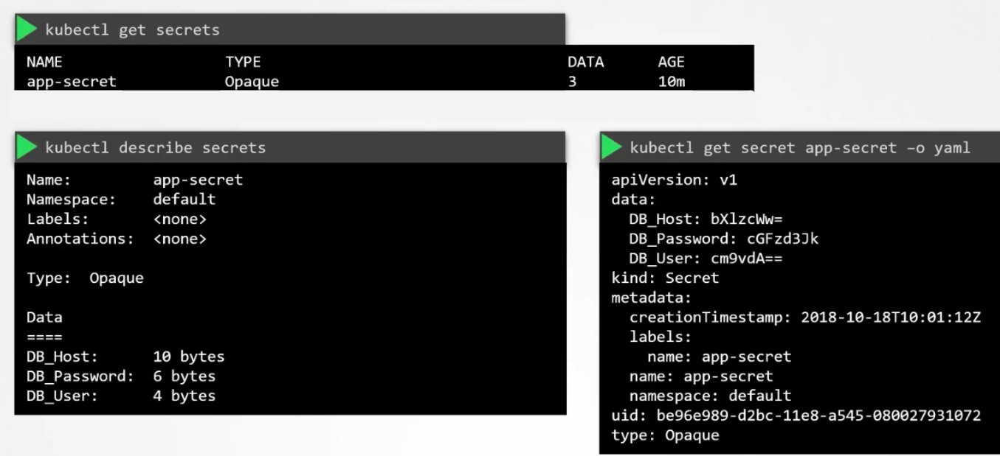
		- 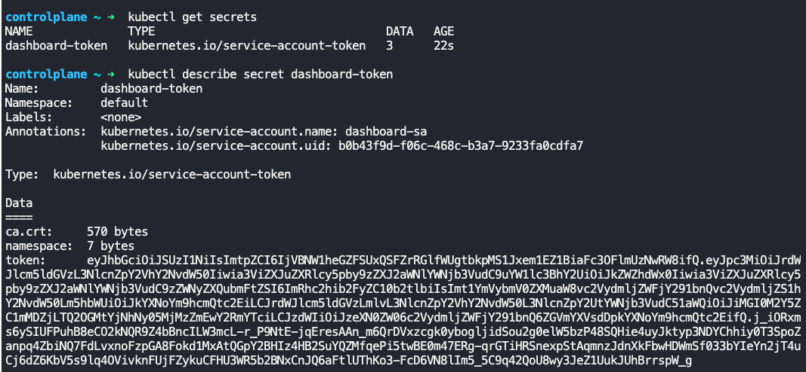
		- 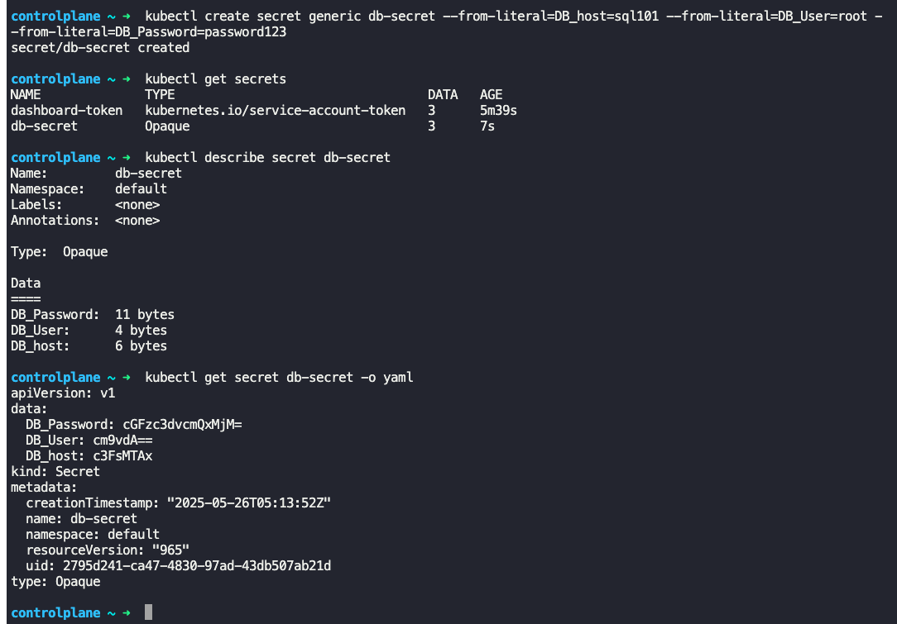
		- 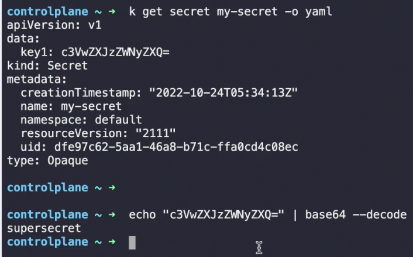
- Inject Secret
	- In the pod definition file, under the section `spec:` -> `containers:`, add `envFrom:`
	- `envFrom:` is a list
	```
	envFrom:
	  - secretRef:
	      name: app-secret
    ```
	- `kubectl create -f pod-defn.yaml` - Creates the pod with secrets injected
	- ![[injectsecretintopod.png]]
	- Other ways to inject secret
		```
		env:
		  - name: DB_Password
		    valueFrom:
		      SecretKeyRef:
		        name: app-secret
		        key: DB_Password
        ```
		- The above method will expose a single secret, and not all the secrets in the secret configuration
		```
		volumes:
		  - name: app-secret-volume
		    secret:
		      secretName: app-secret
       ```
		- The above mehtod allows to read secrets from a volume
- Refer - https://www.youtube.com/watch?v=MTnQW9MxnRI

### Note on secrets

- Secrets are not encrypted, only encoded
	- Do not checkin secret objects (even in encoded form) into code
- Secrets are not encrypted in ETCD
	- Consider enabling encryption at rest
	- https://kubernetes.io/docs/tasks/administer-cluster/encrypt-data/
- Anyone able to create pods/deployments in same namespace can access secrets
	- Configure least privilege access to secrets via RBAC
- Consider 3rd party secrets store providers
	- In AWS/Azure/GCP or any other vault
	- This ensures secrets are stored in a 3rd party vault and not in etcd

### Encrypting secret data at rest

- Follow doc - https://kubernetes.io/docs/tasks/administer-cluster/encrypt-data/
- Install etcdctl
	- `apt-get install etcd-client`
	- etcdctl is command line utility for etcd
- Connect to etcd server using
	- ```

```
ETCDCTL_API=3 etcdctl \
   --cacert=/etc/kubernetes/pki/etcd/ca.crt   \
   --cert=/etc/kubernetes/pki/etcd/server.crt \
   --key=/etc/kubernetes/pki/etcd/server.key  \
   get /registry/secrets/default/secret1 | hexdump -C
```
- This gives the secret stored (assuming we created a secret called "secret1") in etcd store in clear text
- To store in plain text is not recommended, need to encrypt at rest
- Check if encryption at rest is already enabled
	- `ps -aux | grep kube-apiserver | grep "encryption-provider-config"`
		- If nothing is listed, then it is not enabled
	- `cat /etc/kubernetes/manifests/kube-apiserver | grep encryption-provider-config`
		- If nothing is listed, then it is not enabled
- 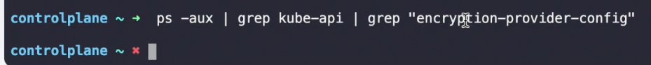
- To enable encryption at rest, first create encryption configuration file
```
apiVersion: apiserver.config.k8s.io/v1
kind: EncryptionConfiguration
resources:
  - resources: -> (What to encrypt? secrets, pods, all etc)
      - secrets
    providers:
      - aescbc: -> (Encryption algorithm. If identity: {} is specified, then no encryption)
          keys:
            - name: key1
              secret: c2VjcmV0IGlzIHNlY3VyZQ== -> (head -c 32 /dev/urandom | base64 -> This command creates a 32-bit random key and base64 encodes it. Insert the output here)

```
- 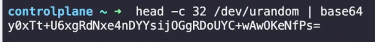
- 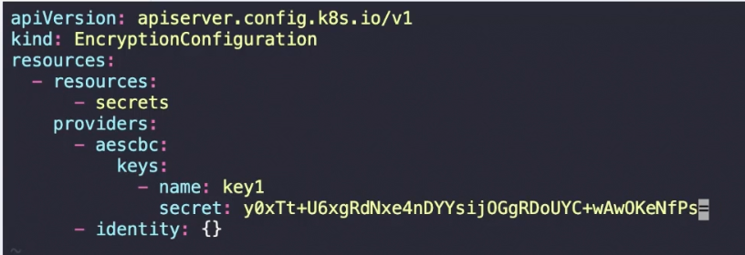
- Store the encryption config file at `/etc/kubernetes/enc/enc.yaml`
- Now edit the kube-apiserver manifest file (`/etc/kubernetes/manifests/kube-apiserver.yaml`) and make changes to enable encryption at rest
	- Add `--encryption-provider-config=/etc/kubernetes/enc/enc.yaml`
	- 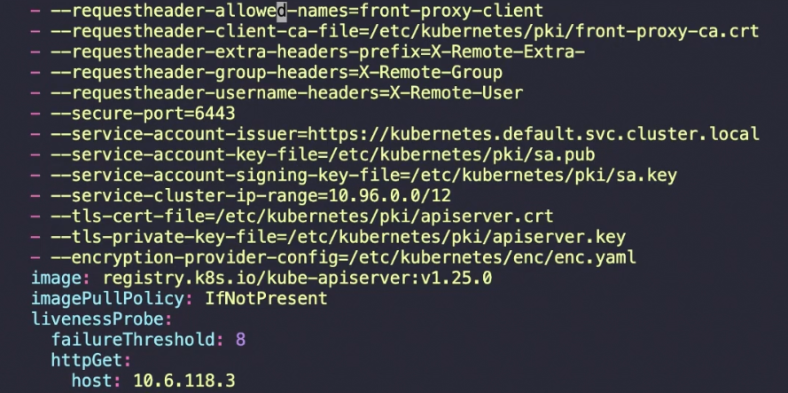
	- Add volume mount paths to do the following
		- The local file at `/etc/kubernetes/enc/enc.yaml` is made available inside the pod
		- What is specified under `volumes:` will be mounted under `volumeMounts:`
		- Once done save the kube-apiserver manifest file
		- This will automatically configure the kube-apiserver with changes
		- 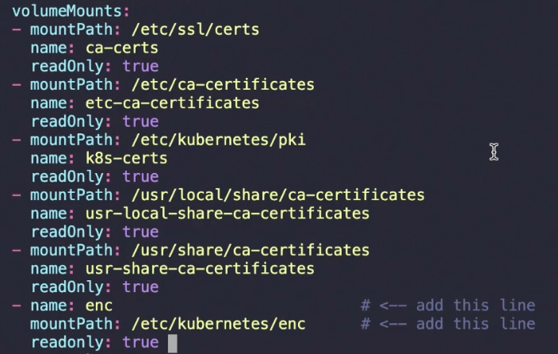
		- 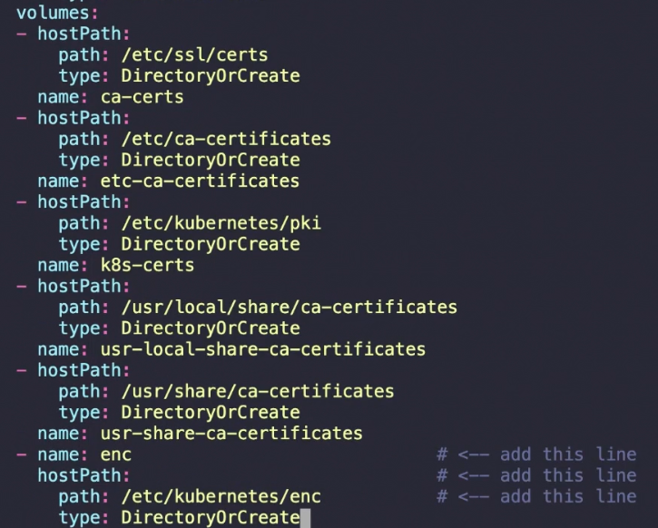
- Check if encryption at rest is enabled
	- `ps -aux | grep kube-apiserver | grep "encryption-provider-config"`
	- This should confirm it
	- 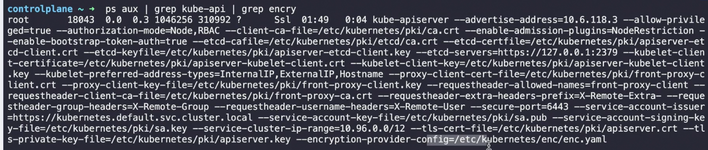
- Now create a new secret (`kubectl create secret ...`) say secret2, and run 
```
ETCDCTL_API=3 etcdctl \
   --cacert=/etc/kubernetes/pki/etcd/ca.crt   \
   --cert=/etc/kubernetes/pki/etcd/server.crt \
   --key=/etc/kubernetes/pki/etcd/server.key  \
   get /registry/secrets/default/secret2 | hexdump -C
```
- It should not return plaintext secret
- 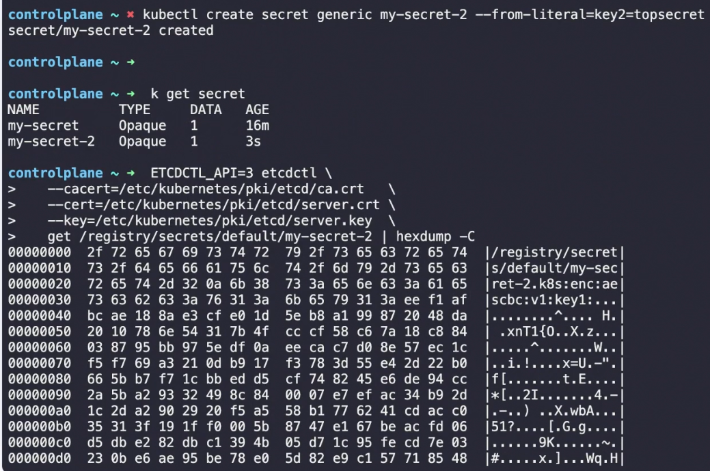
- Note: All secrets created before enabling encryption at rest will remain unencrypted
- To encrypt existing secrets as well, update all of them
	- `kubectl get secrets --all-namespaces -o json | kubectl replace -f -`
	- 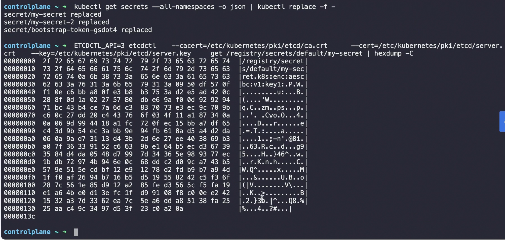


---
