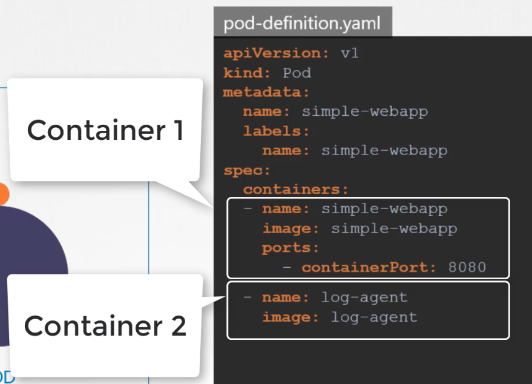
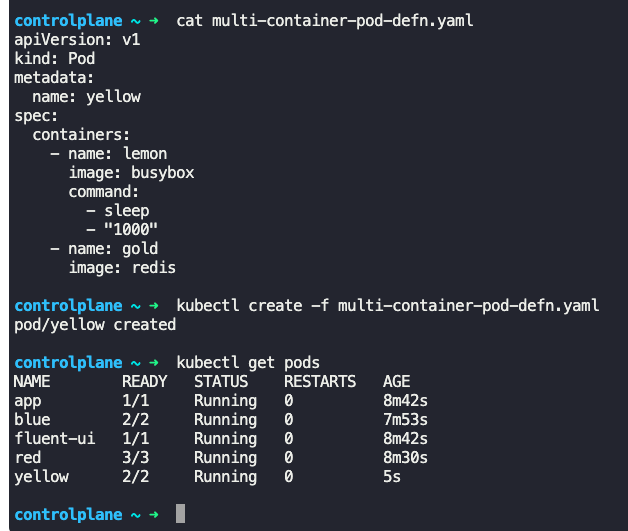
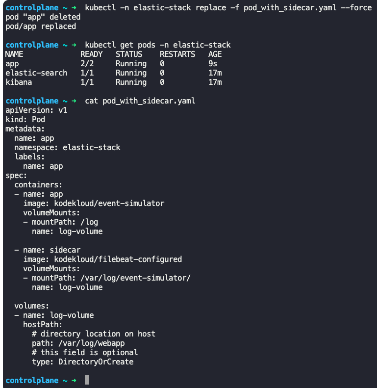

### Kubernetes multi-container pods

- Single monolith application is broken down into smaller micro services, so that each micro service can be easily managed, reused and scaled
- Sometimes 2 applications need to work together, like web server and log server
	- They are developed separately, but when deployed, they are deployed together
	- They are scaled up and down together
- For this use case, we have the concept of multi-container pod
	- The containers in a multi container pod have the same lifecycle, they are created together, destroyed together and scaled together
	- They share same network, they can refer to each other as localhost
	- They have access to same storage volumes
	- No volume sharing or services required between containers in the same pod
- Create a multi container pod by just adding new container info
```
spec:
  containers:
    - name: simple-webapp
      image: simple-webapp
      ports:
        - containerPort: 8080
    - name: log-agent
      image: log-agent
```
- 
- 
- To view the logs
	- `kubectl -n elastic-stack exec -it app -- cat /log/app.log`
		- `elastic-stack` is the name of namespace
		- `app` is the name of pod
		- `cat /log/app.log` is the command executed to view the logs
	- `kubectl logs <name_of_pod> -n <name_of_namespace>`
- 3 common multi container pod patterns
	- Side car pattern
	- Adapter pattern
	- Ambasador pattern
- To add additional containers to existing pod
	- Edit the pod definition yaml file and add the additional container details
	- Use `kubectl replace --force ...` command to recreate the pod with multi containers
	- 


---
