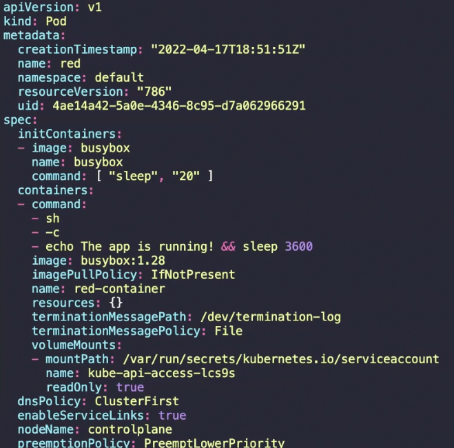
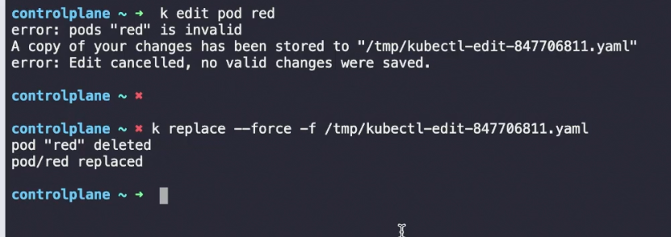

### Init Containers

In a multi-container pod, each container is expected to run a process that stays alive as long as the POD's lifecycle.

For example, in the multi-container pod that we talked about earlier, which contains a web application and a logging agent, both containers are expected to stay alive at all times.

The process running in the log agent container is expected to stay alive as long as the web application is running. If any of them fail, the POD restarts.

But at times, you may want to run a process that runs to completion in a container. For example, a process that pulls code or a binary from a repository that will be used by the main web application.

That is a task that will run only one time when the pod is first created. Or a process that waits for an external service or database to be up before the actual application starts.

That's where **initContainers** come in. An **initContainer** is configured in a pod like all other containers, except that it is specified inside an `initContainers` section, like this:

```
apiVersion: v1
kind: Pod
metadata:
  name: myapp-pod
  labels:
    app: myapp
spec:
  containers:
  - name: myapp-container
    image: busybox:1.28
    command: \['sh', '-c', 'echo The app is running! && sleep 3600'\]
  initContainers:
  - name: init-myservice
    image: busybox
    command: \['sh', '-c', 'git clone  ;'\]
```



When a POD is first created, the **initContainer** is run, and the process in the **initContainer** must run to completion before the real container hosting the application starts.

You can configure multiple such **initContainers** as well, similar to how we did for the multi-container pod. In that case, each **initContainer** is run one at a time in sequential order.

If any of the **initContainers** fail to complete, Kubernetes restarts the Pod repeatedly until the **initContainer** succeeds.

Here’s an updated example of how to configure multiple **initContainers**:

```
apiVersion: v1
kind: Pod
metadata:
  name: myapp-pod
  labels:
    app: myapp
spec:
  containers:
  - name: myapp-container
    image: busybox:1.28
    command: \['sh', '-c', 'echo The app is running! && sleep 3600'\]
  initContainers:
  - name: init-myservice
    image: busybox:1.28
    command: \['sh', '-c', 'until nslookup myservice; do echo waiting for myservice; sleep 2; done;'\]
  - name: init-mydb
    image: busybox:1.28
    command: \['sh', '-c', 'until nslookup mydb; do echo waiting for mydb; sleep 2; done;'\]
```

Read more about **initContainers** here

Add Init container to existing pod



---
