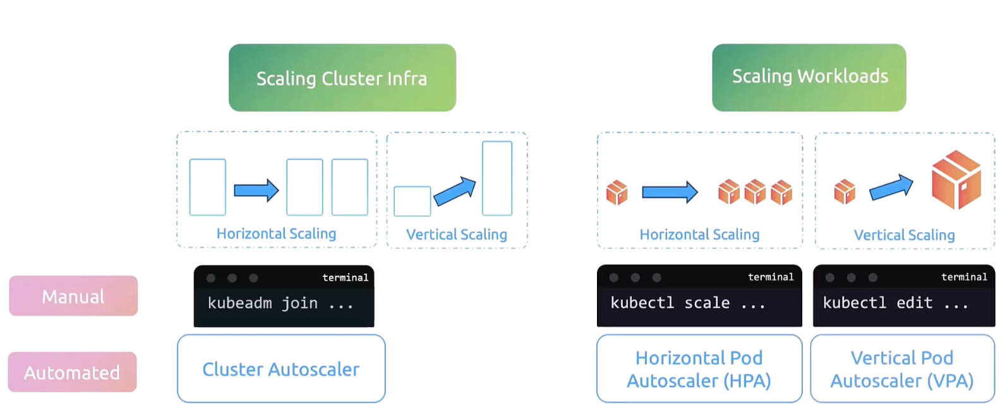

### Autoscaling

- Two types
	- Horizontal pod autoscaling (HPA)
	- Vertical pod autoscaling (VPA)
- 
- Vertical scaling
	- Adding more resource to existing server
- Horizontal scaling
	- Adding more instances/servers
- Scaling workloads
	- Adding more pods/containers
	- Increasing resources for pods/containers
- Scaling cluster infra
	- Adding more servers/nodes in the cluster
	- Increasing server capacity
- Horizontal scaling of cluster infra
	- Adding more server/nodes in the cluster
	- `kubeadm join ...` to scale manually
	- Cluster autoscaler to scale in an automated way
- Vertical scaling of cluster infra
	- Increasing the resources in existing servers/nodes in the cluster
- Horizontal scaling of workloads
	- Adding more pods/containers
	- Manual mode of scaling
		- `kubectl scale deployment <deployment_name> --replicas=5`
		- Can be used for both deployment and stateful sets
	- Automated mode of scaling
		- Horizontal pod autoscaler (HPA)
- Vertical scaling of workloads
	- Increasing resources for existing pods/containers
	- Manual mode of scaling
		- `kubectl edit ...` and edit the CPU and RAM assignment to containers
	- Automated mode of scaling
		- Vertical pod autoscaler (VPA)

---
