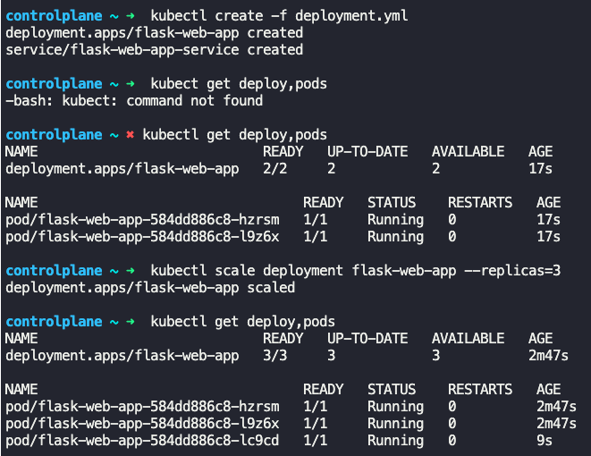
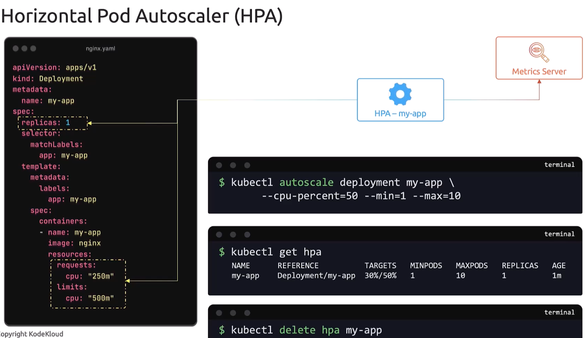
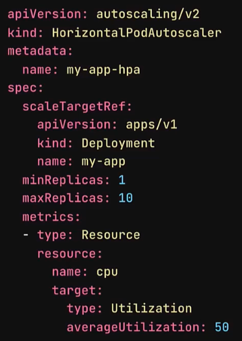

### Horizontal Pod Autoscaler (HPA)

- Manual way to horizontally scale a workload
	- `kubectl scale deployment <name_of_deployment> --replicas=<increased_#_of_replicas>`
	- 
- HPA is automated way
	- It continuously monitors metrics, via "metrics-server", such as cpu and memory usages.
	- When the metrics hits the limit set for a pod/container, it automatically increases the number of pods/containers
	- If the cpu/memory usage drops, it automatically deletes pods/containers
- Configure HPA imperative way
	- `kubectl autoscale deployment <name_of_deployment> --cpu-percent=50 --min=1 --max=10`
	- `cpu-percent` - Defines the cpu threshold, beyond which autoscaling will kick in
	- `min` - Defines the minimum number of pods
	- `max` - Defines the maximum number of pods
	- HPA monitors `spec:` -> `resources:` in the pod definition file. If the threshold configured is breached, it will crate new pods/containers
	- `kubectl get hpa`
		- Shows status of HPA
		- `Target` shows (current usage %)/(threshold%)
	- `kubectl delete hpa <name_of_deployment>`
		- Deletes the HPA configured
	- 
- Configure HPA declarative way
	```
	apiVersion: autoscaling/v2
	kind: HorizontalPodAutoscaler
	metadata:
	  name: my-app-hpa
	spec:
	  scaleTargetRef:
	    apiVersion: apps/v1
	    kind: Deployment
	    name: my-app
	  minReplicas: 1
	  maxReplicas: 10
	  metrics:
	  - type: Resource
	    resource:
	      name: cpu
	      target:
	        type: Utilization
	        averageUtilization: 50
    ```
	- 
	- Create the HPA definition file and save it
		- `scaleTargetRef` section contains deployment information. Needed for deploying new pods/containers while scaling
		- `minReplicas`/`maxReplicas` - Defines minimum and maximum number of instances
		- `metrics` section details the resource type to be monitored and the threshold configured for the resource


---
