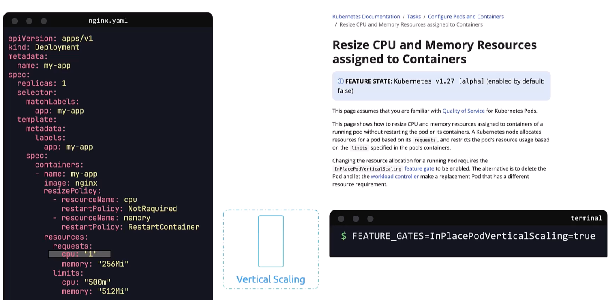

### In-place resize of pods

- If the resource `requests:` is changed, then the existing pods are killed and new pods are created with updated resource configurations
- In-place resize of pods aims to update resources available to pods without killing the pods
	- To enable set the following feature flag
	- `FEATURE_GATES=InPlacePodVerticalScaling=true`
	- Then specify the restart policy, say if cpu resources are changed no restart required, and if memory resources are changed then restart is required
```
apiVersion: apps/v1
kind: Deployment
metadata:
  name: my-app
spec:
  replicas: 1
  selector:
    matchLabels:
      app: my-app
  template:
    metadata:
      labels:
        app: my-app
    spec:
      containers:
        - name: my-app
          image: nginx
          resizePolicy:
            - resourceName: cpu
              restartPolicy: NotRequired
            - resourceName: memory
              restartPolicy: RestartContainer
          resources:
            requests:
              cpu: "1"
              memory: "256Mi"
            limits:
              cpu: "500m"
              memory: "512Mi"
```




---
