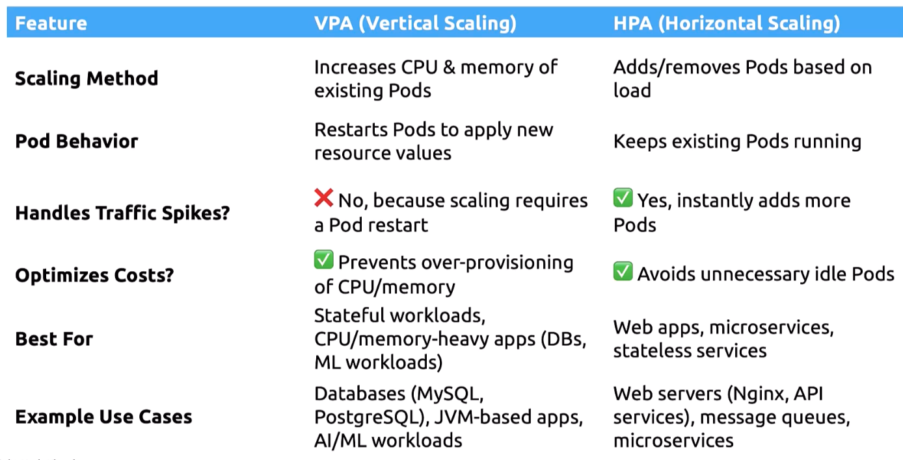

### Vertical Pod Autoscaler (VPA)

- To manually scale the pod vertically, i.e by increasing resources to pods/containers, run
	- `kubectl edit deployment <name_of_deployment>`
	- Change the resources in the definition file, and save and exit
	- This will kill the existing pod and create new pod with increased resources
- VPA automatically increases the resources assigned for pods
	- Monitors metrics of pods using "metrics-server"
- VPA does not come build-in, must be deployed
	- `kubectl apply -f https://github.com/kubernetes/autoscaler/releases/latest/download/vertical-pod-autoscaler.yaml`
	- Check if VPA is deployed properly
		- `kubectl get pods -n kube-system | grep vpa`
	- 
- 3 components of VPA
	- VPA recommender
		- Responsible for continuously monitoring resource usage from "metrics-server"
		- Provides recommendation on optimal cpu and memory values
	- VPA updater
		- Detects pods that are running with sub-optimal resources and evits/terminates them when an update is needed
		- VPA updater takes recommendation from VPA recommender
	- VAP admission controller
		- Responsible for pod creation process
		- Uses the recommendation from VPA recommender
		- Applies the recommended cpu and memory values to new pods
- Create VPA
	- VPA can only be created in declarative way
	```
	apiVersion: autoscaling.k8s.io/v1
	kind: VerticalPodAutoscaler
	metadata:
	  name: my-app-vpa
	spec:
	  targetRef:
	    apiVersion: apps/v1
	    kind: Deployment
	    name: my-app
	  updatePolicy:
	    updateMode: "Auto"
	  resourcePolicy:
	    containerPolicies:
	    - containerName: "my-app"
	      minAllowed:
	        cpu: "250m"
	      maxAllowed:
	        cpu: "2"
	      controlledResources: ["cpu"]
    ```
    - `targetRef:` contains details of the deployment which is monitored
    - `resourcePolicy:` - `containerPolicies:` contains the details of resources which are monitored
	- `updatePolicy:` There are 4 modes available
		- `Off` - Only recommends changes, but doesn't implement the changes
		- `Initial` - Changes are implemented only when the pods are created initially. No effect on existing pods
		- `Recreate` - Pods which go beyond the specified resource range are evicted/terminated
		- `Auto` - Similar to `Recreate`. But if in-place update of pod resource is configured, then it will be preferred
	- 
	- `kubectl describe vpa <name_of_vpa>`
		- Shows the recommendations
	- `kubectl top pod`
		- Gives resource usages in pods
	- `kubect get vpa`
		- Lists all VPAs
	- VPA vs HPA
	- 


---
