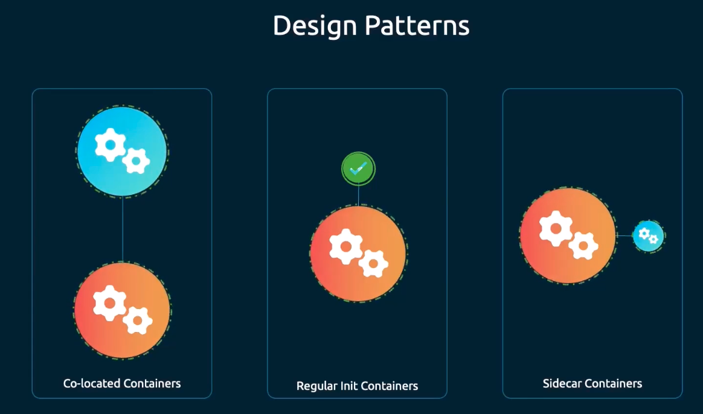
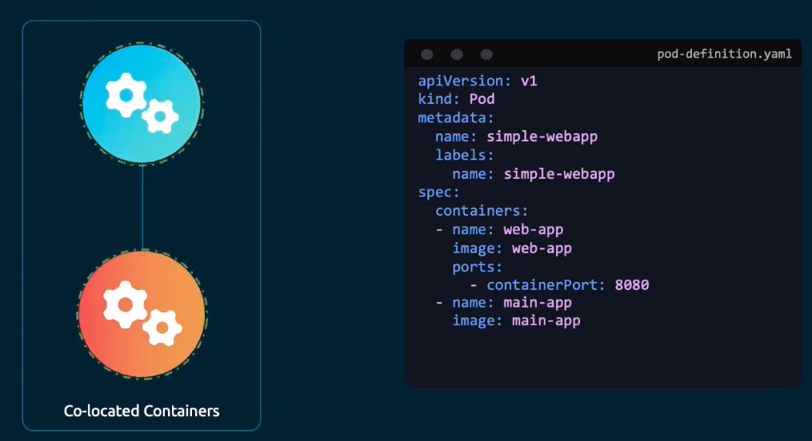
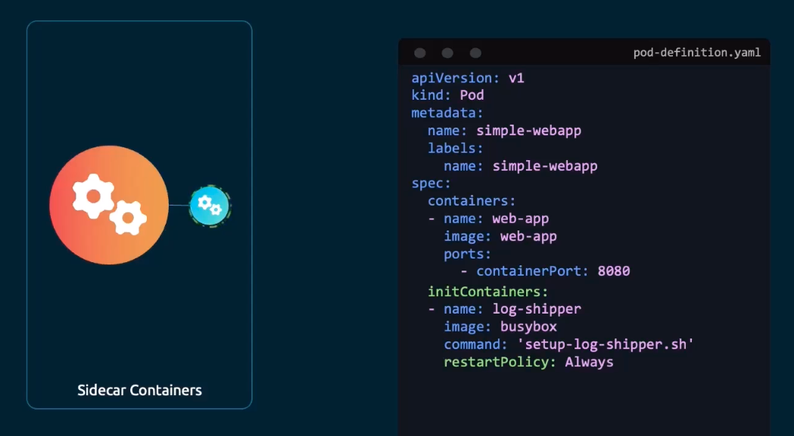

### Multi-container pod design patterns

- Co-located containers
	- Containers running ins a pod together. No differentiation on which container starts first
	- 
- Regular Init containers
	- Initialisation steps done by init container before starting the main container. Once init container finishes, the main container starts
	- 
- Side car containers
	- Setup like an init container, but continues to run throughout the lifecycle of the pod.
	- Main application starts after the sidecar container starts.
	- Sidecar container ends after the main application ends.
	- 

---
