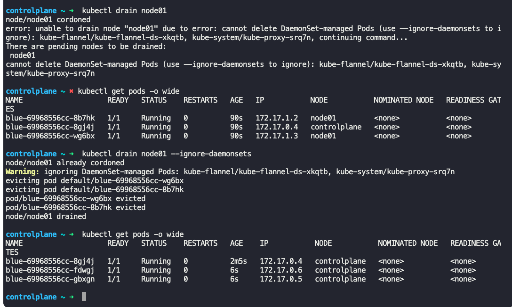
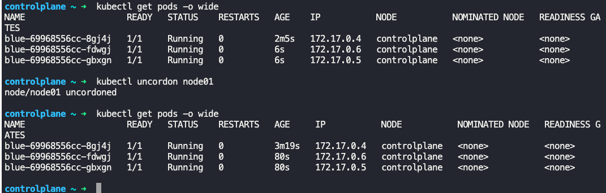
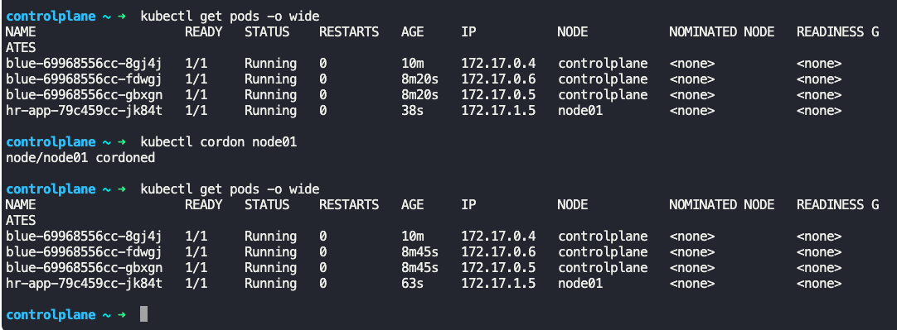

### Operating system upgrades

- When one of the nodes in a cluster goes down
	- If the pods running on the node which is down is part of replica set, then there is no user impact
		- If the pod is not part of a replica set, then the pod becomes inaccessible
	- If the node comes back online immediately, then the kubectl process starts and the pods come back online on the same node
	- If the node was down for more than 5 minutes (pod eviction timeout), then the pods are terminated from that node.
		- Kubernetes will consider the pods dead
		- If the pods were part of replica set, they will be created on a healthy node.
		- Pods not part of replica set, remain dead
		- When the node comes back up after the pod eviction timeout, it comes up blank, without any pods scheduled on it
- If you want to take a node down for maintenance purposefully, then drain the node
	- Draining the node will move the pods on the node to other nodes in the cluster
		- The pods will be gracefully terminated and recreated on the other node
	- `kubectl drain node <name_of_node>`
	- The node is cordoned and marked as un-schedule-able
	- 
- Once maintenance/reboot is finished on the node, un-cordon the node make it schedule-able
	- `kubectl uncordon <name_of_node>`
	- 
- `kubectl cordon <name_of_node>`
	- Marks the node un-schedule-able.
	- Does not drain the pods from the node

---
