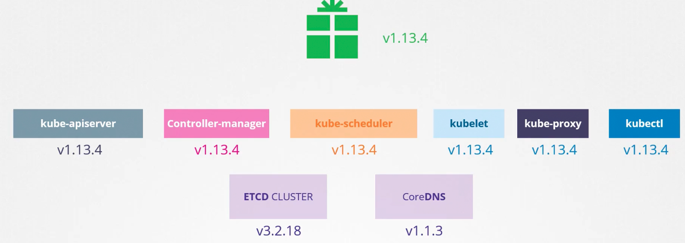

### Kubernetes Software Versions

- `kubectl get nodes`
	- Gives Kubernetes version installed
- Kubernetes version - 1.11.3
	- 1 - Major version, released on July 2015
	- 11 - Minor version - Every few months - Includes features, functionalities
	- 3 - Patch - Critical bug fixes
- Releases listed - github.com/kubernetes/kubernetes/releases
	- tar.gz - will have all the control plane components
		- Except for etcd cluster and coredns, all components will have same version number
- 
- [https://kubernetes.io/docs/concepts/overview/kubernetes-api/](https://kubernetes.io/docs/concepts/overview/kubernetes-api/)
- Here is a link to Kubernetes documentation if you want to learn more about this topic (You don’t need it for the exam, though):
	- [https://github.com/kubernetes/community/blob/master/contributors/devel/sig-architecture/api-conventions.md](https://github.com/kubernetes/community/blob/master/contributors/devel/sig-architecture/api-conventions.md)
	- [https://github.com/kubernetes/community/blob/master/contributors/devel/sig-architecture/api_changes.md](https://github.com/kubernetes/community/blob/master/contributors/devel/sig-architecture/api_changes.md)

---
