### Cluster Upgrade Introduction

- All control plane components need not be at the same version
	- None of the components can be of greater version than that of kube-apiserver
	- controller-manager and kube-scheduler can be of same version as kube-apiserver or a version lower
	- kubelet and kube-proxy can be of same version as kube-apiserver or upto 2 versions lower
	- Example:
		- kube-api server - 1.10
		- controller-manager and kube-scheduler - 1.9 or 1.10
		- kubelet and kube-proxy - 1.8 or 1.9 or 1.10
	- kubectl can be a version higher or a version lower or the same version as kube-apiserver
		- Ex: 1.9 or 1.10 or 1.11
- Kubernetes supports latest version (say 'x') and till 'x-2'. All other versions are unsupported
	- If the latest version is 1.13, then 1.13, 1.12 and 1.11 are supported
	- 1.10 and lower are unsupported
- Recommended way to upgrade is one minor version at a time, 1.10 to 1.11 to 1.12 etc
	- Step 1 - Upgrade the master node components
		- When master node components are getting upgraded, all Kubernetes management functionality goes down.
		- However, the application continues to function
		- Creation of pods or any `kubectl` commands will not work
	- Step 2 - Upgrade worker nodes
		- Strategy 1 - Upgrade all nodes at a time. Will have downtime
		- Strategy 2 - Upgrade one node at a time
			- Pods are moved to other nodes before the node is taken for upgrade
			- This process is repeated till all pods are upgraded
		- Strategy 3 -
			- Add new nodes to the cluster, where the newer nodes will have the upgraded Kubernetes version
			- Move the pods to the new/updated nodes and delete the old nodes
			- This is done till all worker nodes are in upgraded version
 
#### Kubeadm upgrade

- `kubeadm upgrade plan`
	- Gives details about the upgrade plan
	- Also gives command to upgrade cluster
	- Does not upgrade kubelet
- 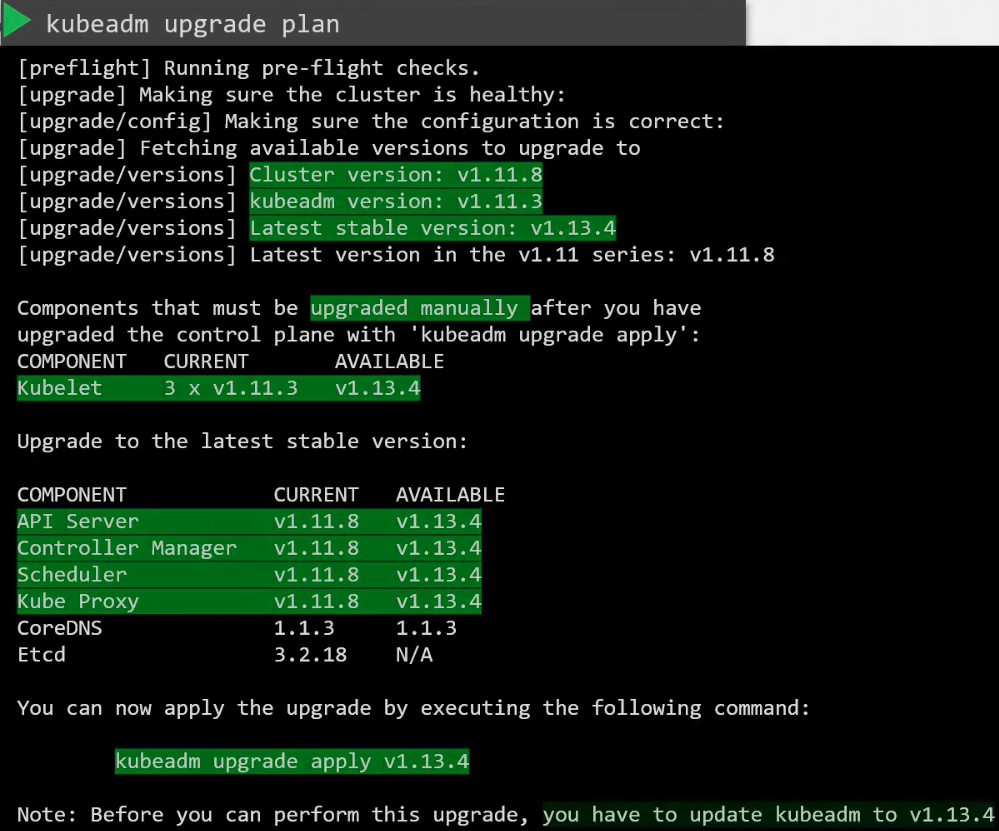
- 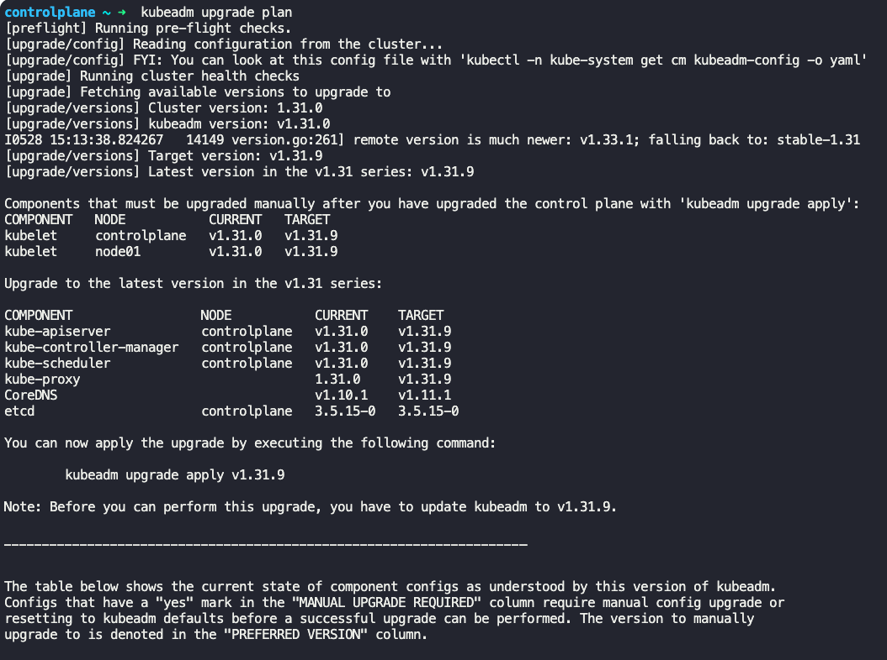
- `kubeadm upgrade apply v1.13.4`
	- Upgrades cluster to v1.13.4

#### Steps to upgrade

- https://v1-32.docs.kubernetes.io/docs/tasks/administer-cluster/kubeadm/kubeadm-upgrade/
- Run `/cat/etc/*releases*` to check the OS of nodes, and follow the appropriate Kubernetes documentation page
- Make sure you upgrade one minor version at a time
- Step 1 - Upgrade sources.list on master node
	- https://v1-32.docs.kubernetes.io/docs/tasks/administer-cluster/kubeadm/change-package-repository/
	- In `/etc/apt/sources.list.d/kubernetes.list` file update it to `deb [signed-by=/etc/apt/keyrings/kubernetes-apt-keyring.gpg] https://pkgs.k8s.io/core:/stable:/v1.32/deb/`
	- Change v1.32 to version which you want to upgrade to.
	- 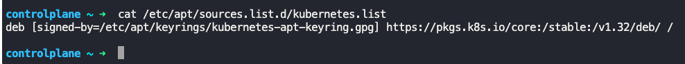
- Step 2 - Identify Kubernetes version to update to
	- Run `sudo apt update` and `sudo apt-cache madison kubeadm`
	- Choose the Kubernetes version to update to
	- 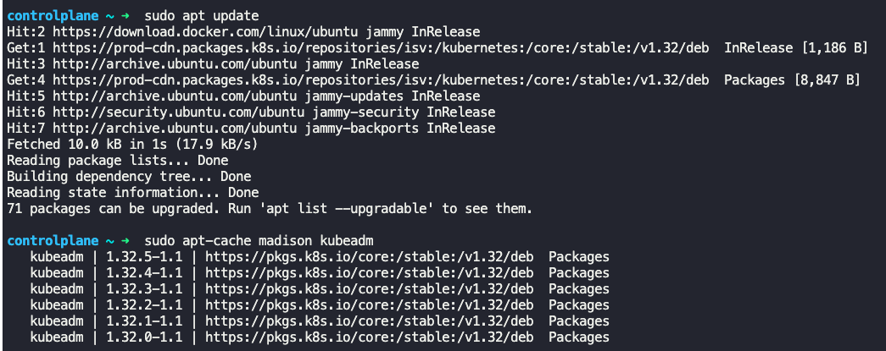
- Step 3 - Update kubeadm
	- Run `sudo apt-mark unhold kubeadm && sudo apt-get update && sudo apt-get install -y kubeadm='1.32.0-1' && sudo apt-mark hold kubeadm`
	- 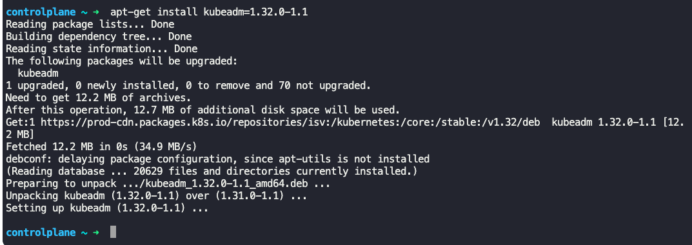
	- Verify by running `kubeadm version` 
- Step 4 - Get kubeadm upgrade plan
	- Run `sudo kubeadm upgrade plan`
	- 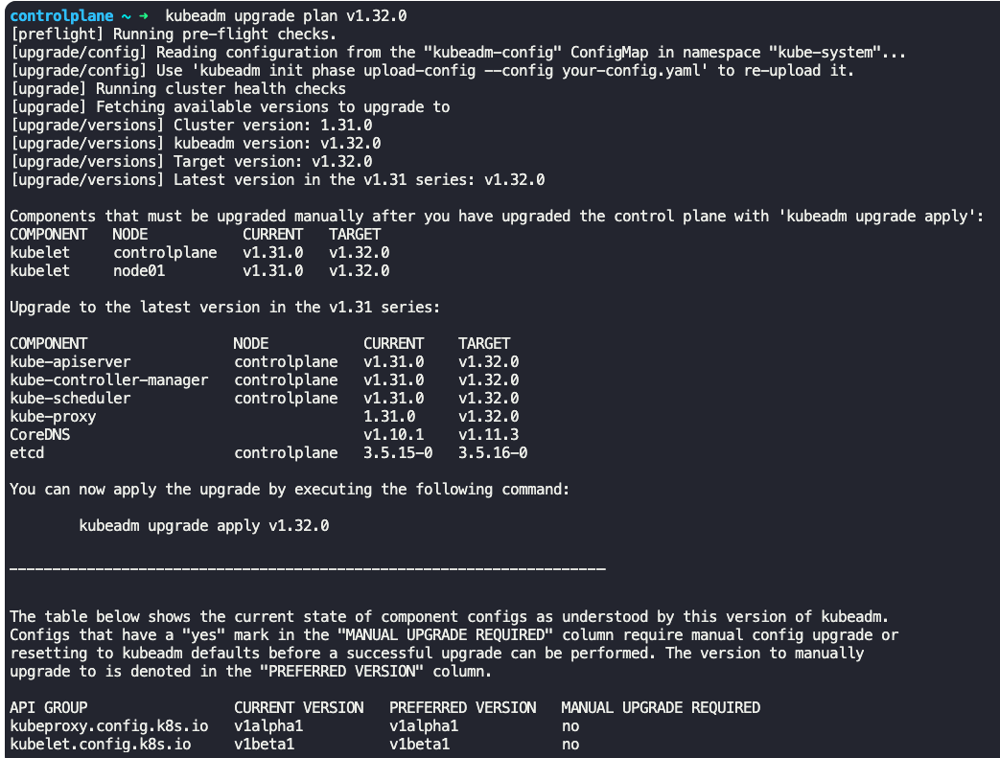
- Step 5 - Upgrade control plane node
	- Run `sudo kubeadm upgrade apply v1.32.0`
	- 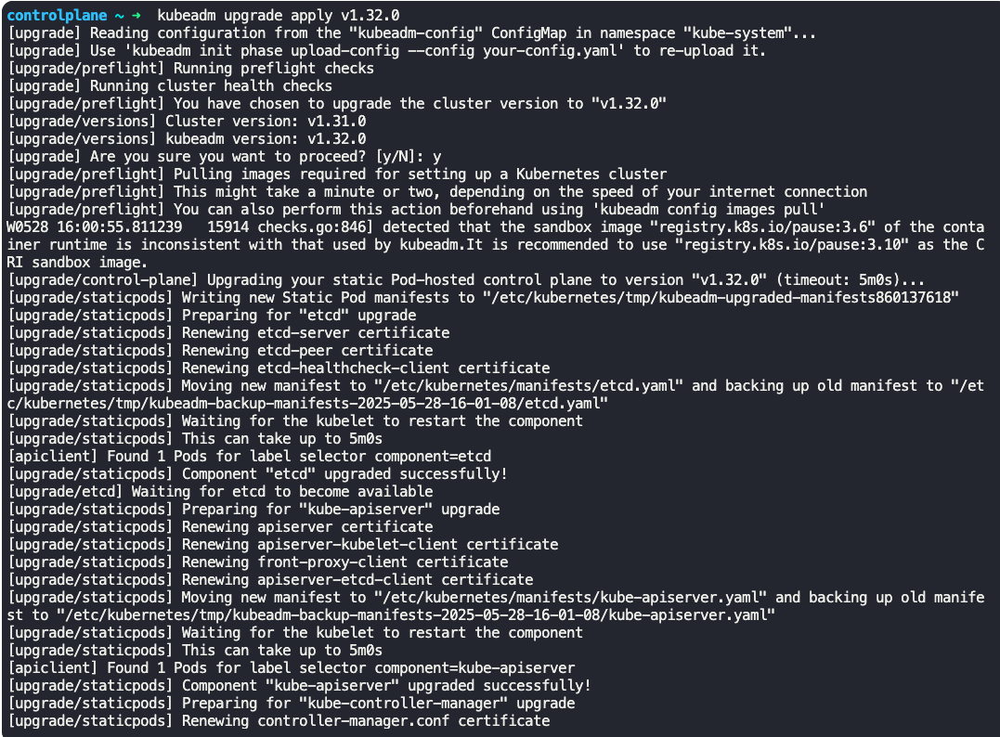
- Step 6 - Upgrade other control plane nodes
	- Run `sudo kubeadm upgrade node`
- Step 7 - Upgrade kubelet and kubectl version
	- `sudo apt-mark unhold kubelet kubectl && sudo apt-get update && sudo apt-get install -y kubelet='1.32.0-1' kubectl='1.32.0-1' && sudo apt-mark hold kubelet kubectl`
	- Restart `sudo systemctl daemon-reload && sudo systemctl restart kubelet`
	- 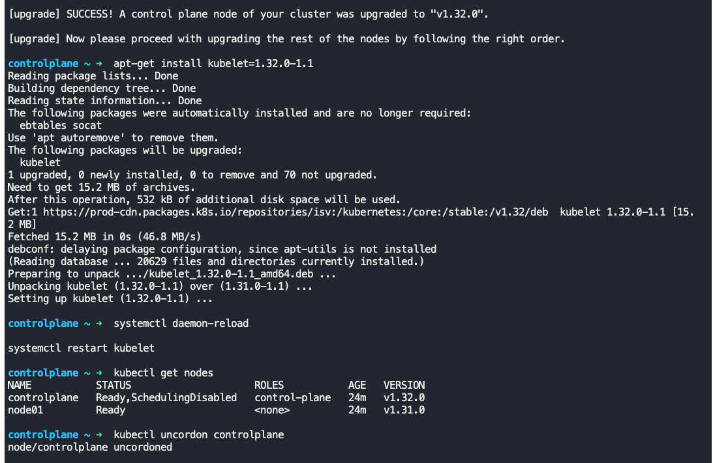
- From the following steps, we will upgrade the worker nodes - https://v1-32.docs.kubernetes.io/docs/tasks/administer-cluster/kubeadm/upgrading-linux-nodes/
- Step 8 - Update sources.list file on worker node
	-  https://v1-32.docs.kubernetes.io/docs/tasks/administer-cluster/kubeadm/change-package-repository/
	- In `/etc/apt/sources.list.d/kubernetes.list` file update it to `deb [signed-by=/etc/apt/keyrings/kubernetes-apt-keyring.gpg] https://pkgs.k8s.io/core:/stable:/v1.32/deb/`
	- Change v1.32 to version which you want to upgrade to.
	- 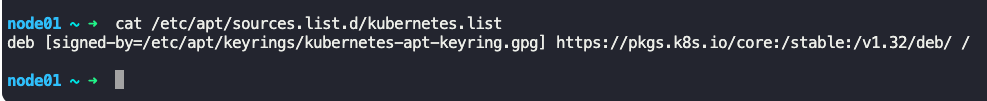
- Step 9 - Identify Kubernetes version to upgrade to for worker nodes
	- Run `sudo apt update` and `sudo apt-cache madison kubeadm`
	- 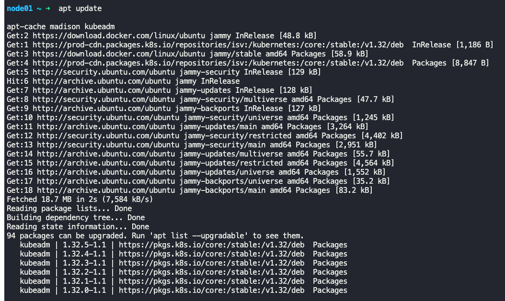
- Step 10 -Upgrade kubeadm
	- Run `sudo apt-mark unhold kubeadm && sudo apt-get update && sudo apt-get install -y kubeadm='1.32.0-1' && sudo apt-mark hold kubeadm`
	- 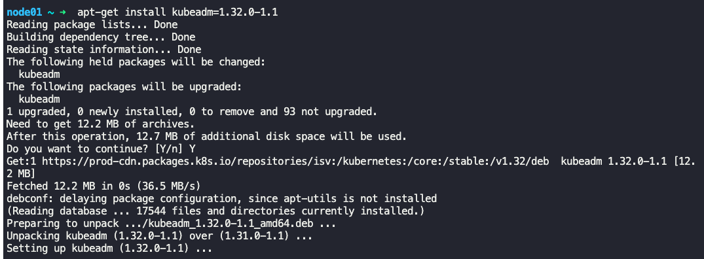
- Step 11 - Upgrade worker node
	- Run `sudo kubeadm upgrade node`
	- 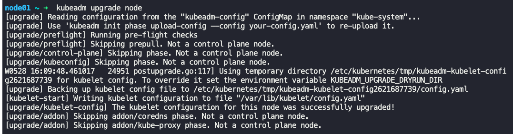
- Step 12 - Drain the node
	- Run `kubectl drain <node-to-drain> --ignore-daemonsets`
- Step 13 - Upgrade kubelet and kubectl version
	- Upgrade kubelet and kubectl version
	- `sudo apt-mark unhold kubelet kubectl && sudo apt-get update && sudo apt-get install -y kubelet='1.32.0-1' kubectl='1.32.0-1' && sudo apt-mark hold kubelet kubectl`
	- Restart `sudo systemctl daemon-reload && sudo systemctl restart kubelet`
	- 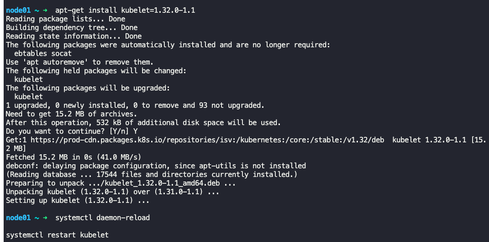
- Step 14 - Uncordon the node
	- Run `kubectl uncordon <node-to-uncordon>`
- Step 15 - Repeat above steps to upgrade each worker node

---

