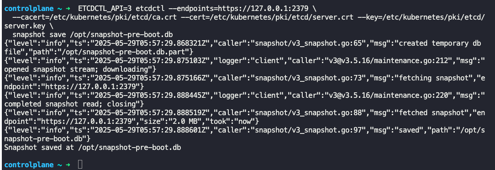
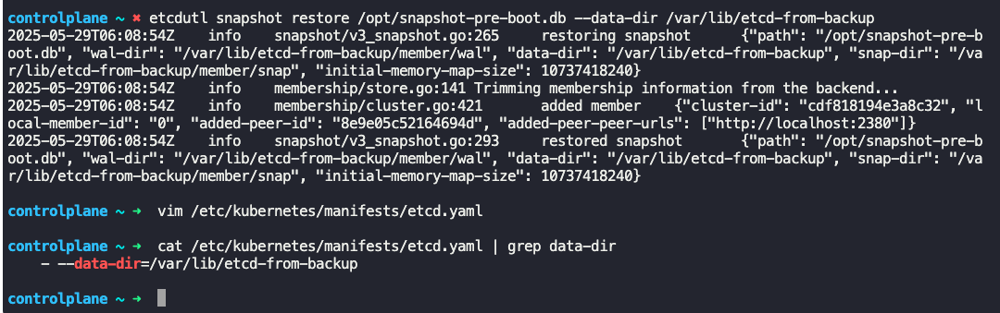

### Backup and Restore Methods

- To get the configuration of all pods, deployments and services
	- `kubectl get all --all-namespaces -o yaml > all-deploy-services.yaml`
	- Save this yaml file in github, as a backup.
	- You could deploy all the configurations from this yaml file using `kubectl create -f ...` command
	- Velero can take backup of Kubernetes cluster using Kubernetes APIs
- ETCD
	- ETCD Cluster
		- Stores information about the state of the cluster
	- ETCD service
		- ETCD service runs on all master nodes
		- ETCD service has a "--data-dir" configuration where all data is stored
		- This location can be configured to be backed up using the backup tool
	- ETCD comes with a builtin snapshot capability
		- `ETCDCTL_API=3 etcdctl snapshot save snapshot.db`
	- Status of backup
		- `ETCDCTL_API=3 etcdctl snapshot status snapshot.db`
	- To restore from backup
		- Stop kube-apiserver
			- `service kube-apiserver stop`
		- Restore from backup
			- `ETCDCTL_API=3 etdctl snapshot restore snapshot.db --data-dir <path_of_backup_file> (/var/lib/etcd-fraom-backup)`
		- Configure the etcd.service to use the above `--data-dir`
		- `systemctl daemon-reload` and `systemctl etcd restart`
		- `service kube-apiserver start`
	- Note: While running etcdctl command, always specify the cluster endpoint, cacert, cert and the key, like below
		- `ETCDCTL_API=3 etcdctl snapshot save snapshot.db --endpoints=https://127.0.0.1:2379 --cacert=/etc/etcd/ca.cert --cert=/etc/etcd/etcd-server.crt --key=/etc/etcd/etcd-server`
	- 
	- 

---

