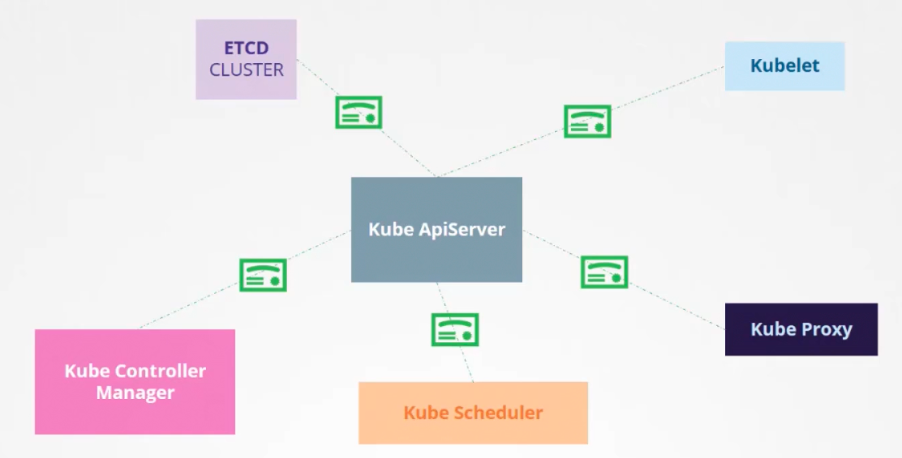

### Kubernetes security primitives

- To secure hosts/nodes hosting the cluster
	- Root access must be disabled
	- Password based authentication must be disabled
	- SSH key based authentication must be enabled
- If the hosts/nodes are compromised, everything is compromised
- `kube-apiserver` is at the heart of Kubernetes
	- Controlling access to it is paramount
	- Authentication mechanism - who can access cluster /`kube-apiserver`?
		- Username/password in static files
		- Username/tokens in static files
		- Certificates
		- External authentication providers, like LDAP
		- Service accounts for machines
	- Authorization mechanism - wha can they do once provided access to cluster/`kube-apiserver`?
		- RBAC
		- ABAC
		- Node authorization
		- Webhook mode
- All communication between various Kubernetes components such as between `ETCD cluster` and `kube-apiserver`, `kubelet` and `kube-apiserver`, are secured using TLS certificates
- 
- By default all pods can access all other pods within the cluster
	- We can restrict access between them using network policies

---
