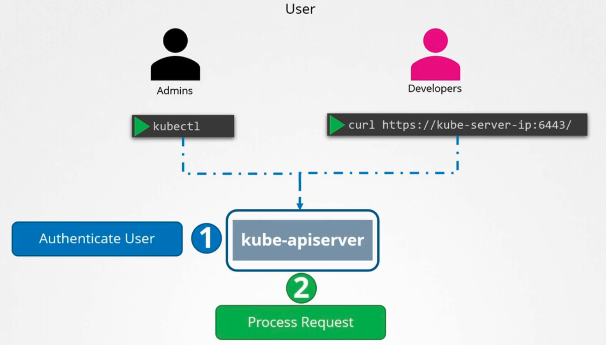
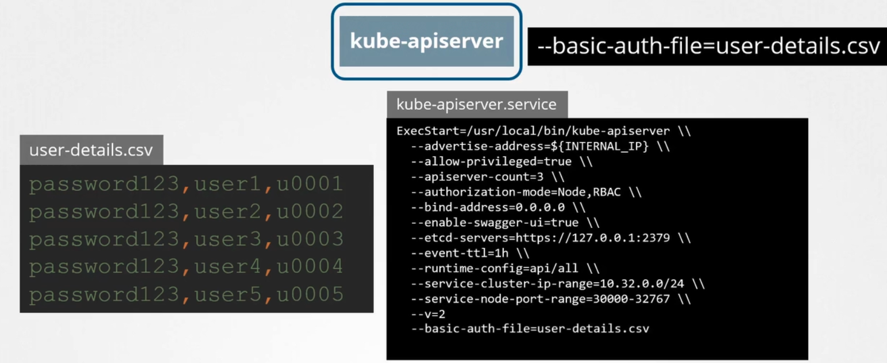
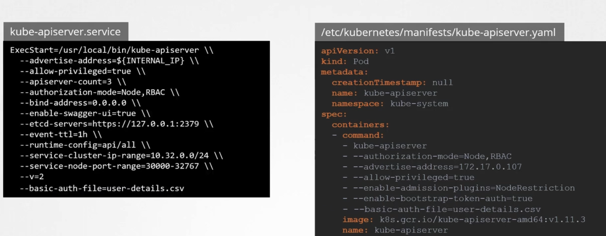
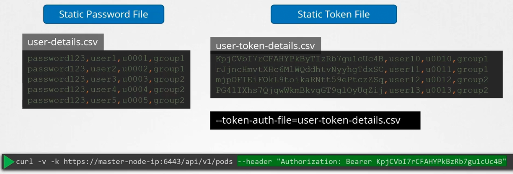

### Authentication

- Different types of users
	- Administrator - to deploy and manage clusters
	- Developers - to test application on cluster
	- End users - access application hosted on cluster
	- Bots - 3rd party applications for integrations
- Need to secure access to cluster using authentication mechanisms
- Typically, authentication of application end users are taken care by application itself internally
	- So, this is not related to authentication into clusters and its components
- Administrator and Developer types of users are typically human users
- Bots use service accounts for integration
- Kubernetes typically does not maintain users, and relies on file with user details or certificates
- All user access is managed by `kube-apiserver`, for requests both via `kubectl` tool and API call
	- `curl https://kube-server-ip:6443/` send an API call
		- `kube-apiserver` authenticates the request before processing it
	- `kube-apiserver` needs either a 
		- static file with a list of username and password
		- static file with a list of username and token
		- certificates
		- 3rd party identity service, like LDAP etc
	- Static password file
		- is in .csv format
		- has 4 columns -> password, username, user ID, groups
- 
- To have `kube-apiserver` perform authentication, pass the file containing passwords/tokens, as an option to `kube-apiserver` service
	- `--basic-auth-file=user-details.csv`
		- If using kubeadm tool to deploy, edit `kube-apiserver.yaml` file and add the above option
	- Restart `kube-apiserver` service
- 
- 
- To send user authentication information while calling `kube-apiserver`
	- `curl -v -k https://master-node-ip:6443/api/v1/pods -u "user1:password123"`
- Similar to the password file, a static token file can be used
	- It is in .csv format
	- has 4 columns -> token, username, user ID, group
	- set `kube-apiserver` service with the parameter `--token-auth-file=user-token-details.csv`
- To send user authentication information while calling `kube-apiserver`
	- `curl -v -k https://master-node-ip:6443/api/v1/pods --header "Authorization:Bearer <token>"`
- 
- Note: Storing usernames, password and tokens in static files is not a recommended approach

---
