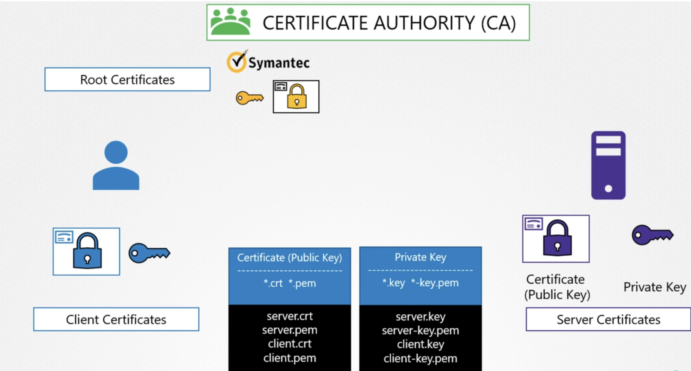
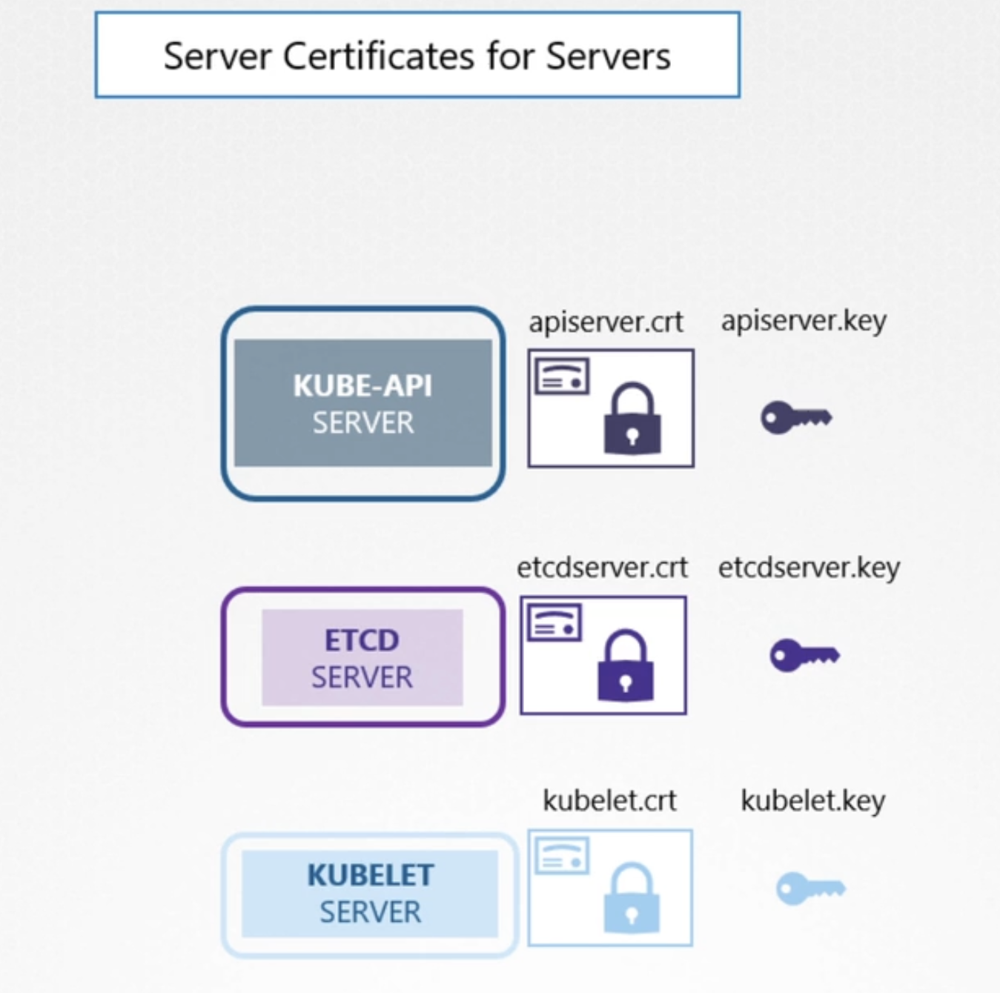
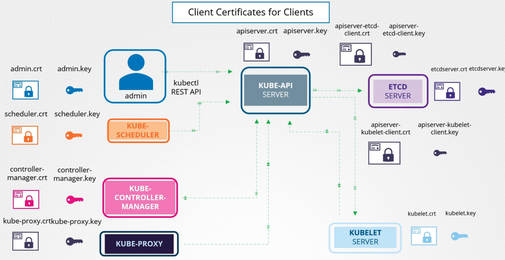
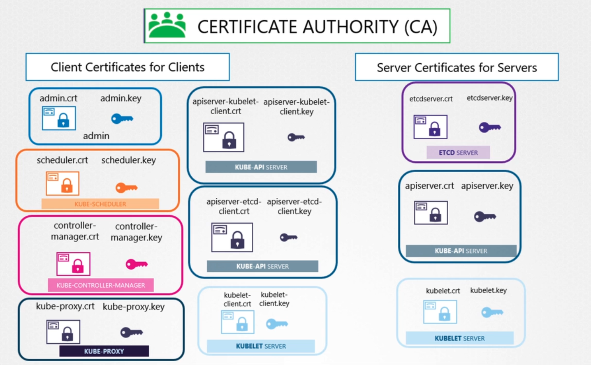

### TLS in Kubernetes

- Different types of certificates
	- Root certificate - Public + private certificate of certificate authority
	- Server certificate - Public + private certificate configured on the server
	- Client certificate - Public + private certificate configured on the client
	- Private keys end with .key or -key.pem
	- Public keys end with .crt or .pem
- 
- All communication between different components in a cluster must be secured using TLS, using server and client certificates
- Server certificates are configured on the following components
	- `kube-apiserver` - Has a public certificate and a private key
	- `ETCD server` - Has a public certificate and a private key
	- `Kubelet server` - Has a public certificate and a private key
- 
- Client certificates are configured on the following components
	- Administrators - Administrators are clients who interact with the cluster using `kubectl` or `kube-apiserver`
		- Each administrator should be configured with a public certificate and a private key
	- `Scheduler` needs to talk to `kube-apiserver` to deploy pods
		- So `Scheduler` is configured with a public certificate and a private key
		- `Scheduler` acts as a client to `kube-apiserver`
	- `Kube-Controller-Manager` acts as a client and talks to `kube-apiserver`
		- So `Kube-Controller-Manager` is configured with a public certificate and a private key
	- `Kube-proxy` acts as a client and talks to `kube-apiserver`
		- So `Kube-proxy` is configured with a public certificate and a private key
	- As far as `ETCD server` is concerned, `kube-apiserver` is a client
		- No one else talks to `ETCD server`
		- So `kube-apiserver` uses its server certificate to talk to `ETCD server`
		- You could generate a separate public certificate + private key to talk to `ETCD server` (and not reuse the public certificate + private key for server part)
	- `kube-apiserver` also talks to `kubelet`, acting as a client
		- Similar to above, `kube-apiserver` can either us the public certificate + private key for its server portion or generate one separately for this connection
- 
- 

---
