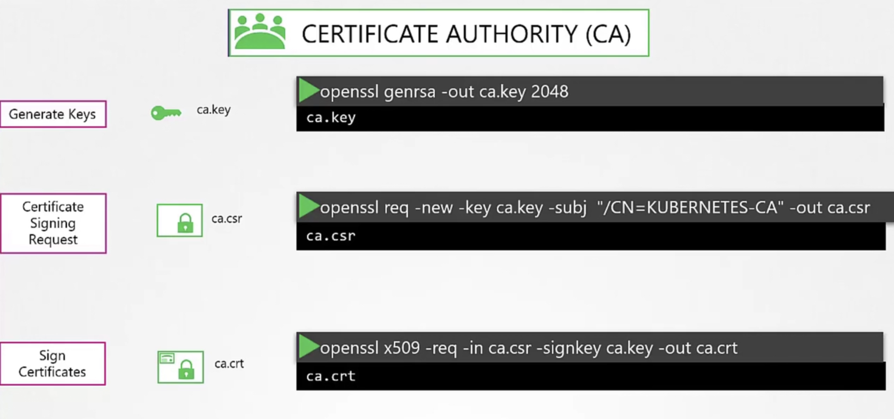
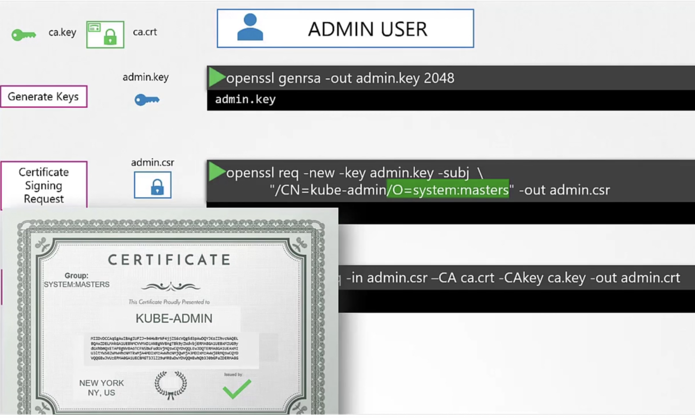
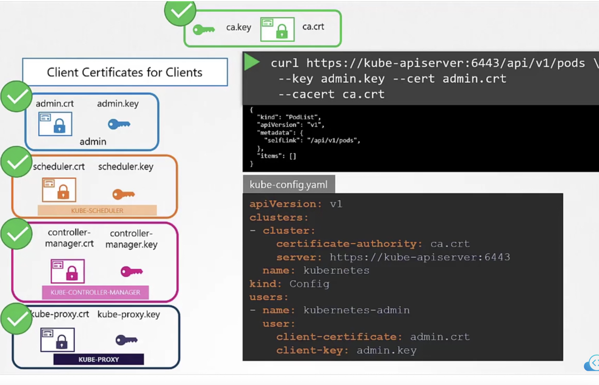
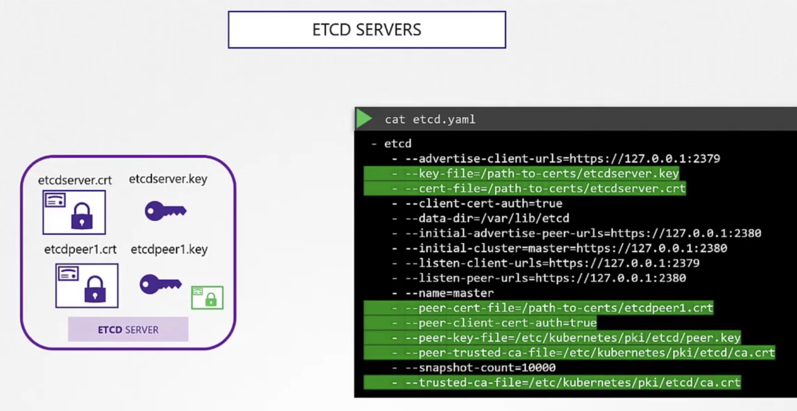
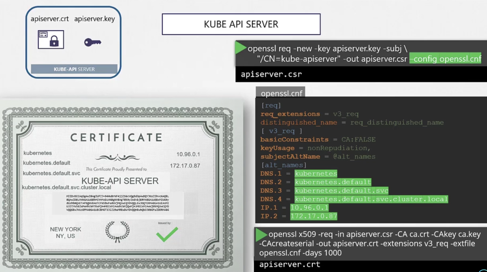
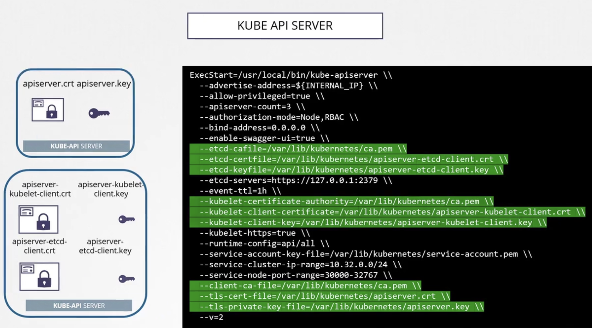
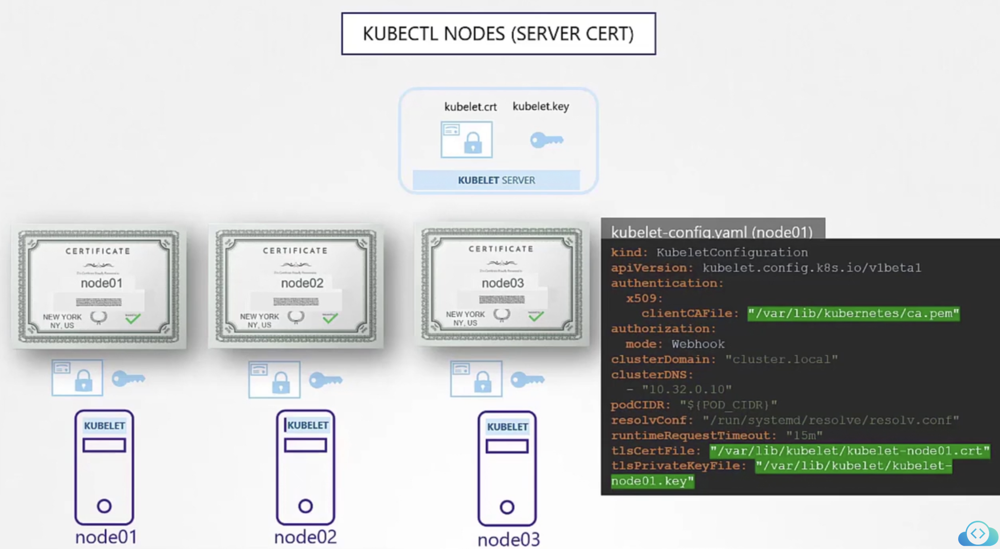
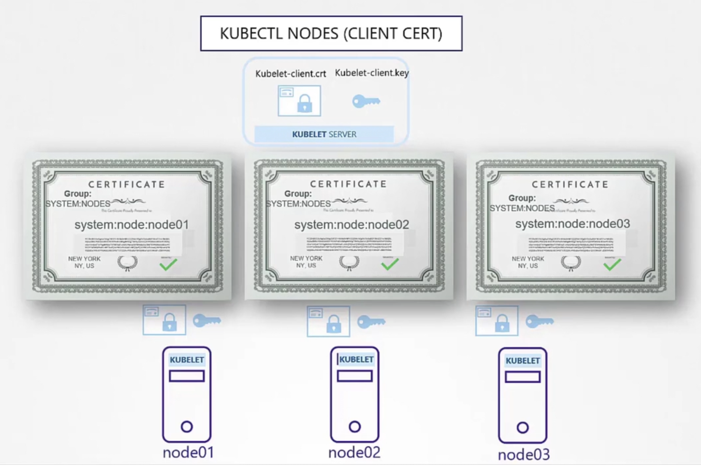

### Create Certificate Authority key and Certificate Authority certificate

- Certificate Authority (CA) is the root level certificate
- Create key
	- `openssl genrsa -out ca.key 2048`
- Create CSR
	- `openssl req -new -key ca.key -subj "/CN=KUBERNETES-CA" -out ca.csr`
- Create signed certificate
	- `openssl x509 -req -in ca.csr -signkey ca.key -out ca.crt`
- 

### Create Client Certificates

- For Administrator user
	- Create key - `openssl genrsa -out admin.key 2048`
	- Create CSR - `openssl req -new -key admin.key -subj "/CN=kube-admin/OU=system:masters" -out ca.csr`
		- `CN` can be anything.
		- `OU` indicates that the user belongs to `system:masters` group, which is an admin group
	- Create signed certificate - `openssl x509 -req -in admin.csr -CA ca.crt -CAkey ca.key -out admin.crt`
	- 
- For `Scheduler`, we need a client certificate
	- Create the client certificate for `Scheduler` using the same steps as of Administrator user
	- Since it is a system component, and not an user (like Administrator user), its name must be prefixed `system:` -> `"CN=SYSTEM:KUBE-SCHEDULER"`
- Similarly for `kube-controller-manager`, create a client certificate with `system:` prefixed in the name -> `"CN=SYSTEM:KUBE-CONTROLLER-MANAGER"`
- Similarly for `kube-proxy`, create a client certificate with `system:` prefixed in the name -> `"CN=SYSTEM:KUBE-proxy"`
- To use the client certificate to connect, say Administrator user's client certificate
	- `curl https://kube-apiserver:6443/api/v1/pods --key admin.key --cert admin.crt --cacert ca.crt`
	- We can also specify in kube-config.yaml file
	```
		apiVersion: v1
		clusters:
		- cluster:
		    certificate-authority: ca.crt
		    server: https://kube-apiserver:6443
		  name: kubernetes
		kind: Config
		users:
		- name: kubernetes-admin
		  user:
		    client-certificate: admin.crt
		    client-key: admin.key
    ```
- 
- For either client/server to validate certificates, configure the CA certificate on all


### Create Server Certificates

- For `ETCD servers`
	- Since it is deployed as cluster, each `ETCD` server needs to be configured with a certificate
	- Configure the certificate and key file locations in etcd.yaml configuration/manifest file
	- 
- For `kube-apiserver`
	- It is known by different names, like `kubernetes`, `kubernetes.default`, `kubernetes.default.svc`, `kubernetes.default.svc.cluseter.local`, `i.p` etc
	- All these names must be specified in the certificate
	- Use openssl.cnf file and specify all these alternative names
	- Configure the created certificates and keys in `kube-apiserver` configuration/manifest file
	- 
	- 
- For `kubelet` server
	- Certificates are created using the corresponding node name, as `kubelet` runs on a node
	- Specify the certificates and keys in kubelet-config.yaml file, for each node (`kubelet`)
	- 
	- To configure client certificates on `kubelet`, use name `system:node:<node_name>`
		- Nodes must be added to group `system:nodes`
	- 


---
