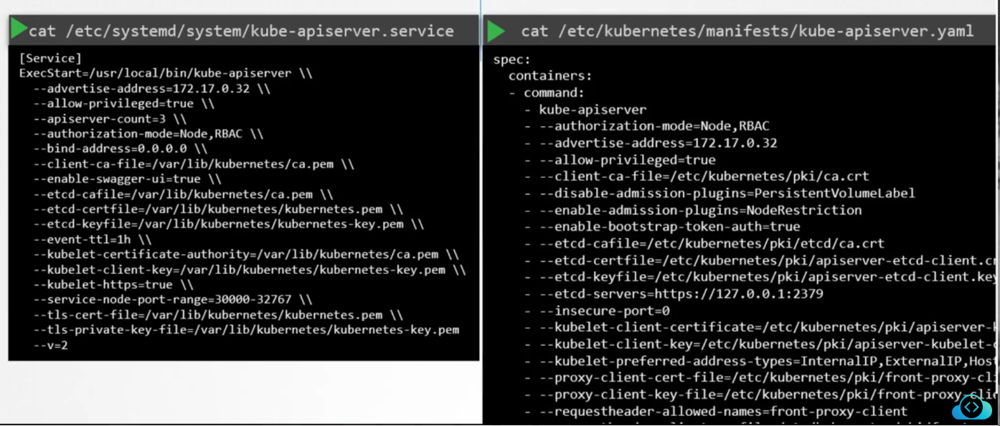

### View certificate details

- Certificates can be configured manually or using automated way such as kubeadm
- Manual
	- Create certificates and update path in `/etc/systemd/system/kube-apiserver.service`
- Automated/kubeadm
	- `/etc/kubernetes/manifests/kube-apiserver.yaml`
- 
- Create and maintain an excel sheet with component, type, certificate path, CN name, ALT names, organisation, issuer, expiration details
	- To get the certificate details to fill the above excel, if cluster setup using kubeadm, see the certificates in locations mentioned in `/etc/kubernetes/manifests/kube-apiserver.yaml` file
	- See certificate in each purpose and note it down in excel sheet
- 
- 
- To view details of a certificate
	- `openssl x509 -in /etc/kubernetes/pki/apiserver.crt -text -noout`
	- Get CN name, SAN names, issuer details from the output of above command
	- Follow the above procedure to get details about all certificates and fill the excel sheet
- To view logs
	- `kubectl logs <pod_name>`, like `kubectl logs etcd-master`
	- 
	- If `kube-apiserver` is down, the `kubectl` command won't work
		- You have to go one level down and run `docker ps -a` and get the container i.d
		- Then run `docker logs <container_id>` to view logs of the container
		- You could use `crictl ps -a` and `crictl logs <container_id>` as well
		- 
- `kube-apiserver` certificate locations
	- Certificate file for `kube-apiserver` will be mentioned under `--tls-cert-file` in `/etc/kubernetes/manifests/kube-apiserver.yaml`
		- Corresponding private key will be under `--tls-private-key-file`
	- Client certificate file used by `kube-apiserver` to authenticate to `ETCD server` is mentioned under `--etcd-cert-file` and the corresponding key is mentioned under `--etcd-key-file` in `/etc/kubernetes/manifests/kube-apiserver.yaml`
		- `--etcd-ca-file` will have the CA file for the `ETCD server`
	- Client certificate used by `kube-apiserver` to authenticate to `kubelet` is mentioned under `--kubelet-client-certificate` and the corresponding private key is mentioned under `--kubelet-client-key` in `/etc/kubernetes/manifests/kube-apiserver.yaml`
	- 
	- 
- `ETCD server` certificate locations
	- In `/etc/kubernetes/manifests/etcd.yaml`, `--cert-file` will have the server certificate to host `ETCD server`
	- The corresponding private key is specified under `--key-file`
	- `--trusted-ca-file` will have the CA certificate
		- `ETCD server` can have its own CA certificate and `kube-apiserver` can have a different CA
- We use `openssl x509 -in <cert_file> -text -noout` to get details about a certificate
	- like CN name, Alternate names, issuer, validity etc

---
