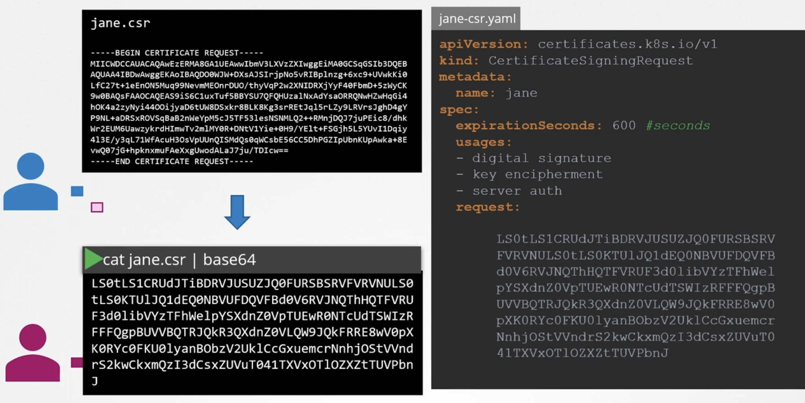
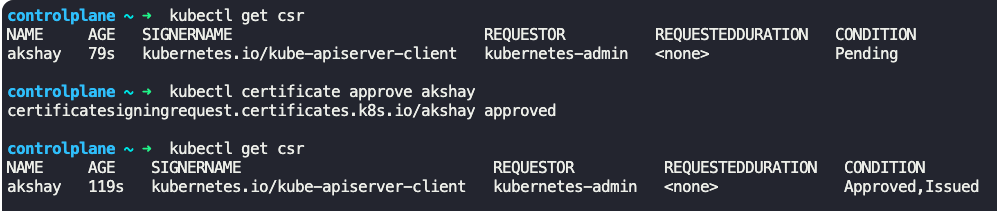
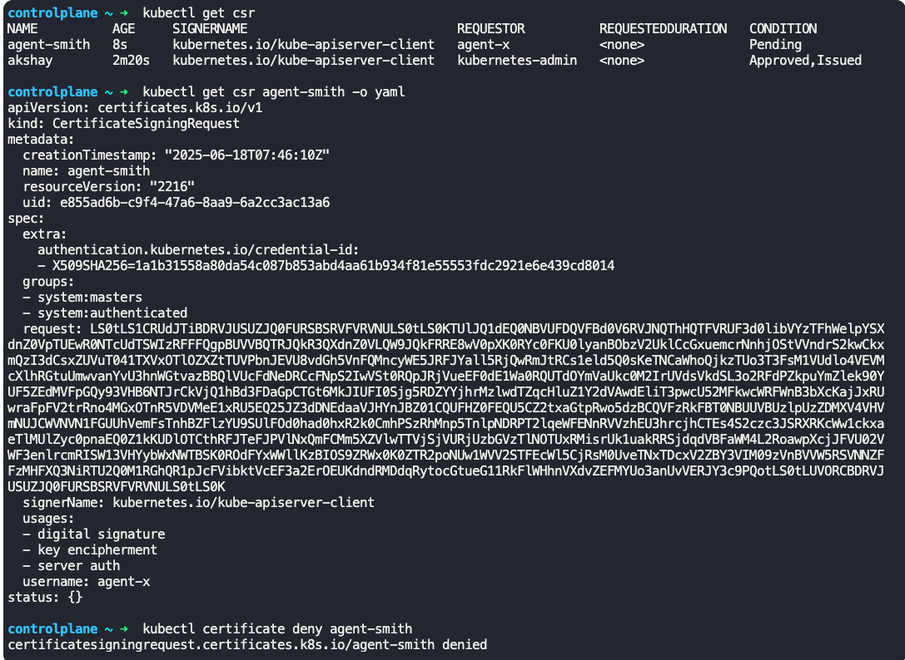
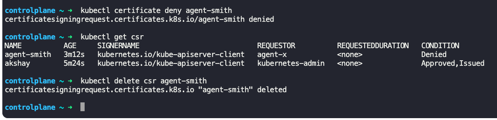
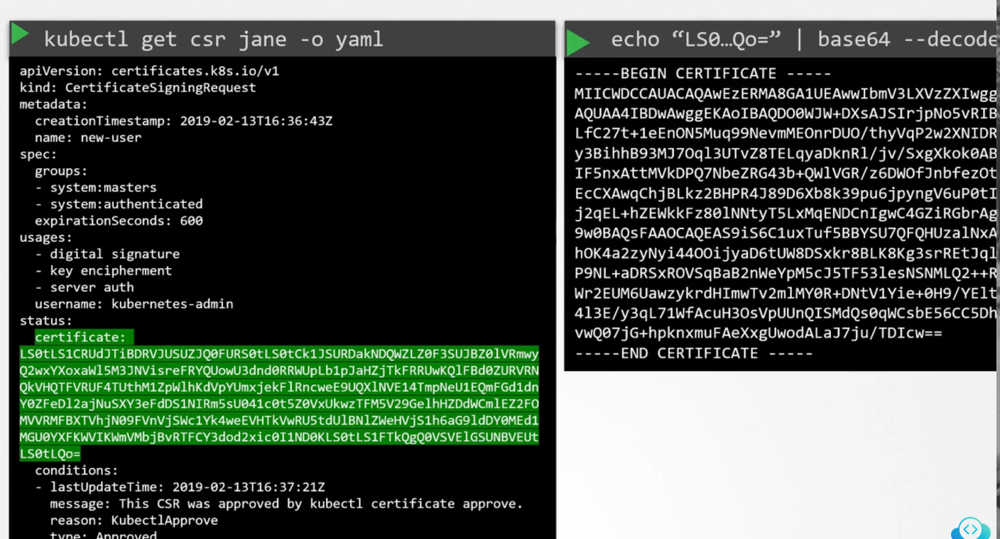

### Certificates API

- Automated way to manage certificates, rotate certificates and sign CSRs are done via Certificates APIs
- Certificates APIs are provided by Kubernetes
- Steps to approve/reject CSR
	- Step 1 - User generates a key
		- `openssl genrsa -out jane.key 2048`
	- Step 2 - User creates a certificate signing request (CSR)
		- `openssl req -new -key jane.key -subj "/CN=jane" -out jane.csr`
		- Base64 encode the CSR - `cat jane.csr | base64 --wrap=0`
	- Step 3 - Create a CSR object
		- 
		- 
	- Step 4 - List CSRs awaiting approval
		- All administrators can see all CSRs
		- `kubectl get csr`
	- Step 5 - Approve/Reject CSR
		- `kubectl certificate approve <csr_name>`
		- `kubectl certificate approve jane` -> Approve CSR
		- 
		- `kubectl certificate deny agent-smith` -> Reject CSR
		- 
		- `kubectl delete csr <csr_name>` deletes CSR
		- 
	- Step 6 - To view the certificate in yaml format
		- `kubectl get csr jane -o yaml`
		- Certificate will be in `certificate:` field in base64 encoded format
		- Decode it by `echo "<base64encoded_certificate>" | base64 --decode`
		- 
	- Step 7 - Share the decoded certificate with the user who requested the CSR
- All the certificate related operations in Kubernetes are carried out by `Controller-Manager`
	- It has components like `CSR-approving`, `CSR-signing` etc
	- `Controller-Manager` is configured with CA server's root certificate and the signing key
		- It is specified in `/etc/kubernetes/manifests/kube-controller-manager.yaml` file, under `--cluster-signing-cert-file` and `cluster-signing-key-file` parameters respectively
		- 

---
