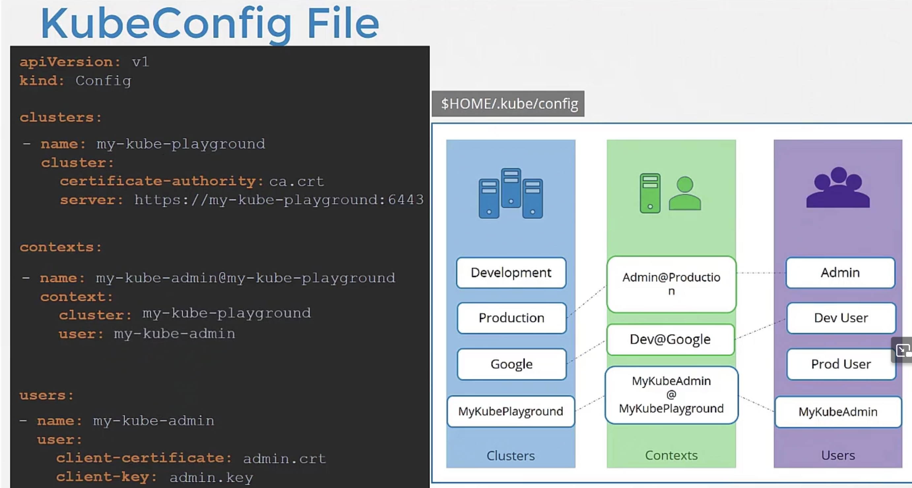
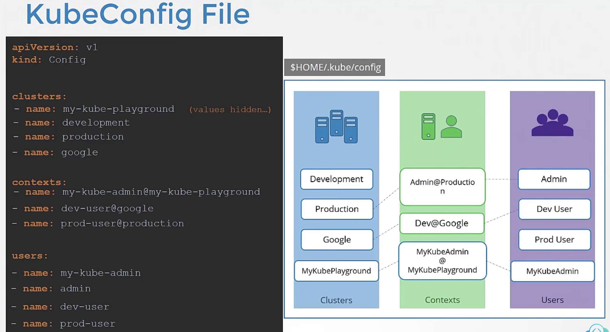
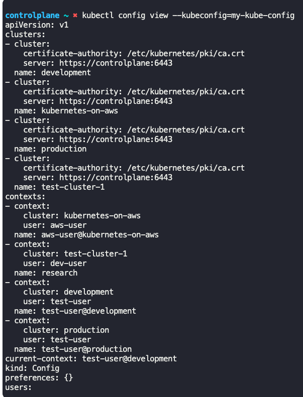
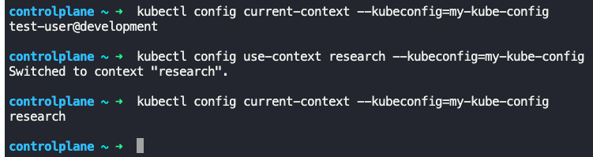
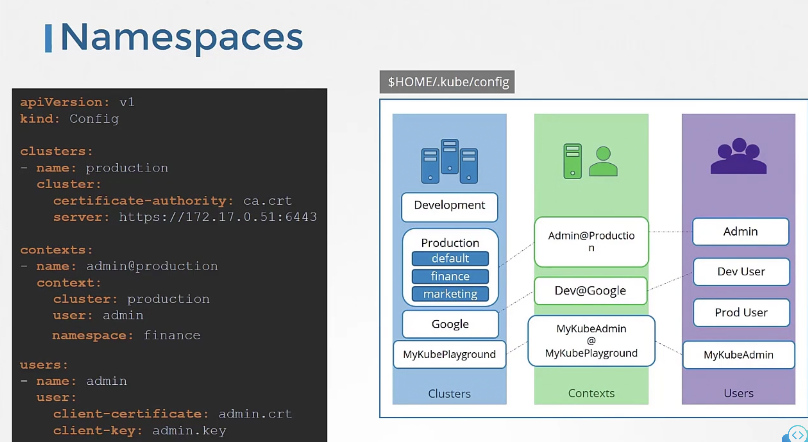
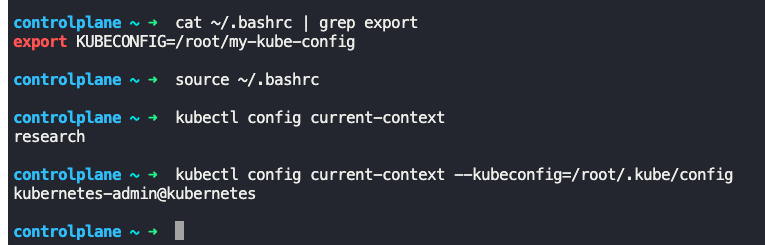

### Kubeconfig

- Use client (Administrator) certificate details to call `kube-apiserver` APIs using 2 ways
	- `curl https://my-kube-playground:6443/api/v1/pods --key admin.key --cert admin.crt --cacert ca.crt`
	- `kubectl get pods --server my-kube-playground:6443 --client-key admin.key --client-certificate admin.crt --certificate-authority ca.crt`
- Instead of mentioning all the above parameters for each command, move this parameter to a kubeconfig file, named "config"
```
--server: my-kube-playground:6443
--client-key: admin.key
--client-certificate: admin.crt
--certificate-authority: ca.crt
```
- Run `kubectl get pods --kubeconfig config`
- By default `kubectl` looks for kubeconfig file under `$HOME/.kube/config`
	- So if we create the kubeconfig filein the default location, no need to specify `--kubeconfig` parameter in the `kubectl` command
- Kubeconfig file is split into 3 sections
	- Clusters
		- Dev, Prod, Google, AWS, etc
	- Users
		- Admin, Dev_user, Prod_user, etc
	- Contexts
		- Which user account is mapped to which cluster
		- Admin@Prod, Dev_user@Google, etc
- The `--server` and the `--certificate-authority` goes into `clusters` section
- The `--client-key` and the `--client-certificate` goes into the `users` section
- There will be a `context` tie-ing the `clusters` and `users` sections
```
apiVersion: v1
kind: Config
clusters:
  - name: my-kube-playground
    cluster:
      certificate-authority: ca.crt
      server: https://my-kube-playground:6443
contexts:
  - name: my-kube-admin@my-kube-playground
    context:
      cluster: my-kube-playground
      user: mykube-admin
users:
  - name: my-kube-admin
    user:
      client-certificate: admin.crt
      client-key: admin.key
```
- 
- 
- Specify `current-context: user@cluster`, like `current-context: dev-user@google` in the kubeconfig file to set a default context
- 
- `kubectl config view` shows the config file being used
	- This shows the config file in `$HOME/.kube/config`
- `kubectl config view --kubeconfig=my-custom-config`
	- Shows the specified kubeconfig file
	- 
- To change context
	- `kubectl config use-context prod-user@production`
	- This changes the current context to prod-user@production
	- 
- Can specify namespace in kubeconfig file under `contexts` section
- 
- It is better to use full paths in kubeconfig file for certificates, like `/etc/kubernetes/pki/ca.crt` etc
- You could also specify the certificate in base64 format in kubeconfig file using `certificate-authority-data: LSo...=` field
- To know current context
	- `kubectl config current-context --kube-config=my-kube-config`
	- The above command is for a custom kubeconfig file. If using the default, no need to specify `--kube-config` parameter
- To change current context
	- `kubectl config use-context --kube-config=my-kube-config <context_name>`
	- The above command is for a custom kubeconfig file. If using the default, no need to specify `--kube-config` parameter
- To set a custom kubeconfig as default, without overwriting `$HOME/.kube/config` file
	- Go to `vim ~/.bashrc`
	- Add `export KUBECONFIG= /root/my-kube-config` (The path to file can be anything)
	- Reload bash -> `source ~/.bashrc`
	- 
- To set credentials for a user in kubeconfig file
	- `kubectl config set-credentials dev-user --client-cert=/../../.. --client-key=/../../.. --kube-config=/../../..`


---
