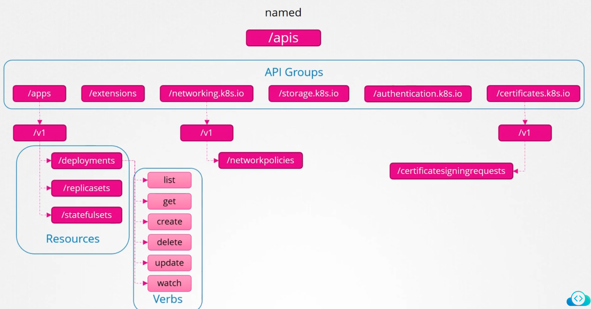
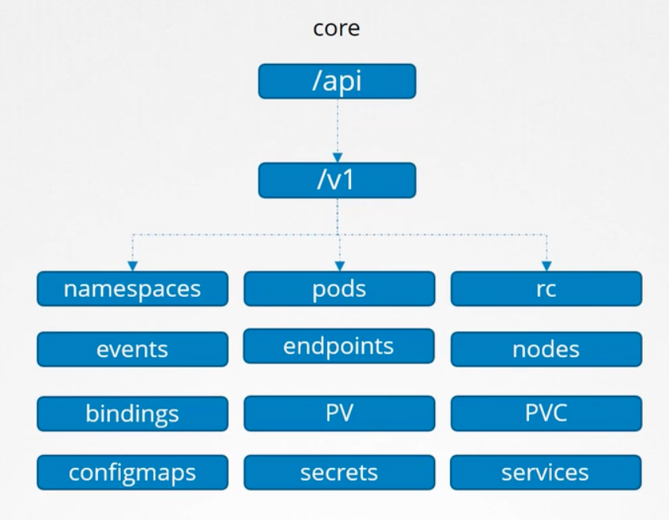

### API Groups

- Kubernetes APIs are grouped into multiple groups, such as
	- /version - Shows version of cluster
	- /api - Core functionality
	- /apis - Named, more organised, newer features here
	- /healthz and /metrics - To monitor health of cluster
	- /logs - To integrate with 3rd party logging application
- All resources in Kubernetes are grouped into different API groups
	- Top level - Core API group, Named API group
	- Under top level - One for each section
	- Under each section - Resources will be listed
	- Under each resource - Verbs will be listed
- 
- 

---

