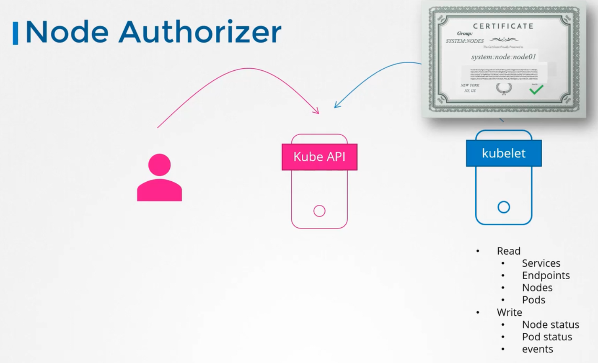
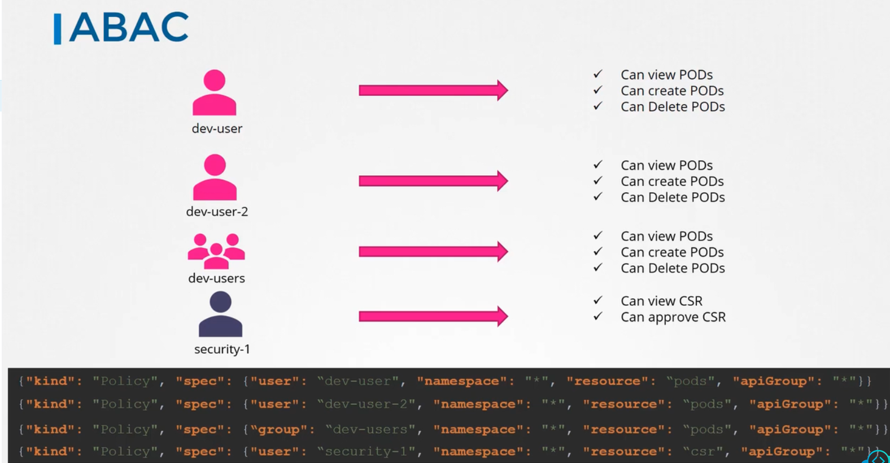
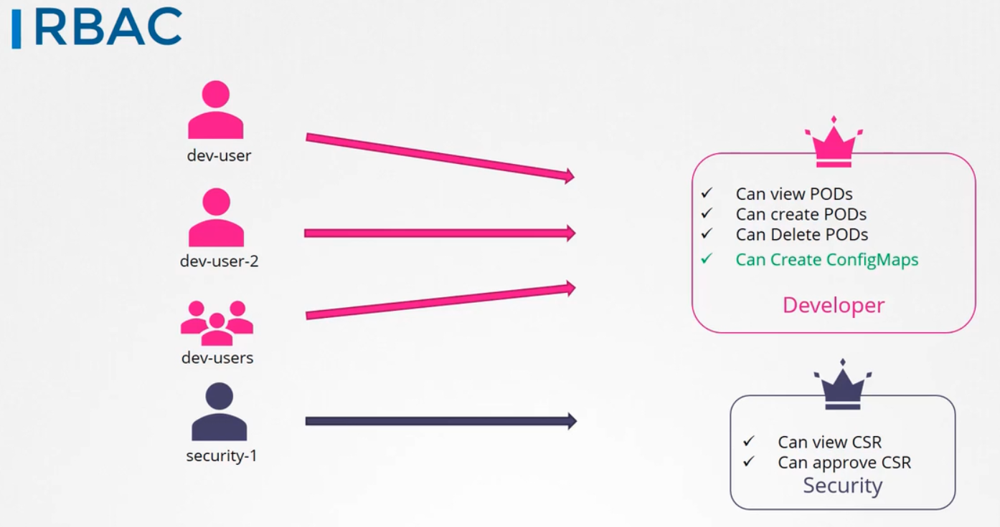
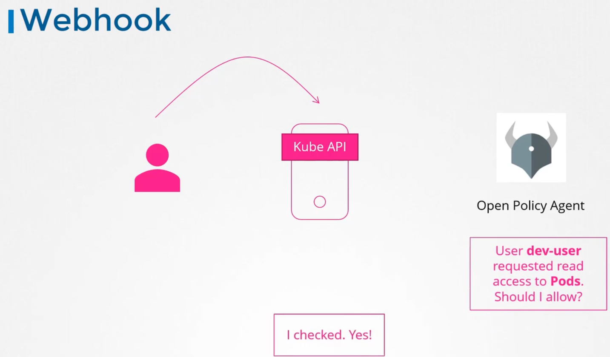
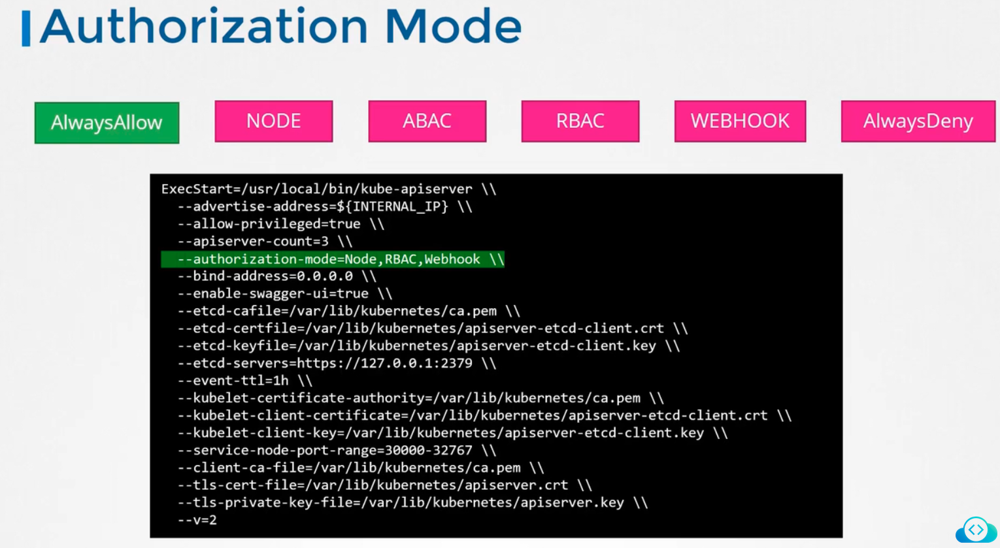
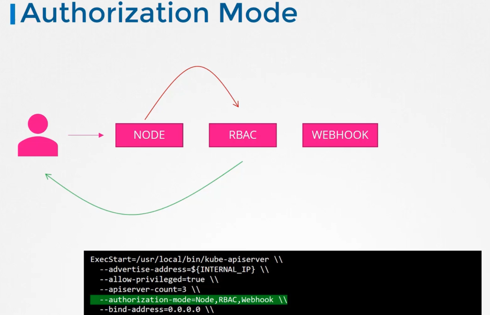

### Authorization

- There are 6 authorization mechanisms
- Node authorization
	- `kube-apiserver` services requests from users accessing cluster and kubelets, to read various resources in cluster and write the statuses
	- Node authorizer is responsible for authorizing these requests
	- Requester should have `system:node` permission to be authorised to perform these operations
	- 
- ABAC - Attribute based authorisation
	- Provide a user or a group of users with a set of permissions
	- To typically give access, we specify the user and the permission required in the policy file in json format
	- This is cumbersome to scale and maintain. Each time an entry is made, `kube-apiserver` must be restarted
	- 
- RBAC - Role based authorization
	- We create a role with set of permissions and assign the role to users
	- 
- Webhook
	- To outsource all authorization mechanisms
	- Like open policy agent can be used by `kube-apiserver` to check if the user should be allowed to do an operation or not
	- 
- Always allow
	- Allows all requests without performing any authorization checks
	- This is the default option
- Always deny
	- Denies all requests
- Modes are set using the `--authorization-mode=AlwaysAllow` option in the `kube-apiserver` service
- Multiple authorization modes can be set by comma seperated values
	- `--authorization-mode=Node,RBAC,Webhook`
	- For the request to be serviced, it has to be authorised by at least one, in the order specified
	- If a mode authorizes, the authorisation is complete
- 
- 

---
