### Role Based Access Controls

Create a role by creating a role object via a definition file
``` developer-role.yaml
apiVersion: rbac.authorization.k8s.io/v1
kind: Role
metadata:
  name: developer
rules:
- apiGroups: [""]
  resources: ["pods"]
  verbs: ["list", "get", "create", "update", "delete"]
- apiGroups: [""]
  resources: ["ConfigMap"]
  verbs: ["create"]
```
- To create the role - `kubectl create -f developer-role.yaml`
- 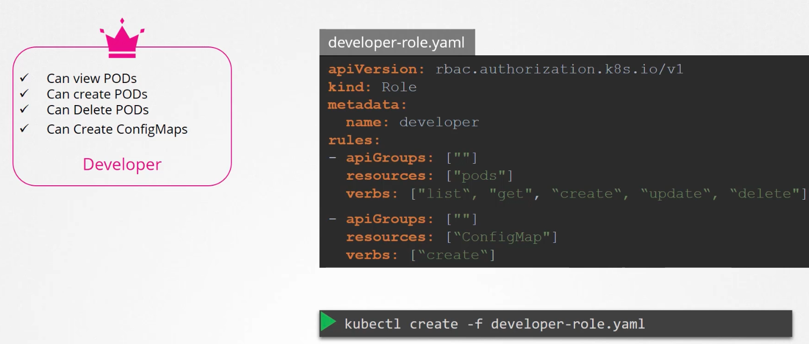

Next step is to link a user to a role
- This is done via RoleBinding object

``` devuser-developer-binding.yaml
apiVersion: rbac.authorization.k8s.io/v1
kind: RoleBinding
metadata:
  name: devuser-developer-binding
subjects:
- kind: User
  name: dev-user
  apiGroup: rbac.authorization.k8s.io
roleRef:
  kind: Role
  name: developer
  apiGroup: rbac.authorization.k8s.io
```
- To create the role binding - `kubectl create -f devuser-developer-binding.yaml`
- 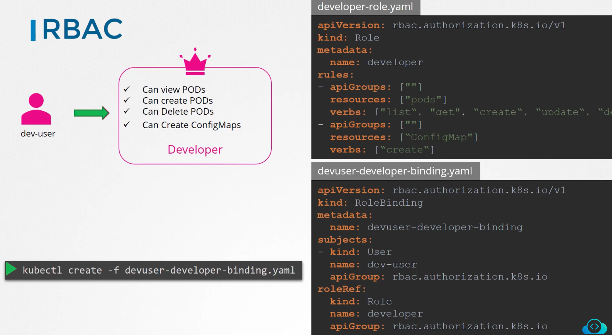
- 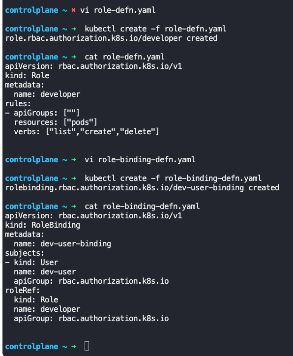
- 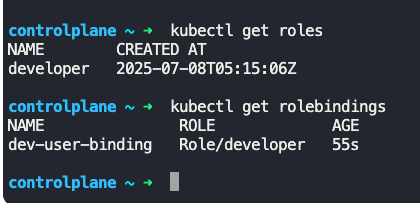

- Roles and RoleBindings fall under the scope of namespaces.
	- In the above example, `dev-user` gets access to pods and config maps within the default namespace
	- To limit access to a particular namespace, mention the same in the role definition file

- To view create roles
	- `kubectl get roles`
	- 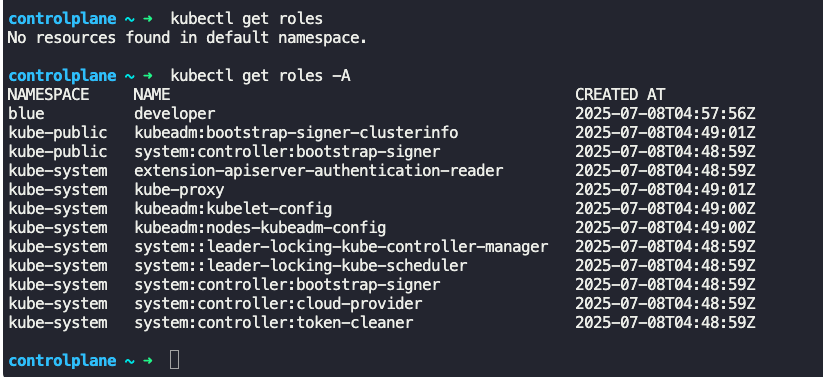
- To list RoleBindings
	- `kubectl get rolebindings`
	- 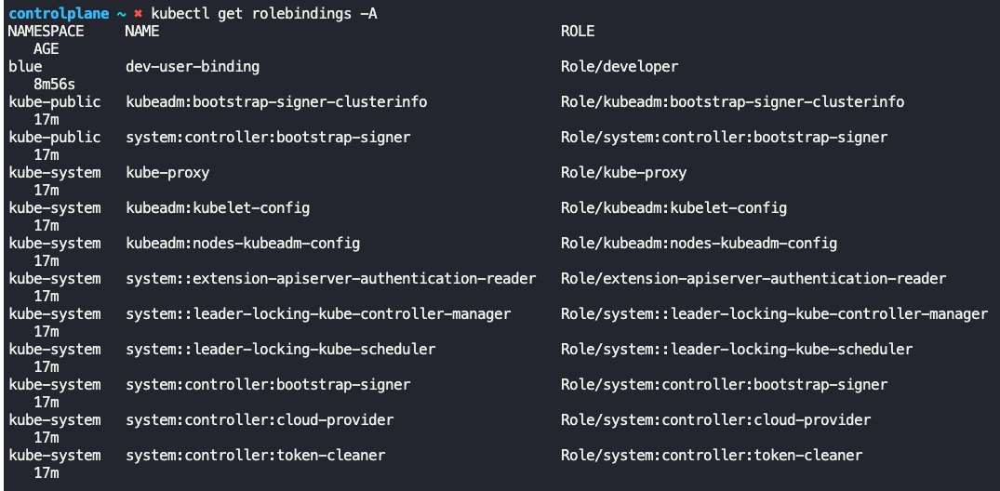
- To view more details about a role
	- `kubectl describe role <role_name>`
	- `kubectl describe role developer`
	- 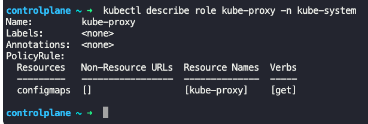
- To describe details about RoleBindings
	- `kubectl describe rolebinding <role_binding_name>`
	- `kubectl describe rolebinding devuser-developer-binding`
	- 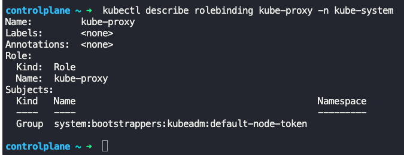
- To check access of current user
	- `kubectl auth can-i create deployments`
	- `kubectl auth can-i delete nodes`
- If you are an administrator, you can check the access for another user without authenticating as that user
	- `kubectl auth can-i create deployments --as dev-user`
	- `kubectl auth can-i create pods --as dev-user`
	- `kubectl auth can-i create deployments --as dev-user --namespace test`
	- 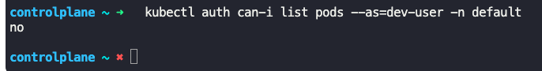

- Resource Names - Allows you to restrict access to specific resources, such as specific pods in a namespace.
	- This can be done by adding `resourceNames` under `rules:` section in role definition file

``` developer-role.yaml
apiVersion: rbac.authorization.k8s.io/v1
kind: Role
metadata:
  name: developer
rules:
- apiGroups: [""]
  resources: ["pods"]
  verbs: ["list", "get", "create", "update", "delete"]
  resourceNames: ["blue", "orange"]
```
- Here `blue` and `orange` are pod names, and this addition restricts access to these pods only
- 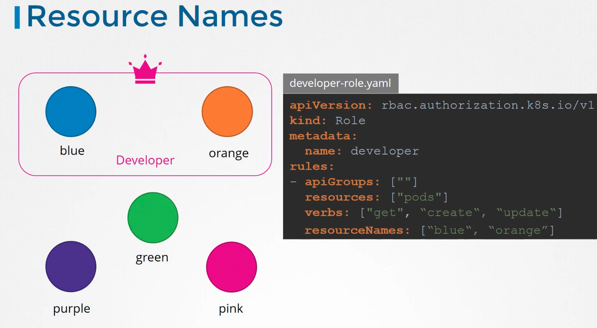
- 

- To get authorization mode
	- `cat /etc/kubernetes/manifests/kube-apiserver | grep authorization-mode`
	- `ps -aux | grep authorization-mode`
	- 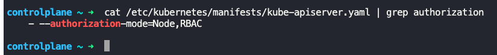

- To edit existing role
	- `kubectl edit role <role_name> -n <namespace>`
	- `kubectl edit role developer -n blue`
	- 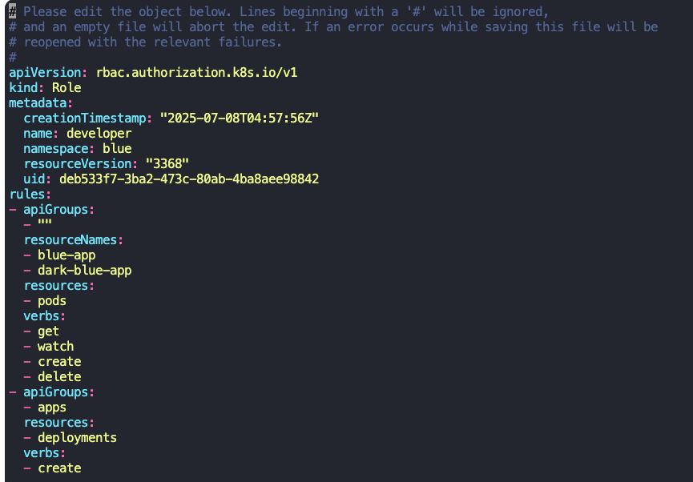
- To create a role using imperative command
	- `kubectl create role <role_name> --verb=list,create,delete --resource=pods`
- To create a RoleBinding using imperative command
	- `kubectl create rolebinding <rolebinding_name> --role=<role_name> --user=<user_name>`


---

