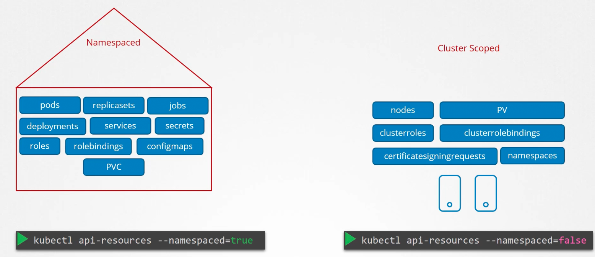
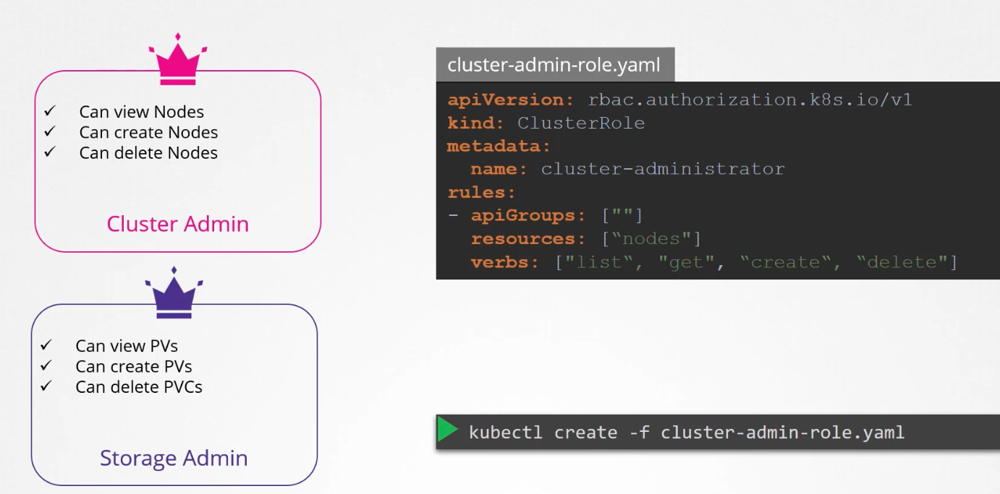
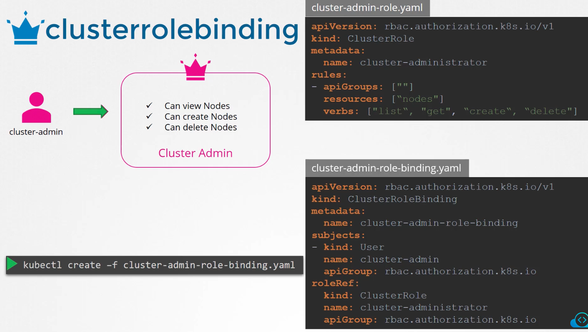
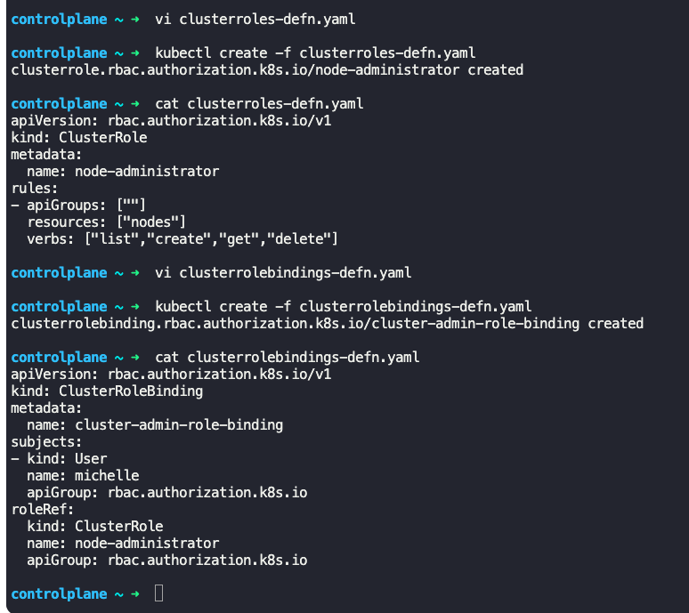
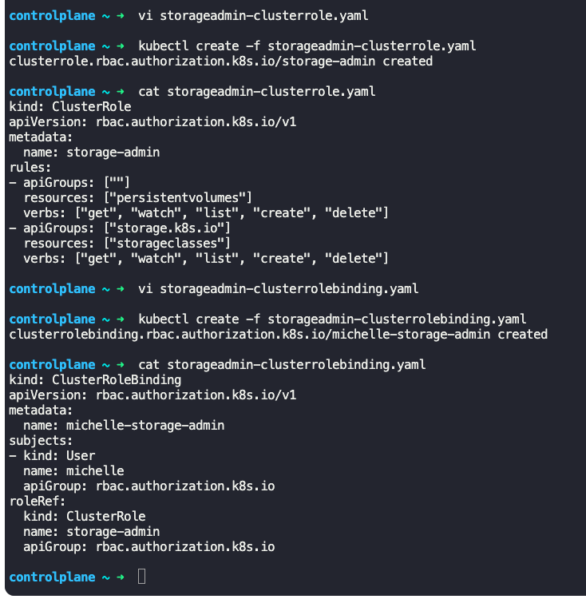
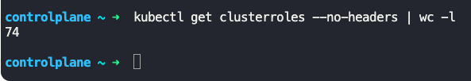
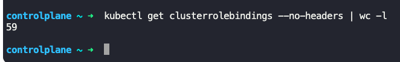
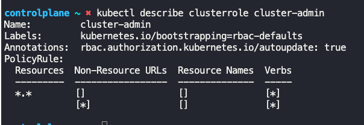
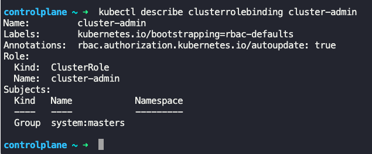
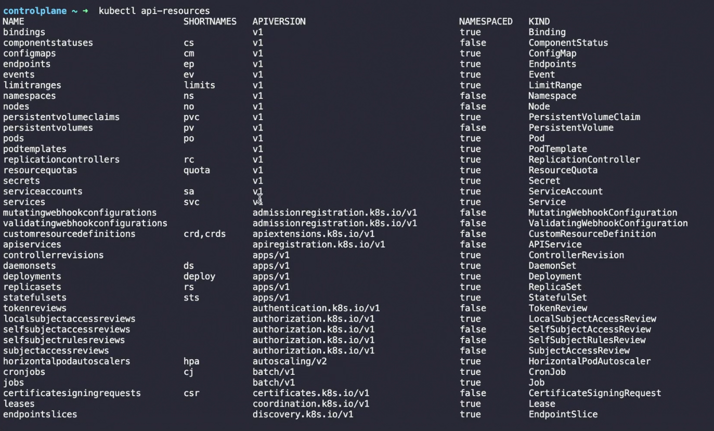

### Cluster Roles

- Resources are categorized either into Namespace or Cluster scoped
- 
- Cluster roles and cluster RoleBindings are used to authorize access to cluster wide resources, such as nodes and persistent volumes
	- They are not bound to any namespace
- Cluster roles are for cluster scoped resources, similar to roles
- Create cluster role
```
apiVersion: rbac.authorization.k8s.io/v1
kind: ClusterRole
metadata:
  name: cluster-administrator
rules:
- apiGroups: [""]
  resources: ["nodes"]
  verbs: ["list", "get", "create", "delete"]
```
- Create cluster role
	- `kubectl create -f cluster-admin-role.yaml`
- 
- Cluster RoleBinding links user to role
```
apiVersion: rbac.authorization.k8s.io/v1
kind: ClusterRoleBinding
metadata:
  name: cluster-admin-role-binding
subjects:
- kind: User
  name: cluster-admin
  apiGroup: rbac.authorization.k8s.io
roleRef:
  kind: ClusterRole
  name: cluster-administrator
  apiGroup: rbac.authorization.k8s.io
```
- Create RoleBinding
	- `kubectl create -f cluster-admin-role-binding.yaml`
- 
- 
- 
- If a cluster role is created to access pods, then the user using that cluster role will have access to all pods.
- Where as if a role is created to access pods, the user using that role will have access only to the pods in the specific namespace
- List all cluster roles
	- `kubectl get clusterroles`
	- Gives the number of cluster roles - `kubectl get clusterroles --no-headers | wc -l`
	- 
- List all cluster RoleBindings
	- `kubectl get clusterrolebindings`
	- Gives the number of cluster RoleBindings - `kubectl get clusterrolebindings --no-headers | wc -l`
	- 
- Get details about a cluster role
	- `kubectl describe clusterrole <clusterrole_name>`
	- 
- Get details about a cluster RoleBinding
	- `kubectl describe clusterrolebinding <clusterrolebinding_name>`
	- 
- To create cluster role using imperative command
	- `kubectl create clusterrole <cluster_role_name> --resource=persistantvolumes,storageclasses,nodes --verb=list,create,get,watch`
- To create cluster RoleBindings using imperative command
	- `kubectl create clusterrolebinding <cluster_role_binding_name> --user=<user_name> --clusterrole=<clusterrole_name>`
- `kubectl api-resources`
	- Lists all resources like pods, deployments, replica sets, etc, along with short names, api versions, kinds and if it is Namespaced or not
	- 


---
