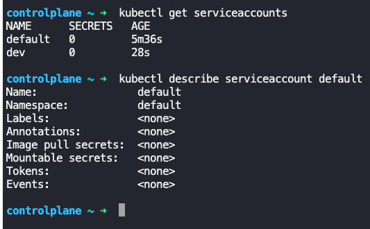
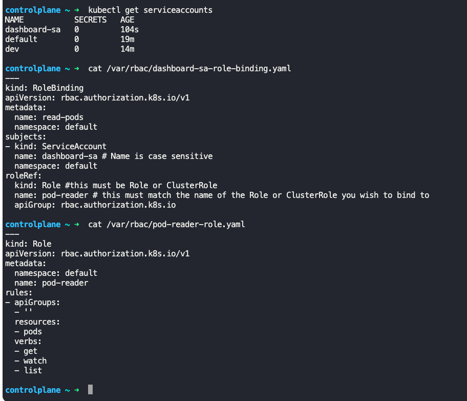
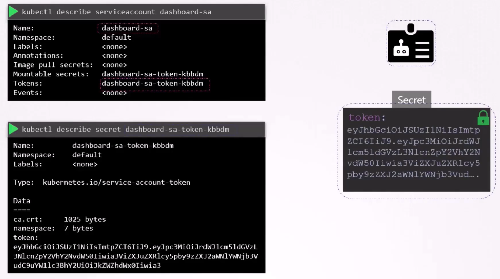
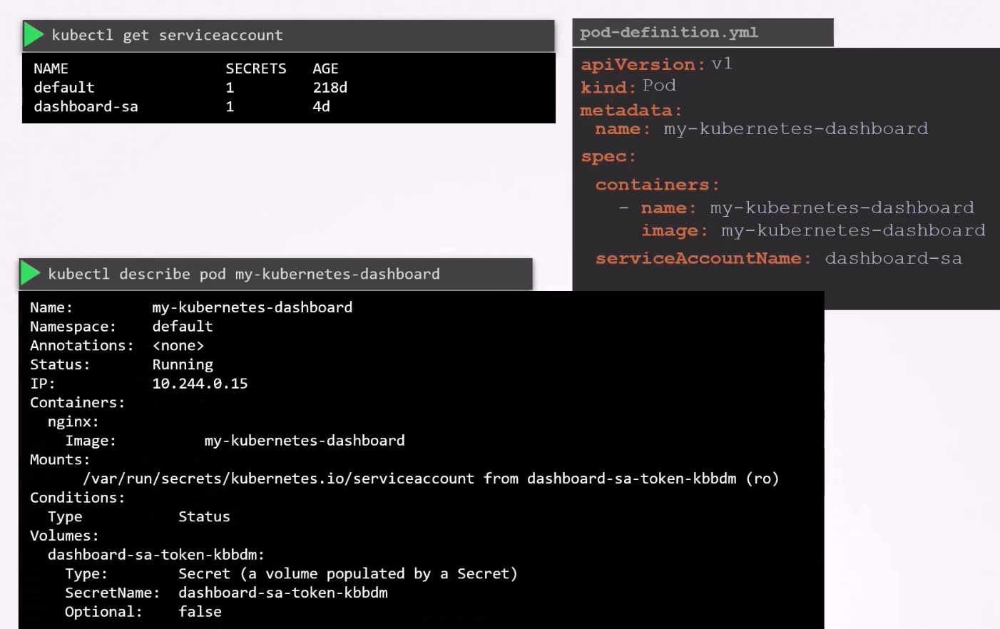
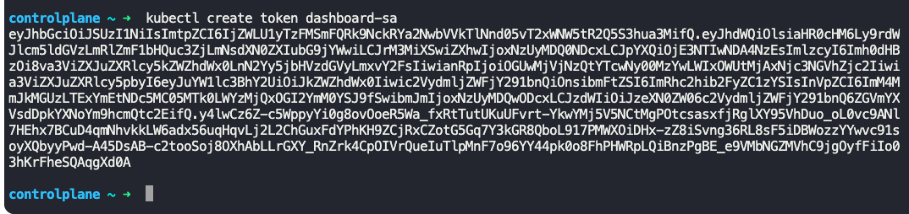
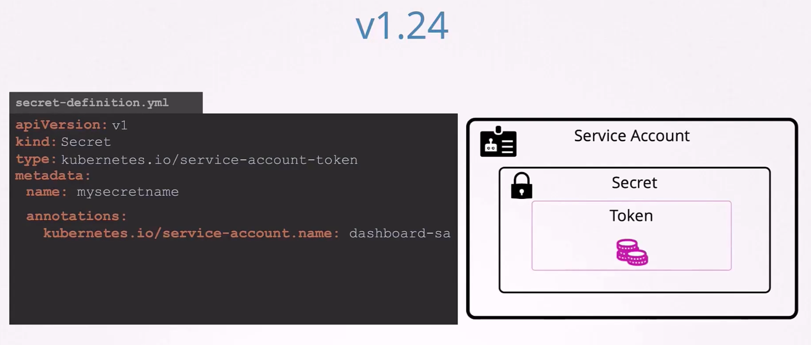
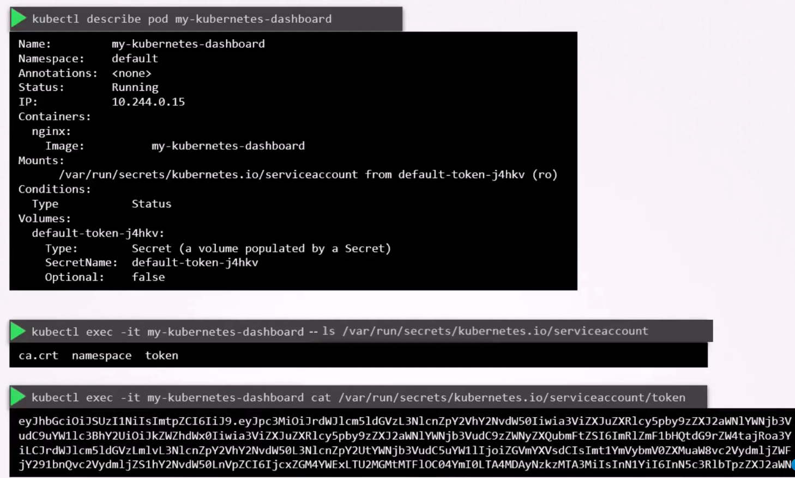

### Service Accounts

- There are 2 types of accounts in Kubernetes
	- User accounts
		- For human users
		- For administrators and developers accessing cluster
	- Service accounts
		- For machines
		- An account used by an application to interact with Kubernetes cluster
		- For Ex: A Monitoring application can use a service account to poll the cluster for performance metrics. Automated build tools can use service accounts to talk to cluster for deployment
- To create a service account
	- `kubectl create serviceaccount <serviceaacount_name>`
- To list/view service accounts
	- `kubectl get serviceaccounts`
- To describe a service account
	- `kubectl describe serviceaccount <serviceaccount_name>`
- 
- 
- When a service account is created, a token is created automatically.
	- This token is stored as secret object
	- The name of the token is shown when describing a service account
	- The secret object containing the token is linked to the corresponding service account
		- To view the secret object - `kubectl describe secret <token_name>`
	- This token can be used as authentication bearer token while making a REST call to Kubernetes API, like,
		- `curl https://192.168.56.70:6443/api -insecure --header "Authorization:Bearer eyJhbG...."`
- 
- Each namespace has its own default service account
- Whenever a default service account is created, the default service account and its token are automatically mounted to that pod as volume mount
- To have a pod use a service account (other than the default service account), modify the pod definition yaml file and give the following under `spec:`section
	- `serviceAccountName: <name_of_service_account>`
- 
- Kubernetes automatically mounts the default service account to pods, unless we explicitly specify not to. This can be done by specifying the following under `spec:` section
	- `automountServiceAccountToken: false`
- Since Kubernetes v1.24, whenever a service account is created, the corresponding token is not automatically created. To create the token, do the following
	- `kubectl create serviceaccount <serviceaccount_name>`
	- `kubectl create token <serviceaccount_name>`
	- The token created will have an expiry of 1 hour by default
- 
- If you want to create non-expiring tokens and secret objects the old way
```
apiVersion: v1
kind: Secret
type: kubernetes.io/service-account-token
metadata:
  name: mysecretname
  annotations:
    kubernetes.io/service-account.name:<serviceaccount_name>
```
- 
- To identify the service account used on a pod
	- `kubectl get pod <pod_name> -o yaml`
	- Search for `serviceAccountName`
	- Path mounted will be `mountPath: /var/run/secrets/kubernetes.io/service-account`
- 
- To edit a deployment to use a different service account
	- `kubectl edit deployment <deployment_name>`
	- Under `spec.template.spec` section, add `serviceAccountName: <serviceaccount_name>`


---
