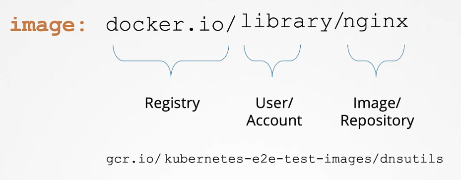
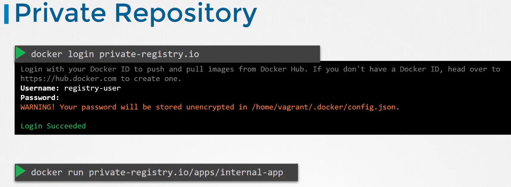
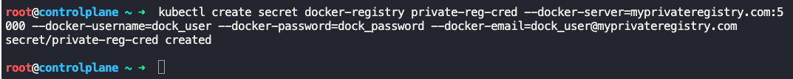
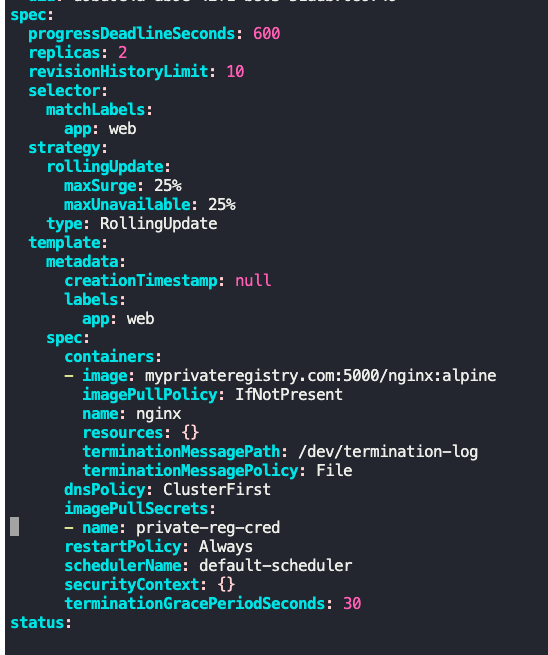

### Image Security

- Image path - registry(docker.io/gcr.io)/library(user/account)/image(or repo)(nginx)
- 
- Private repository
	- Needs authentication and is not open to public
	- `docker login priv-reg.io`
	- `docker run priv-reg.io/apps/internal-app`
	- 
- To specify private repository in a pod definition file, we need to create a secret object with the credentials to the private repository, and input it in the pod definition file
	- `kubectl create secret docker-registry <secret_name> --docker-server=... --docker-username=... --docker-password=... --docker-email=...`
	- 
	- `docker-registry` secret type was built for storing docker credentials
	- Inside the pod definition file, mention the secret name under `spec.template.spec` section, after `containers`
```
imagePullSecrets:
- name: <secret_name>
```
- 
- Different types of secrets
	- Docker registry
	- Generic
	- TLS


---
