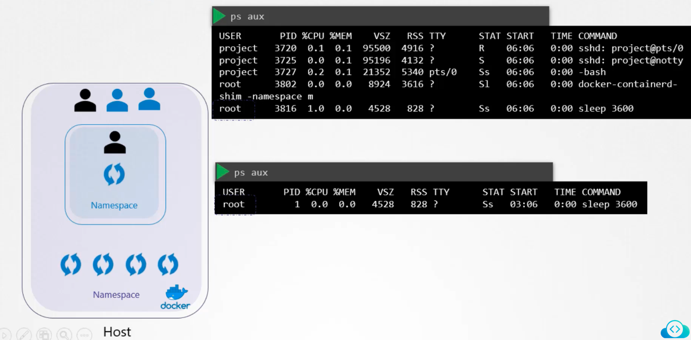

### Docker Security

- Containers and host share the same kernel
- On the host, there are a number of OS related processes running, along with the docker daemon
	- The container also runs as a process in the host
- Containers are isolated using namespaces in Linux
- Host has a namespace, and the containers have their own namespace
- All process run by the containers are run on the host itself, but in container's namespace
- A container can see all running processes in its own namespace only.
	- It cannot see anything outside of its namespace
- Whereas in the docker host, all processes of its own and all the processes in the containers namespaces are visible
- The process ID (PID) for the same process will be different on the container and the one on the docker host
	- This is how docker achieves process isolation
- 

#### Users in context 

- Docker host has a set of users, a root user and a set of non-root users
- By default, docker runs processes within the container as root user
- If you do not want the processes inside the container as root user, you could mention the user ID (UID) as part of the docker run command
	- `docker run --user=1000 ubuntu sleep 3600`
	- You could specify the same in the docker image file, so that it is enforced during creation itself
``` DockerFile
FROM UBUNTU
USER 1000
```
- Build - `docker build -t my-ubuntu-image`
- 
- 
- Root user within the container is not like the root user on the docker host
	- Docker limits permission of root user in the container
	- Docker uses Linux capabilities to achieve this
- Root user has unrestricted permissions on the system
- Any process run as root user will also have unrestricted access on the system
- All linux capabilities are listed under `/usr/include/linux/capability.h`
- By default, docker runs containers with limited capabilities, thereby restricting containers from executing operations on the host
	- To provide additional capabilities to the container - `docker run --cap-add MAC_ADMIN ubuntu` (`docker run --cap-add <capability> <container_name>`)
	- To drop privileges - `docker run --cap-drop KILL ubuntu`
	- To run container with all privileges enabled - `docker run --privileged ubuntu` (`docker run --privileged <container_name>`)


---
