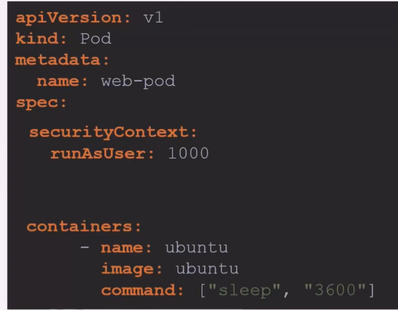
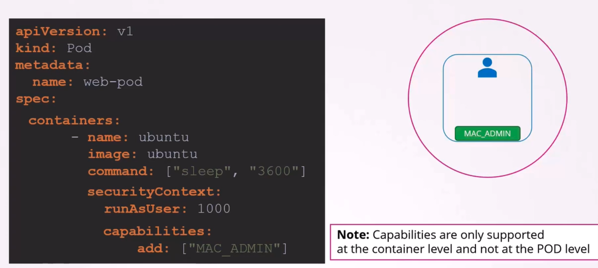
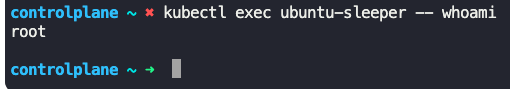

### Security Contexts

- In Kubernetes, we can choose to set the security context at container level or at the pod level
- If a security context is set at pod level, all the containers in the pod will have the same security context
- If you set both on pod and container, the settings on the container will override the settings on the pod
- To set security context at pod level
``` pod-defn.yaml
apiVersion: v1
kind: Pod
metadata:
  name: web-pod
spec:
  securityContext:
    runAsUser: 1000
  containers:
    - name: ubuntu
      image: ubuntu
      command: ["sleep", "3600"]
```
- 
- To set security context at container level
``` pod-defn.yaml
apiVersion: v1
kind: Pod
metadata:
  name: web-pod
spec:
  containers:
    - name: ubuntu
      image: ubuntu
      command: ["sleep", "3600"]
      securityContext:
        runAsUser: 1000
        capabilities:
          add: ["MAC_ADMIN"]
```

- 
- To check which user is used to run a running container
	- `kubectl exec ubuntu-sleeper -- whoami`
	- `kubectl exec <container_name> -- whoami`
- 
- To add a different user context to an already running pod
	- Edit the pod - `kubectl edit pod <pod_name>`
	- Apply changes - `kubectl apply -f pod-defn.yaml --force`
- Note: Capabilities are specified under container level and not under pod level


---
