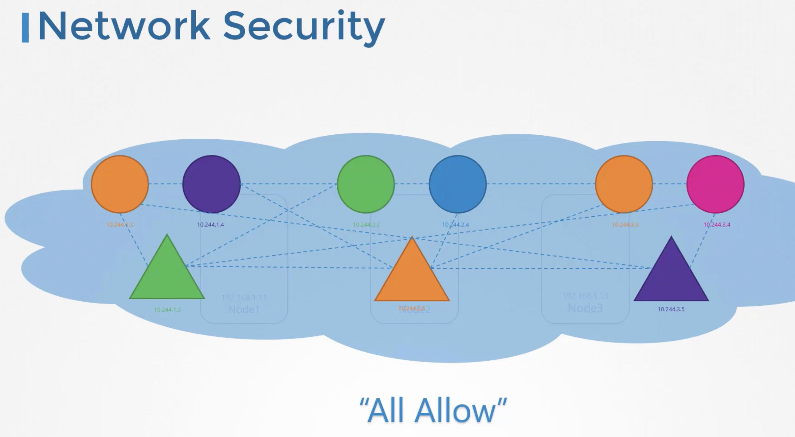
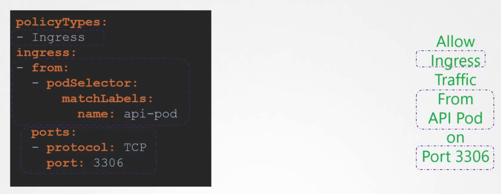

### Network Policies

- Kubernetes by default configures an "All Allow" rule, which allows any pods and services within a cluster to talk to each other
- 
- To restrict communication between pods, we set up network policies
- Network policy is an object in Kubernetes namespace, like pods, services etc
- You link a Network policy to one or more pods
	- Ex: Only allow traffic from "API Pod" on port 3306, is a network policy applied on a pod to restrict pods, other than "API Pod" from reaching it on port 3306
	- Network policy is applied on pods based on labels and rules
	- 
```
apiVersion: networking.k8s.io/v1
kind: NetworkPolicy
metadata:
  name: db-policy
spec:
  podSelector:
    matchLabels:
      role: db  --> Applied to all pods with label "db"
  policyTypes:
  - Ingress
  ingress:
  - from:
    - podSelector:
        matchLabels:
          name: api-pod  --> Allows ingress traffic from any pod having "API-Pod" label, across all namespaces
      namespaceSelector:
        matchLabels:
          name: prod
  ports:
  - protocol: TCP
    port: 3306
```
- For egress, you have to mention that under policy types
- To create the network policy
	- `kubectl create -f network-policy-defn.yaml`
- Network solutions which support network policies
	- Kube-router
	- Calico
	- Romana
	- Weave-net
- Network solutions which does not support network policies
	- Flannel


---
