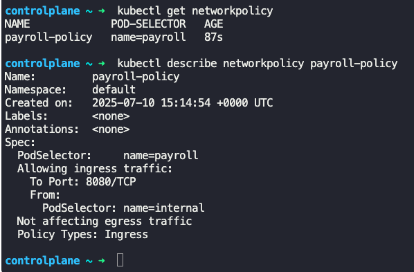

### Developing Network Policies

- To restrict pods to a specific namespace, inside `spec.ingress`
```
apiVersion: networking.k8s.io/v1
kind: NetworkPolicy
metadata:
  name: db-policy
spec:
  podSelector:
    matchLabels:
      role: db  --> Applied to all pods with label "db"
  policyTypes:
  - Ingress
  ingress:
  - from:
    - podSelector:
        matchLabels:
          name: api-pod  --> Allows ingress traffic from any pod having "API-Pod" label, across all namespaces
      namespaceSelector: --> Allows ingress traffic from all pods in namespace "prod"
        matchLabels:
          name: prod
    ports:
    - protocol: TCP
      port: 3306
```
- If you have only the `namespaceSelector` and no `podSelector`, then all pods in the namespace will be able to access
- 
- To allow systems within a certain IP range to reach a pod, use `ipBlock` inside `spec.ingress`
```
apiVersion: networking.k8s.io/v1
kind: NetworkPolicy
metadata:
  name: db-policy
spec:
  podSelector:
    matchLabels:
      role: db  --> Applied to all pods with label "db"
  policyTypes:
  - Ingress
  ingress:
  - from:
    - podSelector:
        matchLabels:
          name: api-pod  --> Allows ingress traffic from any pod having "API-Pod" label, across all namespaces
      namespaceSelector: --> Allows ingress traffic from all pods in namespace "prod"
        matchLabels:
          name: prod
    - ipBlock:
        cidr: 192.168.5.10/32  --> Allows ingress traffic from all pods with IP in specified range 
    ports:
    - protocol: TCP
      port: 3306
```
- 
- OR and AND in rules
```
ingress:
  - from:
    - podSelector:
        matchLabels:
          name: api-pod  --> Allows ingress traffic from any pod having "API-Pod" label, across all namespaces
      namespaceSelector: --> Allows ingress traffic from all pods in namespace "prod"
        matchLabels:
          name: prod
    
	- ipBlock:
        cidr: 192.168.5.10/32  --> Allows ingress traffic from all pods with IP in specified range 
```
- The `podSelector` and `namespaceSelector` works as AND.
	- Both conditions need to be satisfied
- With respect to `ipBlock` , it works as OR with `podSelector` and `namespaceSelector`
	- (`podSelector` AND `namespaceSelector`) OR `ipBlock`
- 
```
ingress:
  - from:
    - podSelector:
        matchLabels:
          name: api-pod  --> Allows ingress traffic from any pod having "API-Pod" label, across all namespaces
    - namespaceSelector: --> Allows ingress traffic from all pods in namespace "prod"
        matchLabels:
          name: prod
	- ipBlock:
        cidr: 192.168.5.10/32  --> Allows ingress traffic from all pods with IP in specified range 
```
- In the above specification, each work together as OR
	- `podSelector` OR `namespaceSelector` OR `ipBlock`
- 
- Egress rule
```
apiVersion: networking.k8s.io/v1
kind: NetworkPolicy
metadata:
  name: db-policy
spec:
  podSelector:
    matchLabels:
      role: db  --> Applied to all pods with label "db"
  policyTypes:
  - Ingress
  - Egress
  ingress:
  - from:
    - podSelector:
        matchLabels:
          name: api-pod  --> Allows ingress traffic from any pod having "API-Pod" label, across all namespaces      
    ports:
    - protocol: TCP
      port: 3306
  egress:
  - to:
    - ipBlock:
        cidr: 192.168.5.10/32
    ports:
    - protocol: TCP
      port: 80
```
- 
- 
- To list all network policies in place
	- `kubectl get networkpolicy`
- To describe network policy
	- `kubectl describe networkpolicy <networkpolicy_name>`
- 


---
