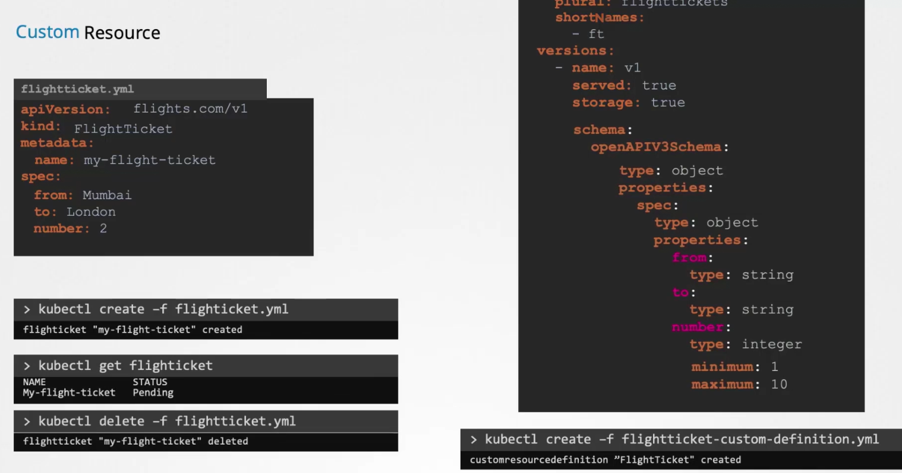

### Custom Resource Definitions

- "Controller" is a Kubernetes object which continuously monitors the "ETCD Datastore" and implements the changes, like creation of pods, deletion of pods etc
- 
- Each resource has a corresponding controller object to deploy and maintain the state of the resource
- 
- Custom Resource Definition (CRD)
``` flighttickets-custom-defn.yaml
apiVersion: apiextension.k8s.io/v1
kind: CustomResourseDefinition
metadata:
  name: flighttickets.flights.com
spec:
  scope: Namespaced
  group: flights.com
  names:
    kind: FlightTicket
    singular: flightticket
    plural: flighttickets
    shortNames:
      - ft
  versions:
    - name: v1
      served: true
      storage: true
      schema:
        openAPIV3Schema:
          type: object
          properties:
            spec:
              type: object
              properties:
                from:
                  type: string
                to:
                  type: string
                number:
                  type: string
                  minimum: 1
                  maximum: 10
```
- Custom Resource
``` flight-tickets.yaml
apiVersion: flights.com/v1
kind: FlightTicket
metadata:
  name: my-flight-ticket
spec:
  from: Mumbai
  to: London
  number: 2
```
- In the CRD, the following values should match the values in the custom resource definition file
	- `spec.group` should match `apiVersion` in custom resource definition file
	- `spec.names.kind` should match `kind` in custom resource definition file
	- `spec.versions.name` should match `apiVersion` in custom resource definition file
- CRD object can either be `namespaced` or `clusterScoped`
- 
- 
- 
- Custom resource is an extension of Kubernetes API, that is not necessarily available in a default Kubernetes installation
- Create custom resource definition
	- `kubectl create -f flightticket-custom-defn.yaml`
- List custom objects
	- `kubectl get flightticket`
- Delete custom object
	- `kubectl delete -f flightticket.yaml`
- To describe a CRD
	- `kubectl describe crd <crd_name>`
- To list CRDs
	- `kubectl get crds`
- 
- 
- 


#### Custom Controllers

- A custom controller is required to actually implement the changes made in ETCD datastore done by the custom object via CRD
- 

#### Operator Framework

- Operator framework ties the CRD and the custom controller into a single entity, called the operator framework
- All operators are available at operatorhub.ai

---
