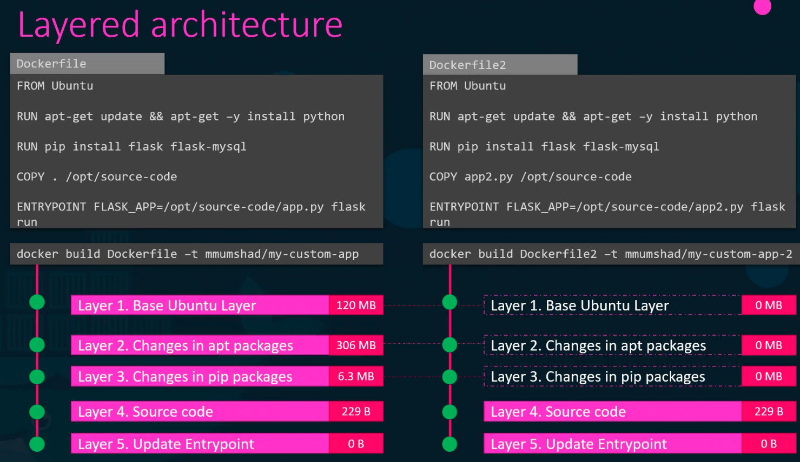
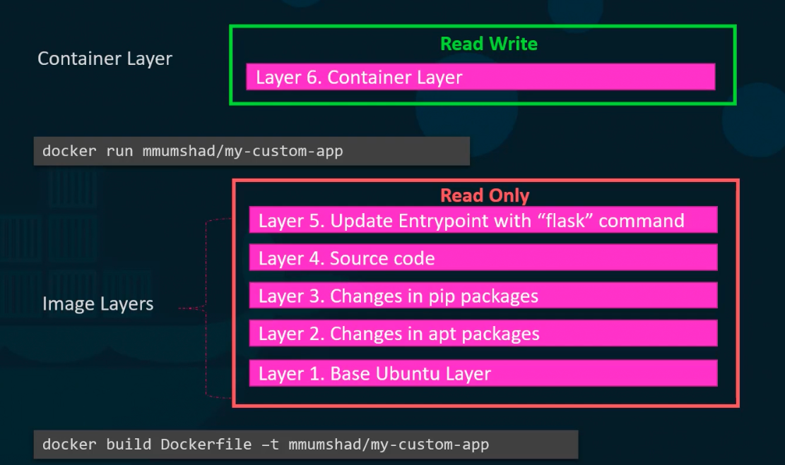
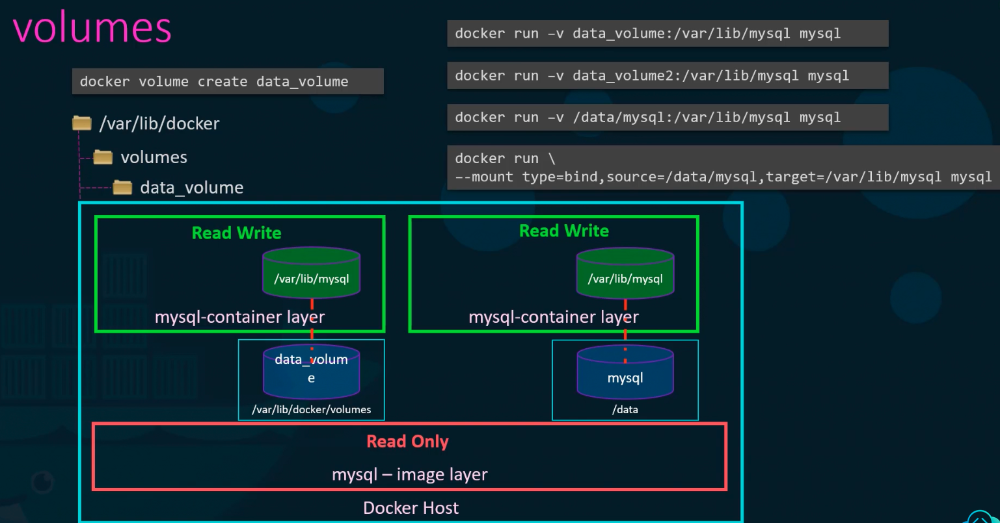

### Storage in Docker

- When docker is installed, it creates `/var/lib/docker` on the host
	- Multiple sub-folders under it like `aufs`, `containers`, `images` are created
	- This is where docker stores files related to containers it is hosting
- Docker uses layered architecture while building an docker image
	- Each layer has its own functionality, like base OS, running updates on OS, etc
	- Each layer can be reused to build different docker images
	- This helps docker build images faster ans saves disk space
- Docker image layers (Read-only)
	- Layer 5: Update ENTRYPOINT
	- Layer 4: Source code
	- Layer 3: Changes in pip packages
	- Layer 2: Changes in apt packages
	- Layer 1: Base Ubuntu layer
- 
- Build image
	- `docker build DockerFile -t my-custom-app`
- Run container
	- `docker run my-custom-app`
- Container layer (Read and write)
	- Layer 6: Container layer
	- Can write log files, temporary files etc. Lifetime is till the container runs
	- All files in the container layer gets deleted when the container seizes to run
- 
- To persist data produced in the container layer, use volumes
	- Volume mounting
		- To create a volume - `docker volume create <vol_name>`
		- It creates a folder under `/var/lib/docker/volumes/`
		- Now when running the docker container, mount this volume inside docker container - `docker run -v <vol_name>:<path_inside_the_Container_to_mount> <container_name>`
		- So when the above command is run, folder `/var/lib/docker/volumes/<vol_name>` is mounted inside container on the path mentioned in the command (`<path_inside_the_Container_to_mount>`)
		- All data written by container on the `<path_inside_the_Container_to_mount>` will be written on the docker host at `/var/lib/docker/volumes/<vol_name>`
		- Docker will automatically create the volume if you run `docker run` without creating the volume first
	- Bind mounting
		- If the volume to be mounted is not under `/var/lib/docker/volumes/`, run the container - `docker run -v <path_to_be_mounted>:<path_inside_the_Container_to_mount> <container_name>`
		- Bind mounting allows mounts from any location in the docker host
		- Using `mount` option - `docker run --mount type=bind,source=<path_on_docker_host>,target=<path_on_container> <container_name>`
		- Something like - `docker run --mount type=bind,source=/data/mysql,target=/var/lib/mysql mysql`
- 
- Docker uses storage drivers to enable layered architecture
	- Storage drivers are based on OS like, aufs, zfs, BTRfs, Device mapper, overlay, overlay2

---
