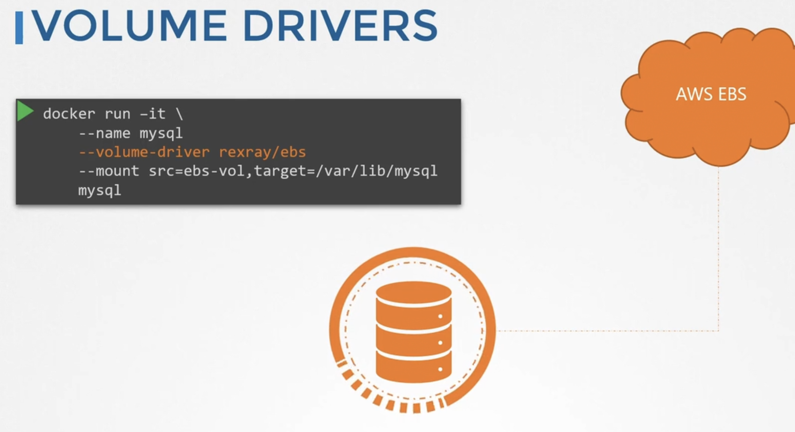

### Volume driver plugins in docker

- Volumes are handled by volume driver plugins and not by storage drivers
- Default volume driver plugin is "Local"
- When running a container, you can choose which volume driver plugin to use
- `docker run -it --name <container_name> --volume-driver <vol_driver_name> --mount src=<vol_to_mount_from_host>,target=<path_in_container_where_vol_will_be_mounted> <container_name>`
- 

---

