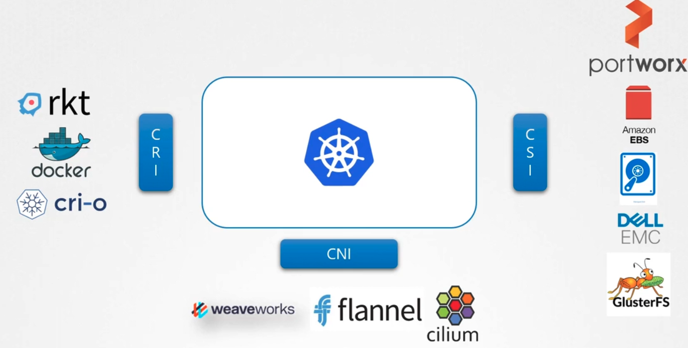

### Container Storage Interface

- Container Runtime Interface (CRI) defines how a container orchestrator like Kubernetes communicates with container runtimes like Docker, RKT, Cri-o
- Container Networking Interface (CNI) is for container orchestrator like Kubernetes to communicate with different networking solutions like Weaveworks, Flannel, Cilium
- Container Storage Interface (CSI) is for container orchestrator like Kubernetes to communicate with different storage solutions like Portworx, AWS EBS, GlusterFS, Azure disk
	- CSI is used to write drivers using a set of guidelines, so that any storage vendor can communicate with a container orchestrating tool like Kubernetes, Cloud Foundry, Mesos etc
- 
- 

---
