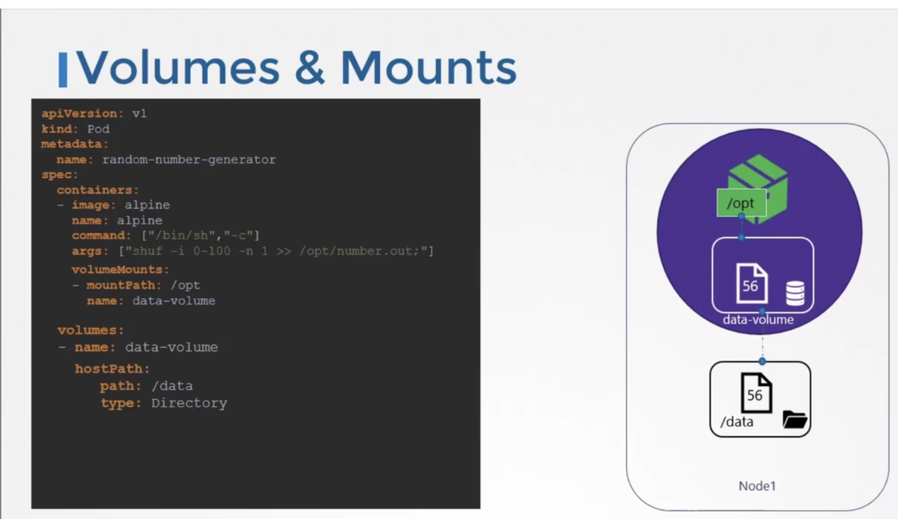

### Volumes

- Docker containers are transient in nature
	- They are meant to live till they finish their processing, post which they die
	- The same is true for the data within the container, the data is destroyed when the container dies
	- To persist data, we use volumes
- In Kubernetes, pods are transient in nature. They get deleted once they finish their processing.
	- The data generated by the pod gets deleted along with the pod
	- To persist data generated by pod, we attach volume to the pod
```
apiVersion: v1
kind: Pod
metadata:
  name: random-number-generator
spec:
  containers:
  - image: alpine
    name: alpine
    command: ["/bin/sh", "-c"]
    args: ["shuf -i 0-100 -n 1 >> /opt/number.out;"]
    volumeMounts:
    - mountPath: /opt --> Inside container
      name: data-volume

  Volumes:
  - name: data-volume
    hostPath:
      path: /data --> In host
      type: Directory
```
- 
- Kubernetes supports different storage solutions like NFS, GlusterFS, AWS EBS, Azure disk, Google persistent disk etc
- Say of using AWS EBS,
```
Volumes:
- name: data-volume
  awsElasticBlockStore:
    volumeID: <vol-id>
    fsType: ext4
```


---
