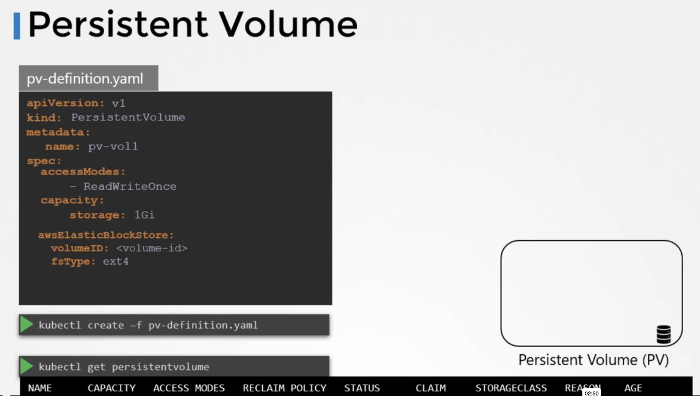

### Persistent Volumes

- If volumes and volume mounts are needed to be specified in pod definition file, then in large environments it will not be scalable
- Persistent Volumes (PV) can solve this problem
- PV is a cluster wide storage pool of volumes
- Users can use this storage using Persistent Volume Claims (PVC)
- To create a PV
```
apiVersion: v1
kind: PersistentVolume
metadata:
  name: pv-vol1
spec:
  accessModes: --> ReadOnlyMany, ReadWriteOnce, ReadWriteMany
    - ReadWriteOnce
  capacity:
    storage: 1Gi
  hostPath:
    path: /tmp/data
```
- Creates PV - `kubectl create -f pv-defn.yaml`
- List PVs - `kubectl get persistentvolume`
- Replace `hostPath` to `AWSEBS`
```
awsElasticBlockStore:
  volumeID: <vol_id>
  fsType: ext4
```




---
