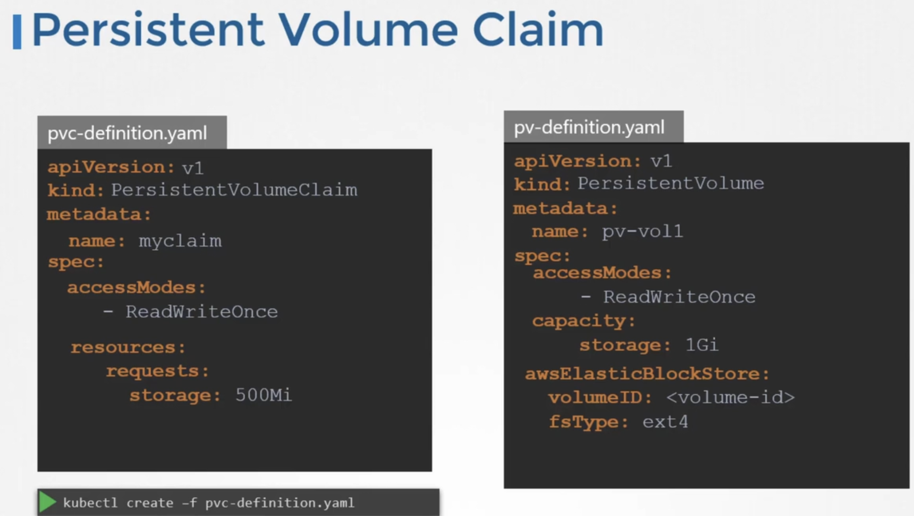
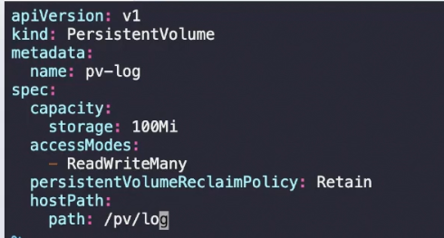
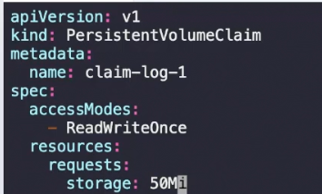
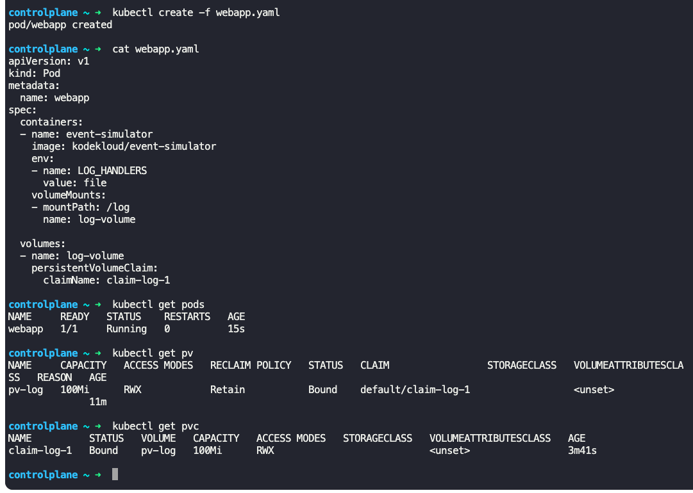
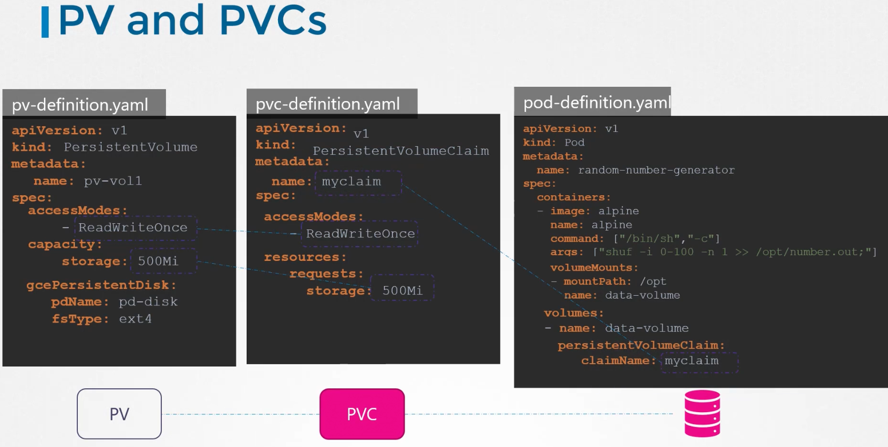

### Persistent Volume Claims

- Administrators create PVs
- Users create PVCs to use PVs
- Every PVC is bound to a single PV
- There is 1 to 1 relationship between claims and volumes
	- No other claims can use the remaining capacity in the volume
- If no volumes are available, then the PVC will remain in pending state
``` pvc-defn.yaml
apiVersion: v1
kind: PersistentVolumeClaim
metadata:
  name: myclaim
spec:
  accessModes:
    - ReadWriteOnce
  resources:
    requests:
      storage: 500Mi
```
- 
- 
- 
- Binding happens based on
	- Sufficient capacity
	- Access modes (should match between PV and PVC)
	- Volume modes
	- Storage class
	- Selector
- Create PVC
	- `kubectl create -f pvc-defn.yaml`
- List PVC
	- `kubectl get persistentvolumeclaim`
- Delete PVC
	- `kubectl delete persistentvolumeclaim <pvc_name>`
- When a PVC is deleted, the PV by default is retained until deleted specifically
- `persistentVolumeReclaimPolicy: Retain`
	- PV is not available for reuse by any other claim
- `persistentVolumeReclaimPolicy: Delete`
	- PV is deleted when the PVC is deleted
- `persistentVolumeReclaimPolicy: Recycle`
	- Data in the PV will be scrubbed, deleted.
	- The PV will be made available to other claims
- Use PVC in pod definition files as follows
```
apiVersion: v1
kind: Pod
metadata:
  name: mypod
spec:
  containers:
  - name: myfrontend
    image: nginx
    volumeMounts:
    - mountPath: /var/www/html
      name: mypd
  Volumes:
  - name: mypd
    persistentVolumeClaim:
      claimName: myclaim
```
- 
- 
- Describe a PV
	- `kubectl describe pv <pv_name>`
- To execute a command inside a pod
	- `kubectl exec <pod_name> -- <command>`
	- `kubectl exec webapp -- cat /etc/shadow`


---
