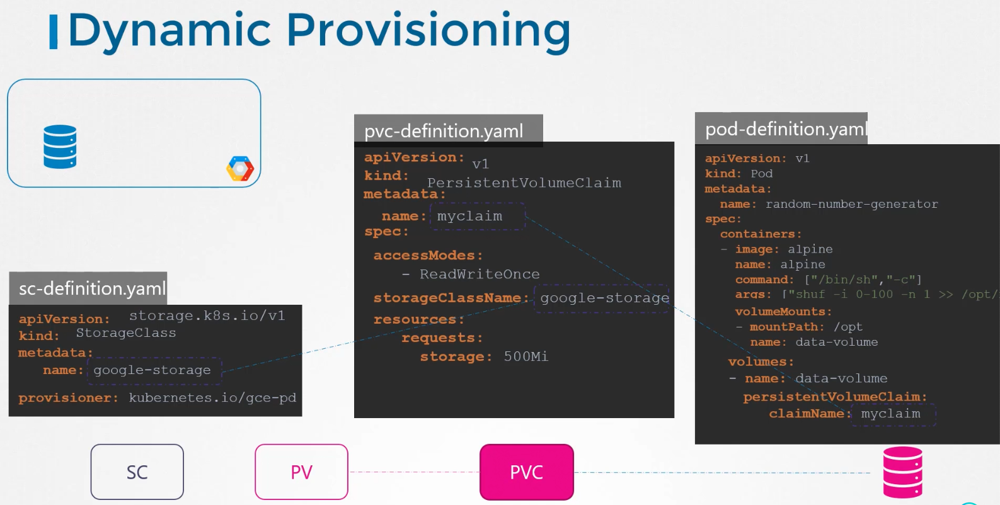
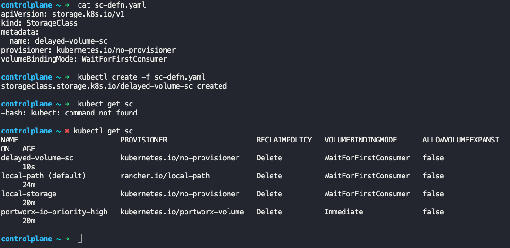
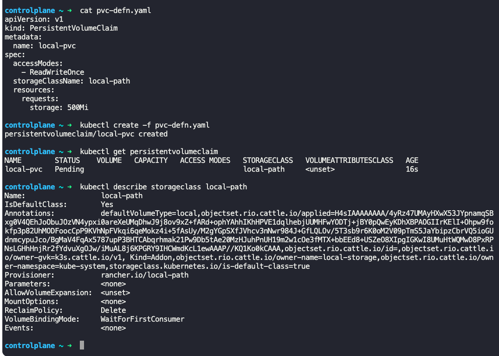
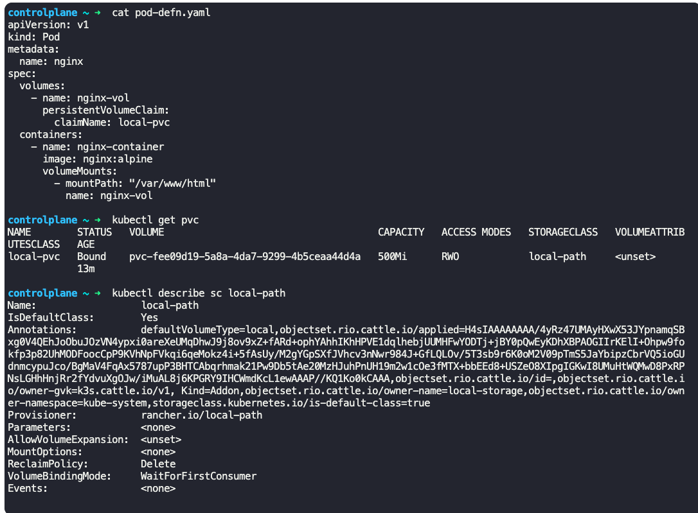
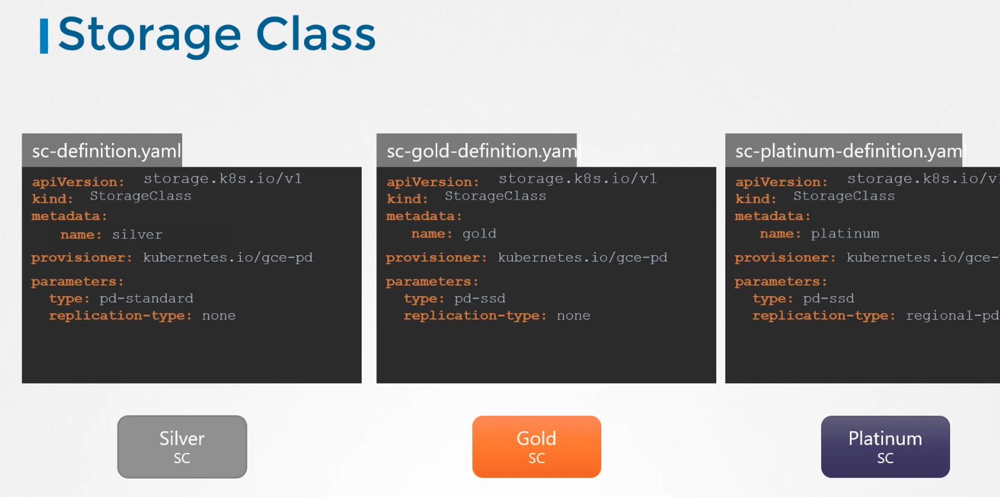
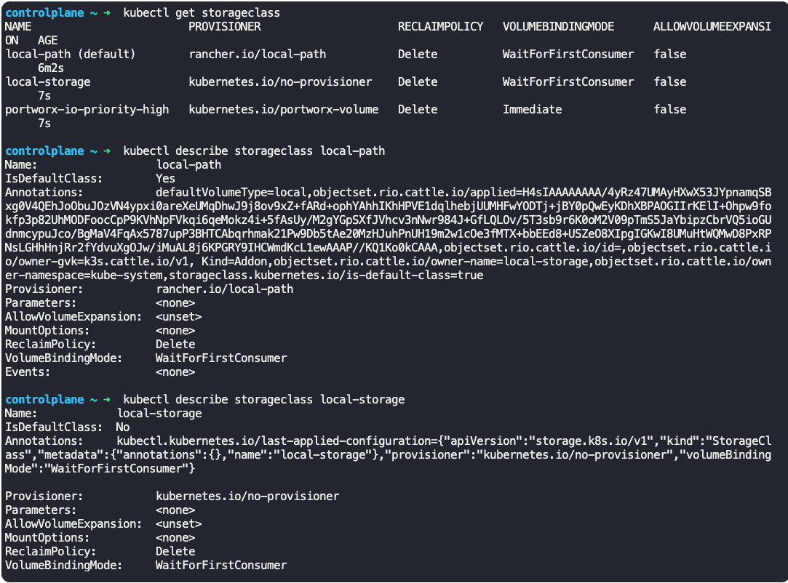

### Storage Class

- If you are creating a PV from google cloud persistent disk, you have to first create the disk on cloud manually
- `gcloud beta compute disks create --size <size> --region <region-1> <disk_name>`
	- `gcloud beta compute disks create --size 1GB --region us-east1 pd-disk`
``` pv-defn.yaml
apiVersion: v1
kind: PersistentVolume
metadata:
  name: pv-vol1
spec:
  accessModes
    - ReadWriteOnce
  capacity:
    storage: 500Mi
  gcePersistentDisk:
    pdName: pd-disk
    fsType: ext4
```
- Now create a PV on the disk created on gcloud manually
- The above process is called static provisioning of volumes
- With storage classes, we can define a provisioner such as google storage, that can automatically provision storage on google cloud and attach that to pods when a claim is made
	- This process is called dynamic provisioning of volumes
- 
- To do this, we create a storage class object
```
apiVersion: storage.k8s.io/v1
kind: StorageClass
metadata:
  name: google-storage
provisioner: kubernetes.io/gce-pd
parameters:
  type: pd-standard  -> type of disk (pd-ssd)
  replication-type: none
  name: regional-pd
```
- 
- Now we do not need any PV definition, as the PV and any associated storage is going to be created automatically when the storage class is created
- For the PVC to use the storage class, we specify the storage class name in the PVC-defn.yaml file
```
apiVersion: v1
kind: PersistentVolumeClaim
metadata:
  name: myclaim
spec:
  accessModes:
    - ReadWriteOnce
  storageClassName: google-storage
  resources:
    requests:
      storage: 500Mi
```
- 
- Now whenever a PVC is created, it uses the provisioner to provision the required disk on GCP
	- It creates a PV automatically and binds the PVC to that PV
	- If `provisioner:` is set to `kubernetes.io/no-provisioner`, then dynamic volume provisioning is not supported
- 
- You can create different storage classes(SC) from different vendors with different parameters
	- So when you create a PVC, specify the class of storage (SC name) for the volumes
- 
- List all storage classes
	- `kubectl get storageclass`
- Describe storage class
	- `kubectl describe storageclass <storageclass_name>`
- 

- 

---
