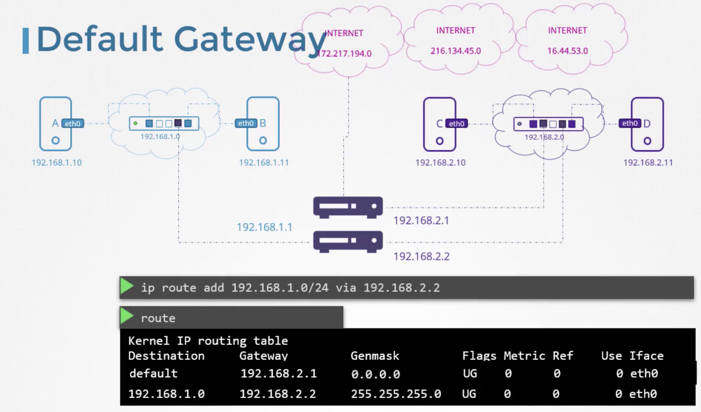

### Switching, Routing, Gateways, CNI in Kubernetes

#### Switching

- A switch helps connect 2 systems to communicate with each other
- To list the network interfaces in a system
	- `ip link`
- To add IP address to a network interface
	- `ip addr add 192.168.1.10/24 dev eth0`
	- `eth0` is the network interface name
	- To persist over reboots, set in `/etc/network.interfaces`
- To show IP address assigned to interfaces
	- `ip addr`
- Once the IP addresses are assigned, the systems can communicate with each other through the switch
- A switch can only receive and deliver packets to systems connected to it.
	- This can be termed as systems in the same network
	- Systems connected to a different switch will be in different network
- For systems in different networks (connected to different switches) to communicate with each other, they use a router
- 

---

#### Routing

- Router connects 2 or more networks
	- Router will get 2 or more IPs assigned, one for each network
- For systems to know where the router is or what the IP of router is, it needs to be configured
- To know the existing/current routes configured on the system
	- `route`
- To configure a route to enable a system to communicate with a system in another network
	- `ip route add 192.168.2.0/24 via 192.168.1.1`
	- The above command states that to reach any systems in the IP range 192.168.2.0/24, go via the gateway/door of 192.168.1.1
	- Running the `route` command will list the new route configured
	- This has to be configured on all systems
- 

---

#### Gateway

- To allow access to any network, which is not the same network as the system's, including access to internet, add a default gateway/route
	- `ip route add default via 192.168.1.1` or
	- `ip route add 0.0.0.0 via 192.168.1.1`
- Multiple routers can be used like, one for internet, one for a network internally
	- Each separate routes need to be added for each
- 
- 
- To configure a linux system as a router, we have to set it up
- By default, for security reasons, forwarding packets from one network interface to the other is disabled on all linux systems
	- This is set by the value `0` in `/proc/sys/net/ipv4/ip_forward`
	- Set this value to `1` to enable packet forwarding between 2 network interfaces
	- To persist across reboots, set it in `/etc/sysctl.conf` file
		- `net.ipv4.ip_forward=1`

---
