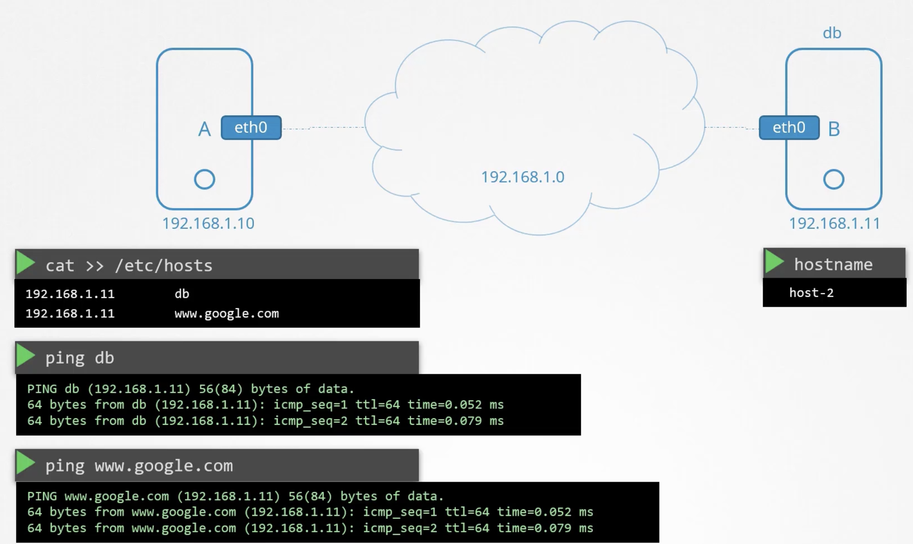
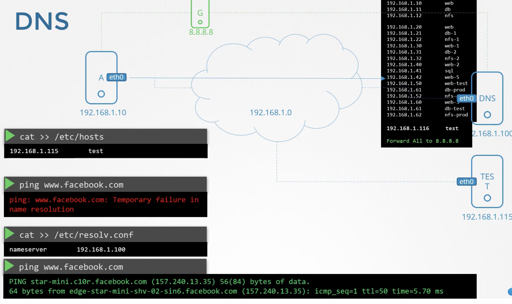
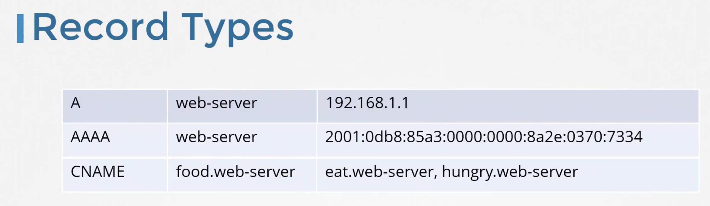
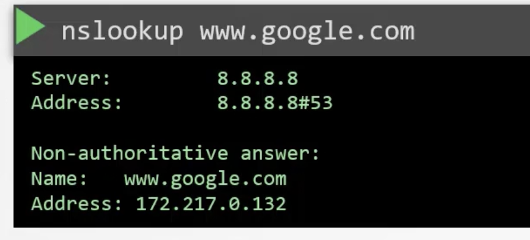
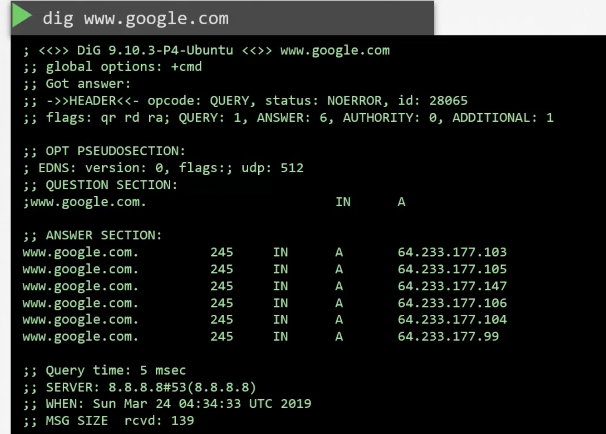

### DNS

- `/etc/hosts` file contains hostname to IP mapping
- 
- Translating hostname to IP address is called name resolution
- Instead of configuring each system in the network with this IP-hostname mapping in the `/etc/hosts` file, we use a Domain Name Server, DNS.
	- Without DNS it is not scalable for larger network
- `/etc/resolv.conf` will have information about IP of DNS
	- Add entry `nameserver    192.168.1.100`
- 
- Once DNS is setup, we do not need `/etc/hosts`file
- If you have the same hostname specified in `/etc/hosts` and in the DNS, each resolving to different IPs, then the entry in the `/etc/hosts` file takes precedence
	- This order is specified in `/etc/nsswitch.conf` at `hosts:    files dns`
	- Reverse the order to have DNS take precedence like `hosts:    dns files`
- Nameserver 8.8.8.8 is a DNS hosted by google to resolve hostnames in the internet
- You can add the line `Forward All to 8.8.8.8` in your DNS

#### Domain Names

- Root - `*`
- Top level domain name - `.com`
- Sub-domain - `www`, `maps`, `drive`, `apps`
- Flow of domain name resolution
	- Organisation's DNS - Internal, where the request originated
	- Root DNS
	- `.com DNS` -> Google's DNS
- 
- Once resolved, typically organisation's DNS will cache responses for quicker resolution
- In the `/etc/resolv.conf` file, add the entry `search    mycompany.com` to append `mycompany.com` to any hostname resolution automatically
- 

#### Record Types

- A record - Contains IPv4 to hostname record
	- `A    web-server    192.168.1.1`
- AAAA record - Contains IPv6 to hostname record
	- `AAAA    web-server    2001:0bd9:...`
- CNAME - Contains mapping one name to another name
	- `CNAME    food-web-server    eat.web-server, hungry.web-server`
- 
- Use `nslookup` to query a hostname from DNS
	- It doesn't consider entries in `/etc/hosts` file
- 
- `dig` gives information about the hostname
- 

---
