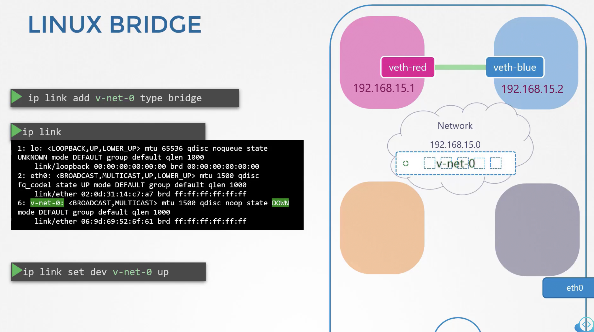

### Network Namespaces

- Namespace
	- An isolated area, typically inside which a container runs
- Hosts
	- On which the container runs
- Namespaces ensures that the containers can only access resources inside the namespace and are completely isolated
- Hosts however will have visibility into all the namespaces and containers running on it
- Process namespace ensures that the container inside a namespace can only see the process it runs
- Hosts can see all processes running, including those running inside the containers it hosts.
	- A process running inside a container will have different Pids inside the container and on the host.
- 
- Network namespace
	- Host has its own interfaces to connect to LAN/outside world
	- Host will have its own routing and ARP table
	- Container will be isolated from host networking details using Network namespace
	- Container will get its own virtual network interface and its access limited inside the namespace
- 
- Create network namespace
	- `ip netns add <N/W_ns_name>`
	- `ip netns add red`
- List network namespaces
	- `ip netns`
- To list the interfaces available on the host
	- `ip link`
- To list the interfaces available on a network namespace
	- `ip netns exec <N/W_ns_name> ip link`
	- `ip link exec red ip link`
	- `ip -n red link`
- To see the arp table on the host
	- `arp`
- To see the arp table inside a namespace
	- `ip netns exec <N/W_ns_name> arp`
	- `ip netns exec red arp`
- To see the routing table on the host
	- `route`
- To see the routing table inside a namespace
	- `ip netns exec <N/W_ns_name> route`
	- `ip netns exec red route`
- To connect 2 network namespaces
	- `ip link add veth-red type veth peer name veth-blue`
	- `veth-red` and `veth-blue` are 2 network interfaces
	- Assign the network interfaces to appropriate namespaces
		- `ip link set veth-red netns red`
		- Sets `veth-red` network interface to namespace `red`
		- `ip link set veth-blue netns blue`
		- Sets `veth-blue` network interface to namespace blue
	- Set IP addresses to the network interfaces
		- `ip -n red addr add 192.168.15.1 dev veth-red`
		- `ip -n blue addr add 192.168.15.2 dev veth-blue`
	- Bring up the network interfaces
		- `ip -n red link set veth-red up`
		- `ip -n blue link set veth-blue up`
	- 
	- Ping between namespaces
		- `ip netns exec red ping 192.168.15.2`
		- `ip netns exec blue ping 192.168.15.1`
	- Now if you list arp tables on both the namespaces, you will find entries of the other
		- `ip netns exec red arp`
		- `ip netns exec blue arp`
		- The host arp table will not have these entries
	- To delete a link between 2 network interfaces
		- `ip -n red link del veth-red`
		- The network interface on the other end (in this case `veth-blue`) gets automatically deleted
	- 
- To scale and connect multiple namespaces, we need to create a virtual switch
	- Linux bridge (Native)
	- Open vSwitch
- To create a switch using Linux Bridge
	- Create new interface in host with type "bridge"
		- `ip link add v-net-0 type bridge` - `v-net-0` is the interface name
		- As far as host is concerned, it is another interface
	- Bring up the new interface
		- `ip link set dev v-net-0 up`
	- 
	- Create a cable between the network interface of a namespace to the switch
		- `ip link add veth-red type veth peer name veth-red-br`
			- `veth-red` is the network interface which will be connected to the namespace, say `red`
			- `veth-red-br` is the network interface which will be connected to the switch `v-net-0`
		- `ip link add veth-blue type veth peer name veth-blue-br`
			- `veth-blue` is the network interface which will be connected to the namespace, say `blue`
			- `veth-blue-br` is the network interface which will be connected to the switch `v-net-0`
		- 
	- Now attach the network interfaces to appropriate namespaces
		- `ip link set veth-red netns red`
			- `veth-red` network interface is connected to `red` namespace
		- `ip link set veth-blue netns blue`
			- `veth-blue` network interface is connected to `blue` namespace
	- Now attach the network interfaces to switch
		- `ip link set veth-red-br master v-net-0`
			- `veth-red-br` network interface is connected to switch on the `v-net-0` interface
		- `ip link set veth-blue-br master v-net-0`
			- `veth-blue-br` network interface is connected to switch on the `v-net-0` interface
	- Set IPs to network interfaces
		- `ip -n red addr add 192.168.15.1 dev veth-red`
		- `ip -n blue addr add 192.168.15.2 dev veth-blue`
		- `ip -n red link set veth-red up`
		- `ip -n blue link set veth-blue up`
	- 
	- The above steps will make the switch route traffic between multiple namespaces
	- To reach the network interface of namespace from the host, assign an IP in the same network as of the network interface in the namespace, to the network interface of the switch
		- `ip addr add 192.168.15.5/24 dev v-net-0`
		- Now we should be able to ping the network interface in a namespace from the host
		- 
- Now add the routing tables
- 
- 
- 
- 

---

### FAQ

While testing the Network Namespaces, if you come across issues where you can't ping one namespace from the other, make sure you set the NETMASK while setting IP Address. ie: 192.168.1.10/24

`ip -n red addr add 192.168.1.10/24 dev veth-red` Another thing to check is FirewallD/IP Table rules. Either add rules to IP Tables to allow traffic from one namespace to another. Or disable IP Tables all together (Only in a learning environment).

---
