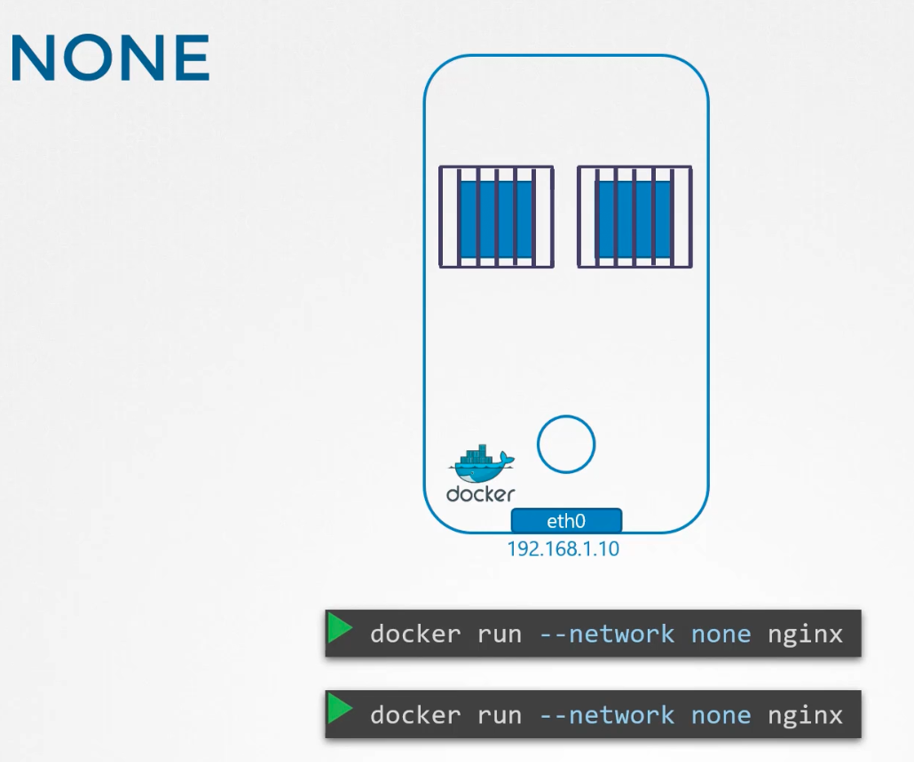
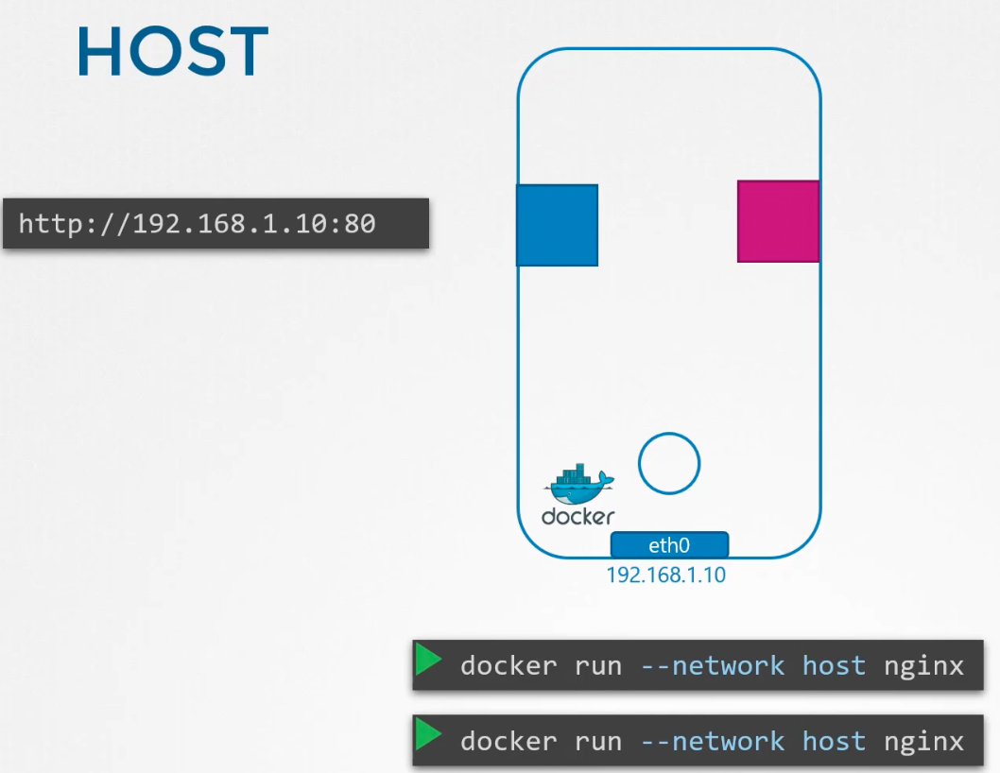
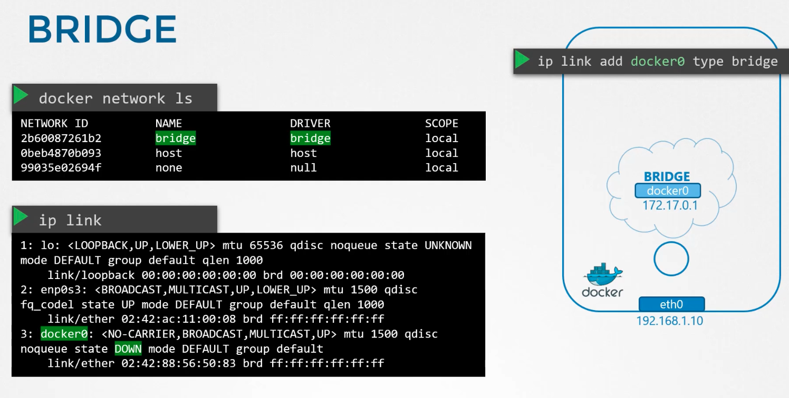
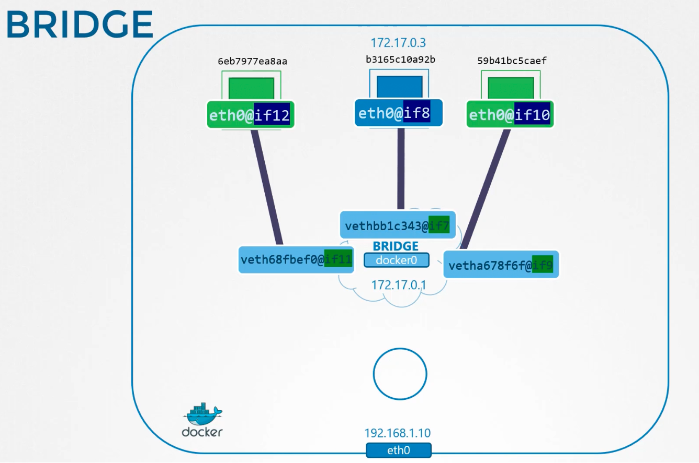
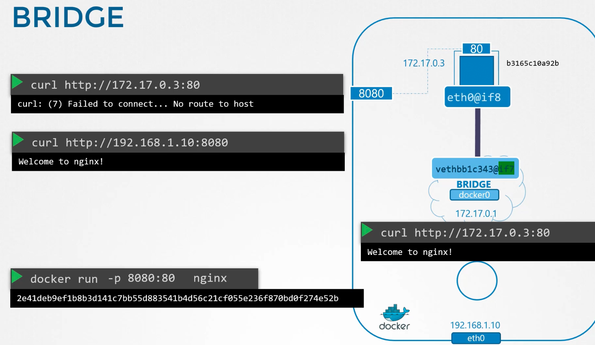

### Docker Networking

There are 3 different networking options in Docker
- None Network
	- When a container is run with "None" option, the container cannot communicate with outside world, including other containers running on the same host or the internet
	- `docker run --network none nginx`
	- 
- Host Network
	- The container is attached to the host network.
	- There is no network isolation between the host and container
	- `docker run --network host nginx`
	- So, if we deploy a web application to run on port 80, then it will be accessible via port 80 on host's IP
		- Keep in mind that no other container can listen on the same port 80
	- 
- Bridge Network
	- There is an internal private network created which all the containers and the host connect to
	- Docker creates a network named "bridge", whereas on the host it will be seen as "docker 0"
	- 
	- Bridge network acts as a switch inside the host with its own network, say 172.17.0.1/24 series
	- 
	- Every time a new container is created, docker creates a namespace, creates a pair of interfaces, attaches one end to the container and the other end to the bridge network
	- Port mapping is used to allow accessing applications hosted on containers to outside world
		- `docker run -p 8080:80 nginx`
		- 8080 is the port listening on the host, and 80 is the port listening on the container
		- Docker achieves port forwarding using IP tables.
	- 

---
