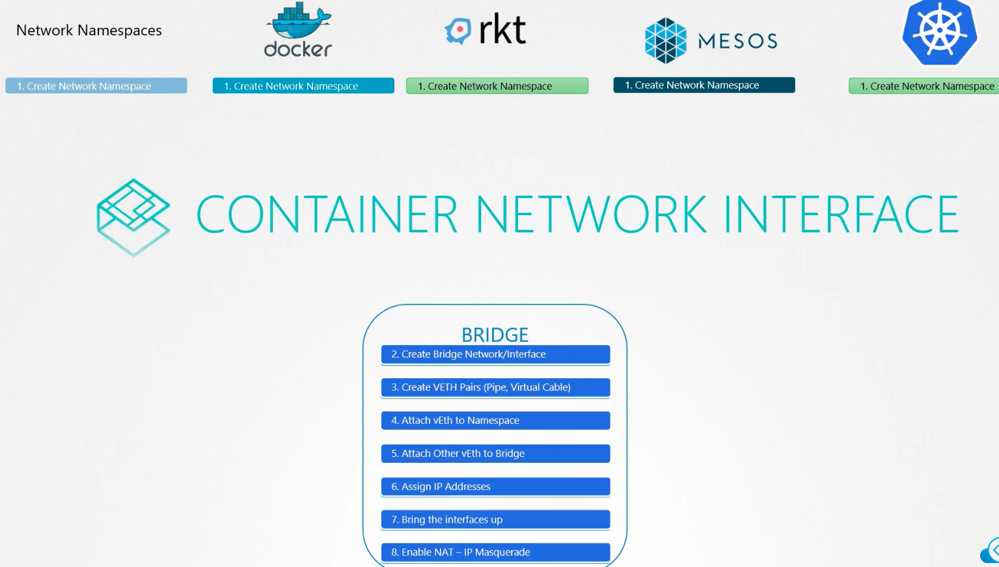
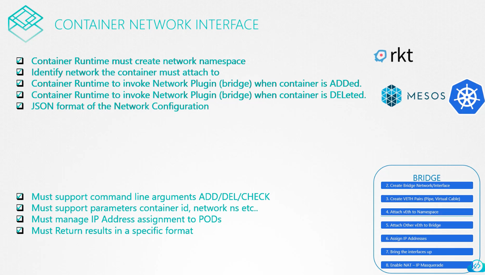

### Container Network Interface

- It is a set of standards that define how programs should be developed to solve networking challenges in a container runtime environments
- The programs are referred as plugins as well, like "Bridge" network creation
- 
- 

---
