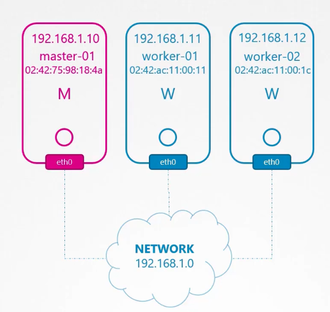
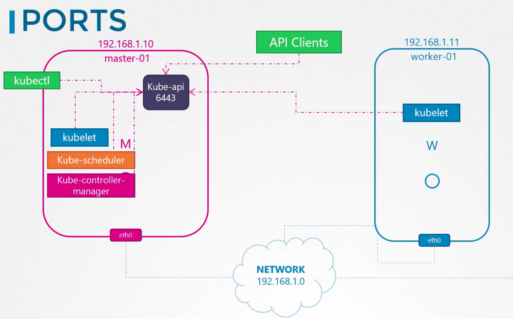
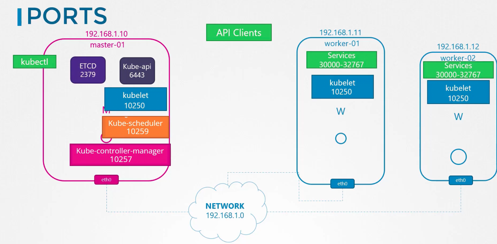
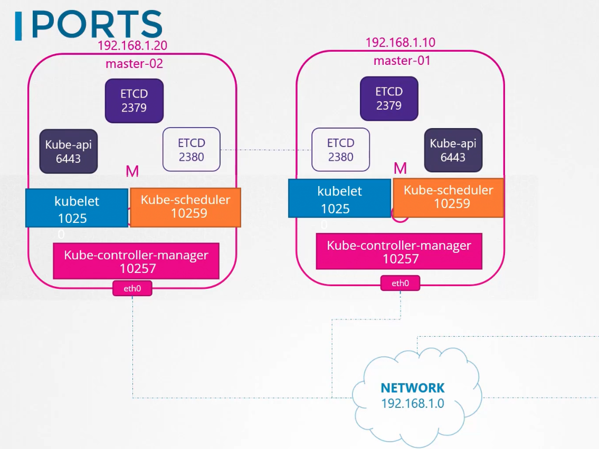

### Cluster Networking

- A cluster has master and worker nodes, each with its own IP and MAC addresses
- 
- Port 6443 on master node should be opened.
	- `kube-apiserver` listens on 6443
- 
- Port 2379 on master node should be opened
	- `ETCD` service listens on 2379
- Port 10250 should be opened on both master and worker nodes
	- `kubelet` listens on 10250 on both master and worker nodes
- Port 10259 should be opened on master node
	- `kube-scheduler` listens on 10259
- Port 10257 should be opened on master node
	- `kube-controller-manager` listens on 10257
- 
- 
- If multiple master nodes are present, then all of these ports must be open on all master nodes as well
	- List of ports required to be open is available in the Kubernetes documentation page

- CNI interface is the interface/bridge created by ContainerD
	- To list all bridge interfaces on the node - `ip address show type bridge`

---

### Handy commands

- `ip link` - To list the network interfaces in a system
- `ip addr` - To show IP address assigned to interfaces
- `ip addr add 192.168.1.10/24 dev eth0` - To add IP address to a network interface
- `route` or `ip route` - To know the existing/current routes configured on the system
- `ip route add 192.168.2.0/24 via 192.168.1.1` - To configure a route to enable a system to communicate with a system in another network
- `/proc/sys/net/ipv4/ip_forward` - Enable(1)/Disable(0) forwarding packets from one network interface to the other
- `arp` - Address resolution protocol
- `netstat -plnt` - Displays current network connections (open ports) in the system/node
	- `-p` - Program
	- `-l` - Shows only listening ports
	- `-n` - Prevents resolving IP addresses to hostnames
	- `-t` - Shows only TCP connections
	- Same as `netstat -anp`
- `netstat -anp | grep etcd` - Shows all open connection for the specified service, in this case `etcd`
- `netstat -anp | grep etcd | grep 2379 | wc -l` - Shows the number of open connection for the specified service, in this case `etcd`, on the said port
- To list nodes in the cluster
	- `kubectl get nodes`
- To know the internal IP of a node in the cluster
	- A node's internal IP is used for cluster connectivity or node to node communication
	- `kubectl describe node <node_name>` - Check for `InternalIP` under `Addresses` section
	- `kubectl get nodes -o wide`

---

**An important tip about deploying Network Addons in a Kubernetes cluster.**

In the upcoming labs, we will work with Network Addons. This includes installing a network plugin in the cluster. While we have used weave-net as an example, please bear in mind that you can use any of the plugins which are described here:

[https://kubernetes.io/docs/concepts/cluster-administration/addons/](https://kubernetes.io/docs/concepts/cluster-administration/addons/)

[https://kubernetes.io/docs/concepts/cluster-administration/networking/#how-to-implement-the-kubernetes-networking-model](https://kubernetes.io/docs/concepts/cluster-administration/networking/#how-to-implement-the-kubernetes-networking-model)

In the CKA exam, for a question that requires you to deploy a network addon, unless specifically directed, you may use any of the solutions described in the link above.

**_However,_** the documentation currently does not contain a direct reference to the exact command to be used to deploy a third-party network addon.

The links above redirect to third-party/ vendor sites or GitHub repositories, which cannot be used in the exam. This has been intentionally done to keep the content in the Kubernetes documentation vendor-neutral.

**Note:** In the official exam, all essential CNI deployment details will be provided

---
