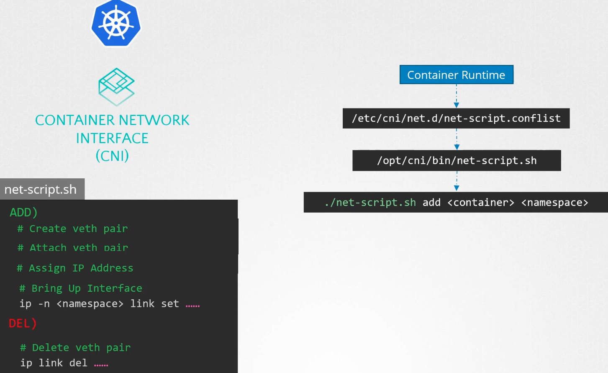

### Pod Networking

Pod Networking model
- Every pod should have an IP
- Every pod should be able to communicate with every other pod in the same node
- Every pod should be able to communicate with every other pod on other nodes without NAT

Steps:
- 
- 
- Create bridge network to attach namespaces on each node
	- `ip link add v-net-0 type bridge`
	- `v-net-0`  is the interface name
- Bring the interface up
	- `ip link set dev v-net-0 up`
- Set private IP address for the bridge interface
	- `ip addr add 10.244.1.0/24 dev v-net-0`
- Attach a container to the bridge
	- `ip link add veth-red type veth peer name veth-red-br`
	- `veth-red` is the network interface which will be connected to the namespace, say `red`
	- `veth-red-br` is the network interface which will be connected to the switch `v-net-0`
- Connect one end of the interface to the container's namespace
	- `ip link set veth-red netns red` - Namespace here is `red`
- Set IP address to the network interface attached to the container's namespace
	- `ip -n red addr add 10.244.1.2 dev veth-red`
- Bring up the network interface attached to the container's namespace
	- `ip -n red link set veth-red up`
- Connect the other end of the network interface to the bridge
	- `ip link set veth-red-br master v-net-0`

The above steps ensures
- that every pod has an IP address
- that every pod will be able to communicate with every other pod in the same node

To configure pod to pod communication across nodes, we could add routes in each node to route the traffic
- `$node01~ ip route add 10.244.2.2 via 192.168.1.12`
- But this is not scalable.
	- To scale, have a router and configure routes on that.
	- Connect all nodes to the router
- 
- 

- All the above steps use Container Network Interface (CNI)
- CNI tells Kubernetes that this is how you should call a script when a container is created
- CNI also defines how a script should look like
	- CNI should have an Add section to add a container to a network
	- CNI should have a DEL section to delete a container from a network
- 

---
