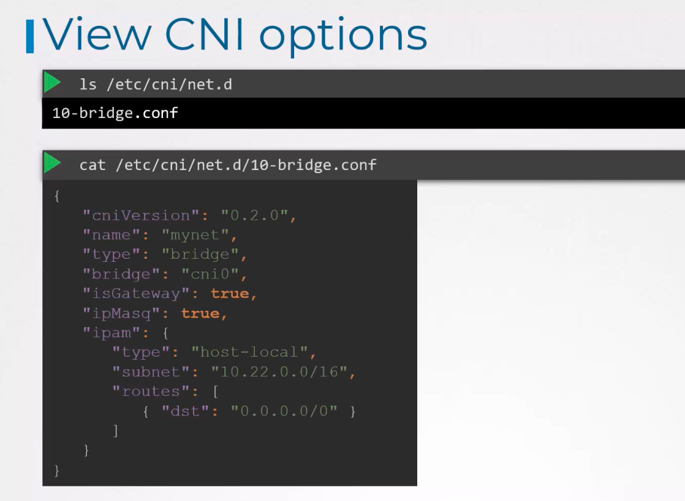
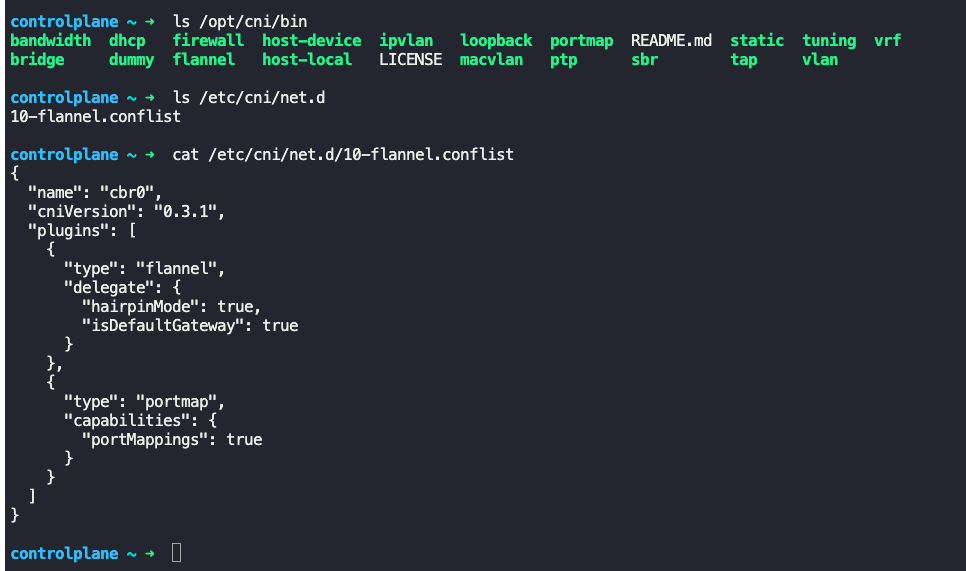

### Container Network Interface

As per CNI
- Container runtime must create network namespace
- Identify and attaching the network which the container must attach to
- Container runtime to invoke network plugin (Bridge), when the container is added
- Container runtime to invoke network plugin (Bridge), when the container is deleted
- JSON format for network configuration

Configuring CNI
- CNI plugin must be invoked by the component responsible for creating containers, which is the container runtime, like Kubernetes, CRIO etc
- CNI plugins are installed in `/opt/cni/bin/` - CNI supported plugin binaries
- Different CNI plugins
	- Weave works
	- VMware NSX
	- Flannel
	- Cilium
- Which CNI plugin to use is mentioned under `/etc/cni/net.d`
- 
- 
- To delete a CNI
	- `kubectl delete daemonset -n kube-flannel kube-flannel-ds` - Deletes the daemon set
	- `kubectl delete cm kube-flannel-cfg -n kube-flannel` - Deletes config maps
	- `rm /etc/cni/net.d/10-flannel.conflist` - Config file delete

---

**Important Update: –**

**Before going to the CNI weave lecture, we have an update for the Weave Net installation link. They have announced the end of service for Weave Cloud.**

**To know more about this, read the blog from the link below: –**

**[https://www.weave.works/blog/weave-cloud-end-of-service](https://www.weave.works/blog/weave-cloud-end-of-service)**

**As an impact, the old weave net installation link won’t work anymore: –**

**kubectl apply -f “[https://cloud.weave.works/k8s/net?k8s-version=$(kubectl](https://cloud.weave.works/k8s/net?k8s-version=$\(kubectl) version | base64 | tr -d ‘\n’)”**

**Instead of that, use the latest link below to install the weave net**: –

**kubectl apply -f [https://github.com/weaveworks/weave/releases/download/v2.8.1/weave-daemonset-k8s.yaml](https://github.com/weaveworks/weave/releases/download/v2.8.1/weave-daemonset-k8s.yaml)**

**Reference links: –**

1. [https://www.weave.works/docs/net/latest/kubernetes/kube-addon/#-installation](https://www.weave.works/docs/net/latest/kubernetes/kube-addon/#-installation)
2. [https://github.com/weaveworks/weave/releases](https://github.com/weaveworks/weave/releases)

---
