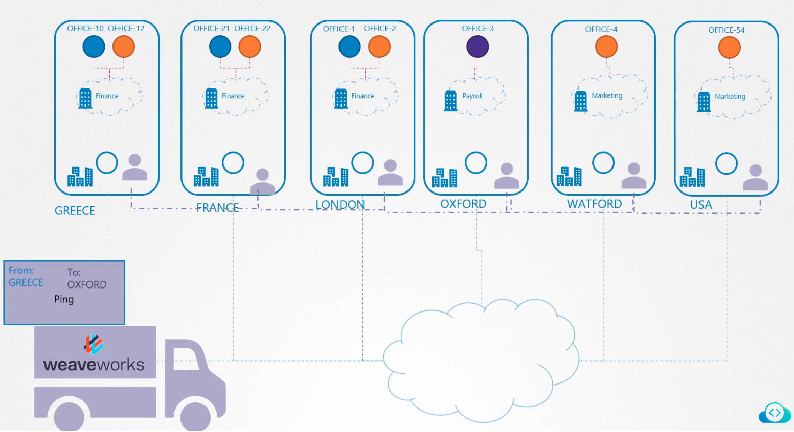
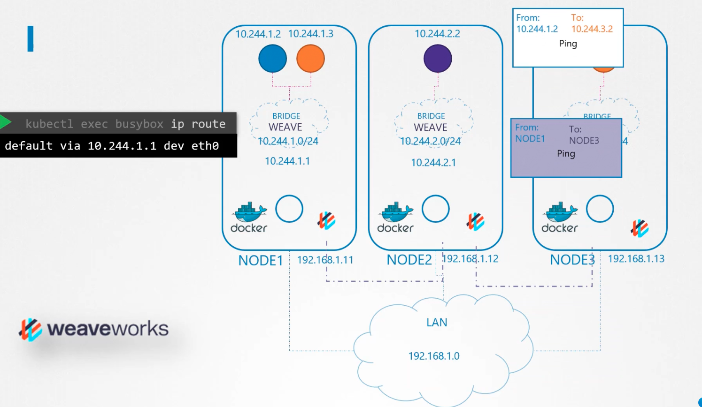

### CNI Weaveworks weave CNI plugin

- CNI weave plugin deploys a service on each node
- They exchange details regarding networks, pods and network details between them
- Weave creates its own bridge network on each node and assigns IPs
- Weave is deployed as pods on all nodes in cluster
	- `kubectl get pods -n kube-system`
- Logs - `kubectl logs weave-net-sg_cmb weave -n kube-system`
- To identify the container runtime endpoint on the Kubelet service
	- `ps -aux | grep kubelet | grep --color container-runtime-endpoint`
- 
- 

---
