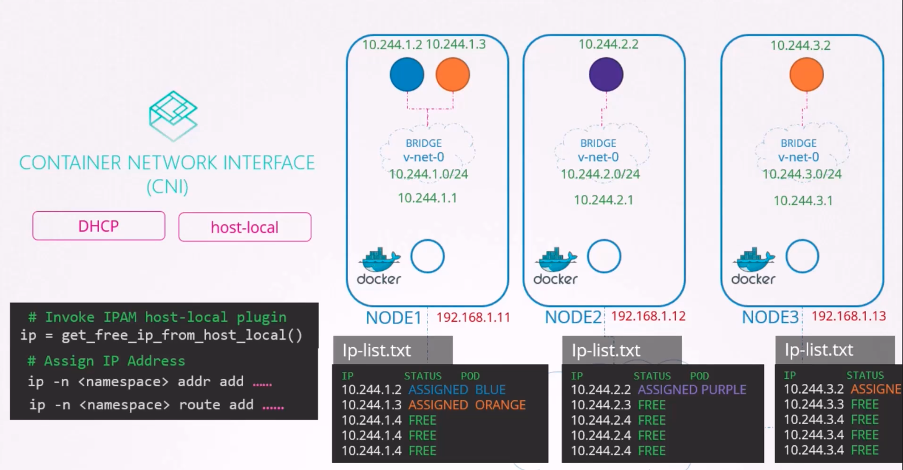

### IP Address Management

- This is with respect to IP addresses inside the nodes, say to pods, bridges, networks etc
- CNI comes with 2 builtin plugins 'DHCP' and 'host-local' to manage IP addresses
- 
- 

---
